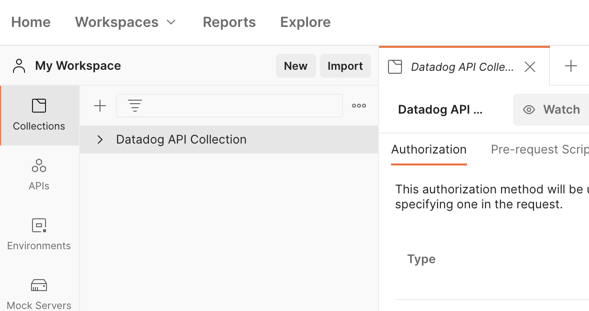
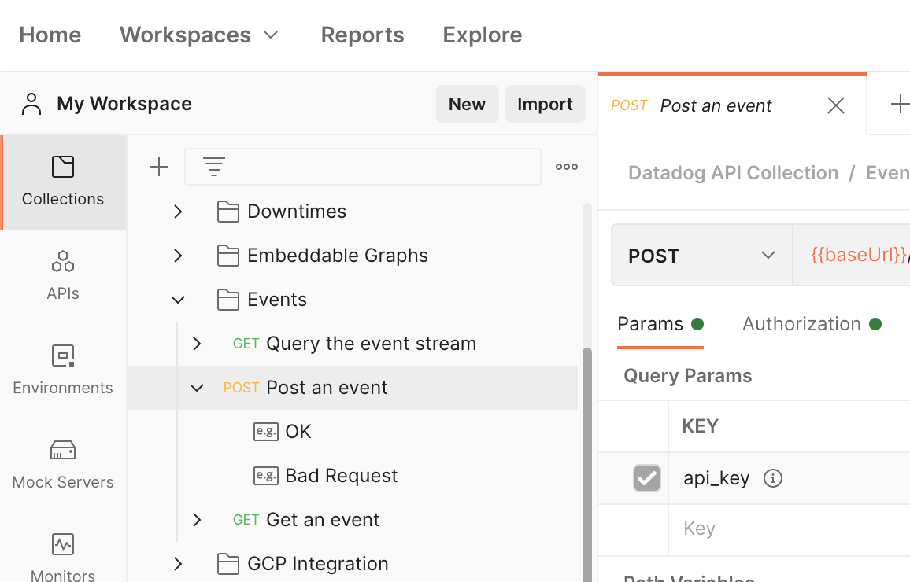
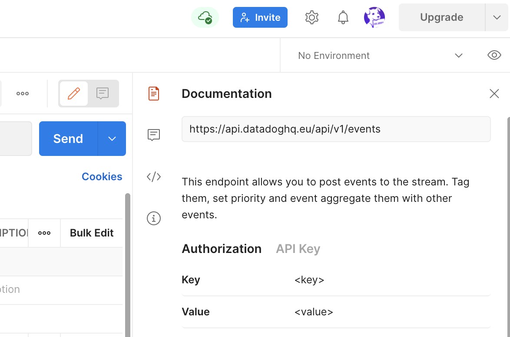
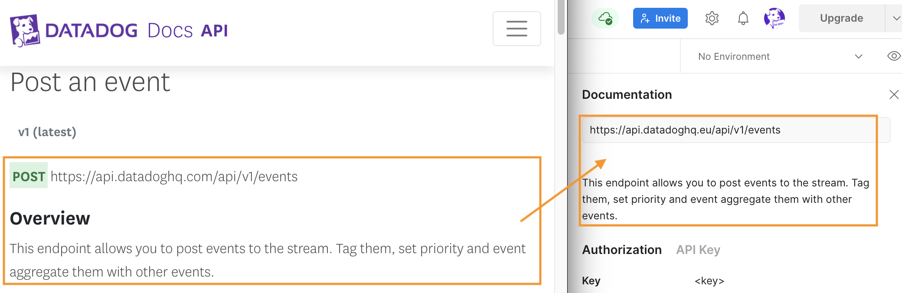
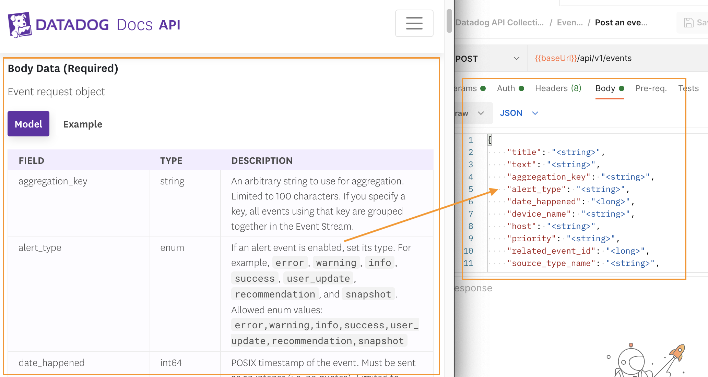
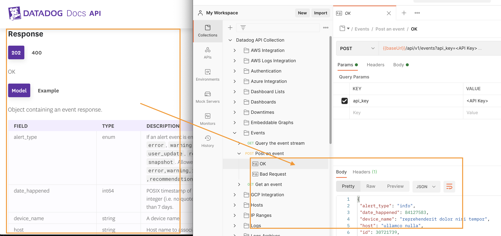
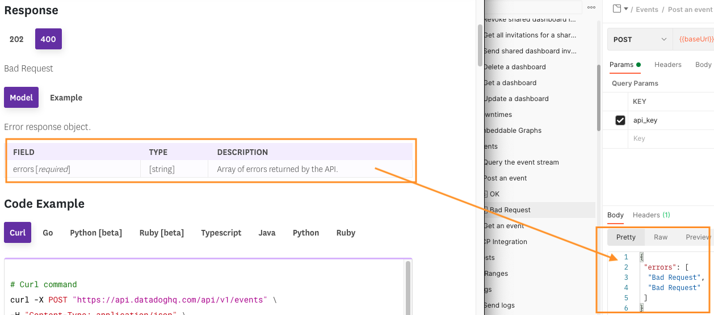

## Setup
If you don't already have one, [create a Postman account here](https://identity.getpostman.com/signup). Postman offers a web application as well as a downloadable native application for most operating systems. This lab demonstrates using the web application, but you can follow along with the native application if you prefer.

Once you log into Postman, import the Datadog collection by clicking on [this link](https://elements.getpostman.com/view/import?collection=b82586cb783eb6f7cf6d&referrer=https%3A%2F%2Fdocs.datadoghq.com%2Fgetting_started%2Fapi%2F#?env%5BDatadog%20Authentication%5D=W3sia2V5IjoiYXBwbGljYXRpb25fa2V5IiwidmFsdWUiOiIiLCJlbmFibGVkIjp0cnVlLCJ0eXBlIjoidGV4dCJ9LHsia2V5IjoiYXBpX2tleSIsInZhbHVlIjoiIiwiZW5hYmxlZCI6dHJ1ZSwidHlwZSI6InRleHQifV0=). When prompted for a workspace in which to import the collection, select **My Workspace**.

When Postman completes the import, you will see the workspace with a collection explorer column to the left.  

## Examine an endpoint
Expand **Datadog API Collection**.

Expand **Events** and then click on **Post an event**:

 

On the right-hand side of the workspace, click on the Documentation icon. This opens the documentation panel corresponding to the selected API endpoint.

 

In a new browser window, open the Datadog API Reference documentation for ["Post an event"](https://docs.datadoghq.com/api/latest/events/#post-an-event). As you read the documentation for this endpoint, see if you can find the corresponding elements in Postman.

You'll find the documentation endpoint URL and overview at the top of the workspace documentation panel:

 

You'll find the documentation request body data in the center of the workspace, in the **Body** tab of the request builder. You will modify this placeholder JSON when you post an event:

 

Moving further down the documentation for this endpoint, you will find the **Response** section documenting the two possible responses this endpoint returns: 200 and 400. You can click on the HTTP code to see the structure of each response. You can find each of these responses in Postman, nested under **Post an event** in the collection explorer. Here is the structure of a 200 OK response from this endpoint:

 

And here is the structure of a 400 Bad Request response from this endpoint:

 

Explore some of the other Datadog API endpoints in the collection and compare them to the Datadog API Reference documentation. Be sure to look at Dashboards, Logs, and Metrics endpoints, as you'll be working with those later in this course.

Click the **Continue** button to create an event using Postman.