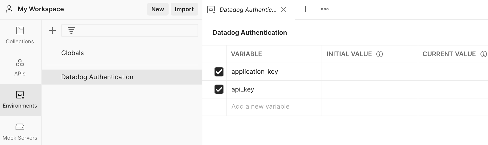
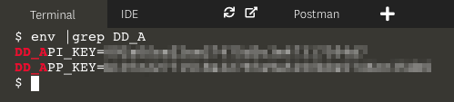
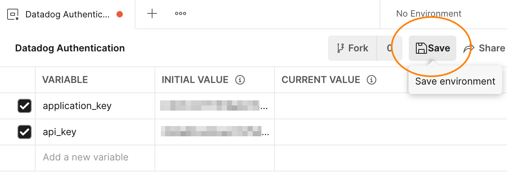
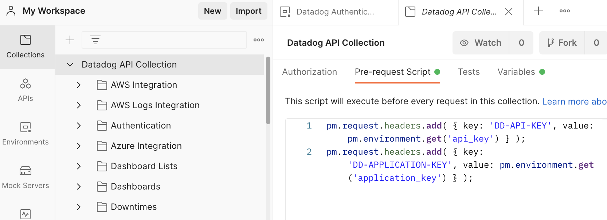
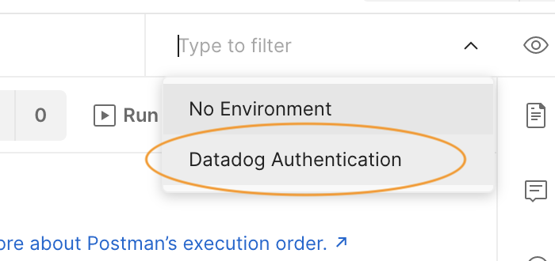
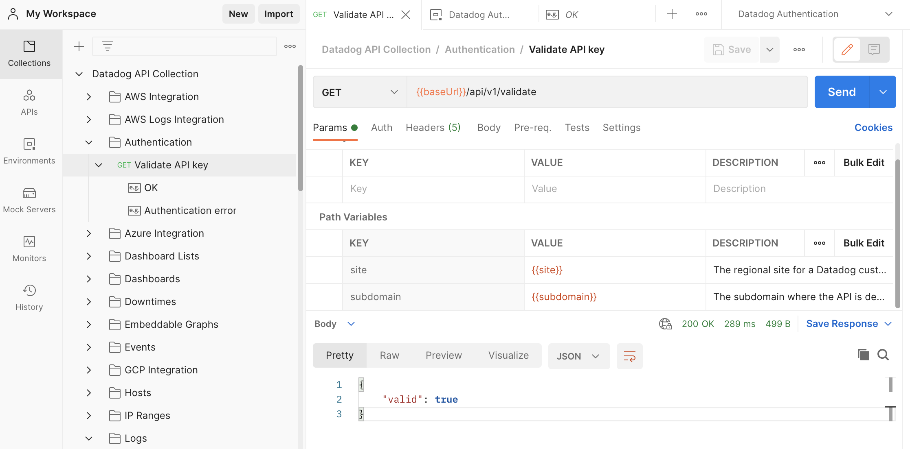
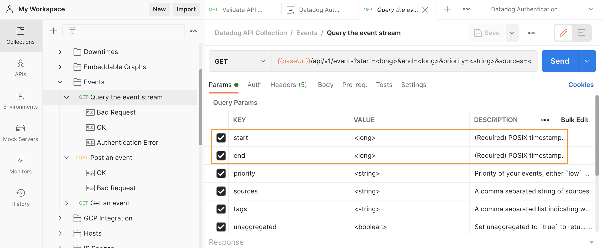
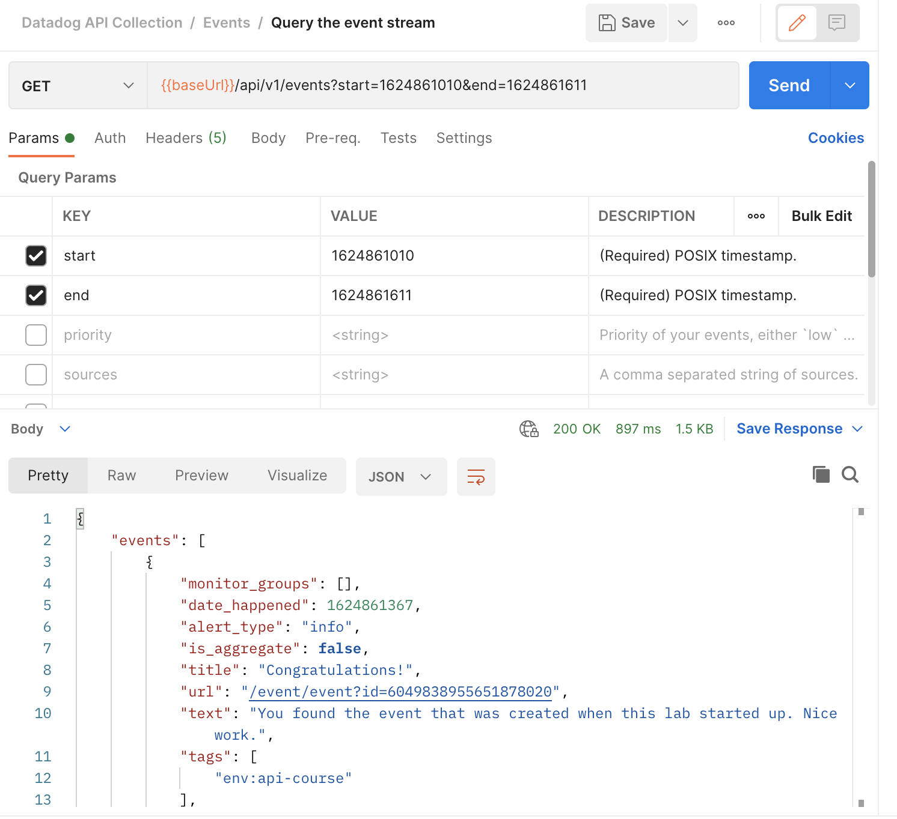

## Datadog Authentication Environment
Requests to the Datadog API require authorization headers containing at least an API key. If the request reads from the API, it must also contain an application key. Set these values in the HTTP headers of requests as `DD-API-KEY` and `DD-APPLICATION-KEY`.

Postman lets you set these values for each endpoint individually or globally for *all* requests using Environments. The Datadog collection comes with a Datadog Authentication environment to automatically add these headers to your requests.

In Postman, click on the **Environments** menu item in the left-hand navigation:

Enter your application key and API key in the **CURRENT VALUE** column. A quick way to find these in the lab is to run this command in the terminal: `env |grep DD_A`{{execute}}:

In the Datadog app, you can find your API keys under **Integrations > APIs**, and application keys under **Team > Application Keys**. Note that you can only see full application keys at the time of creation; if you forget an application key, you will have to create a new one.

When you have added both keys, click the **Save** button: 

Note that any time you change the values in a Postman tab, an orange dot appears next to the tab title, indicating that your changes are unsaved.

To see how the Datadog API and application keys are added to requests in Postman, click **Collections > Datadog API Collection > Pre-request Script**. This tab contains two JavaScript commands that will run before each request in the collection. These commands create the HTTP headers required by the Datadog API using the `api_key` and `application_key` environment variables you set:

Finally, enable the Datadog Authentication environment by clicking on the environment selector beside the **Environment quick look** icon, which looks like a human eye. Select **Datadog Authentication**: 

## Test the API Key
The Datadog API provides a [Validate API key endpoint](https://docs.datadoghq.com/api/latest/authentication/#validate-api-key) that you can use to confirm that you have configured authentication correctly.

In Postman, navigate to **Datadog API Collection > Authentication > Validate API key**. Click the **Send** button in the upper-right corner. When the Datadog API responds, you should see the 200 OK response body under the request builder, with a value of `{ "valid" : true }`:

If you received a 403 Forbidden response, go back and confirm that you have set your API key correctly in the Datadog Authorization environment. Also, make sure that the environment is active.

## Test the Application Key
The Datadog API doesn't provide an endpoint for verifying application keys. To test an application key, you can call an endpoint that requires it, such as [Query the event stream](https://docs.datadoghq.com/api/latest/events/#query-the-event-stream).

In Postman, navigate to **Datadog API Collection > Events > Query the event stream**. In the **Params** tab, you'll see that the first two params are required: `start` and `end`. Under **DESCRIPTION**, you can see that their values must be POSIX timestamps:

Back in the lab terminal, run this command to get `start` and `end` timestamps that cover the uptime of the lab environment:

`expr $(date +%s) - $SECONDS && date +%s`{{execute}}

In Postman, enter those values for `start` and `end` respectively, and uncheck all other parameters. Note that the query string portion of the API URL changes as you remove parameters. All GET requests to the Datadog API send parameters on the query string.

Hit the **Send** button and look for a 200 OK response below the request builder. You should see a JSON object describing an event that was created when this lab started up:

If you received a 403 Forbidden response, go back and confirm that you have set your application key correctly in the Datadog Authorization environment. 

Postman is now correctly configured to make authenticated requests to the Datadog API. 

Click the **Continue** button to create an event with Postman.

