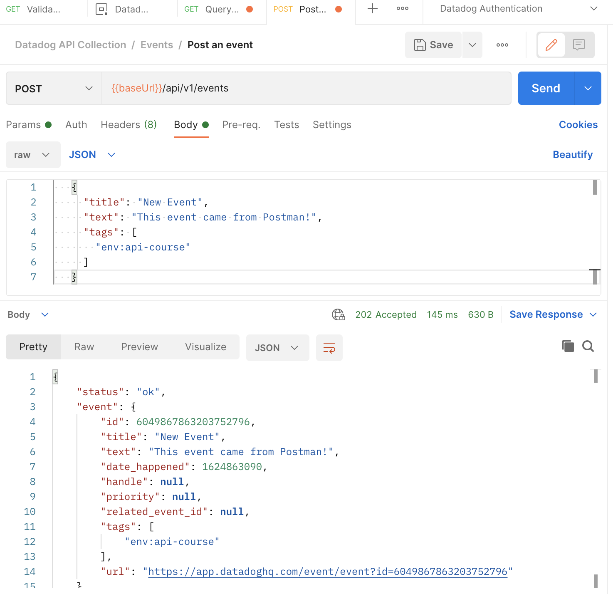
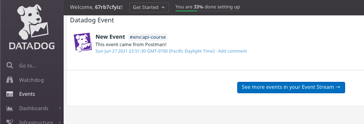
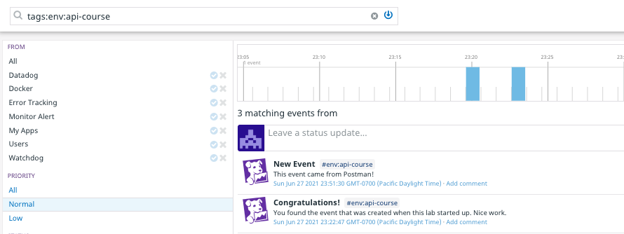

You just queried the Datadog API for all events within a time range. Now you will create some.

1. In Postman, navigate to **Collections > Datadog API Collection > Events** and click on **Post an event**. 
1. Click on the **Body** tab in the request builder. 
1. Replace the template JSON body with the following:
   ```json
   {
     "title": "New Event",
     "text": "This event came from Postman!",
     "tags": [
       "env:api-course"
     ]
   }
   ```{{copy}}
1. Click the **Send** button

You should receive a 202 Accepted response from the Datadog API:



Look at the Datadog API Reference documentation for the [Post an event](https://docs.datadoghq.com/api/latest/events/#post-an-event) endpoint and compare the response you received with the description of the response object.

The response as an `event.url` key. Copy that URL into your browser to see the event in your event stream:



Click on the **See more events in your Event Stream** button to see all events in your stream. Then enter `tags:env:api-course`{{copy}} into the filter to see only those that came from your lab environment:



Notice that the event that you queried earlier is also in the stream.

Spend some time posting and querying events using Postman. Experiment with the documented values for `alert_type`, `priority`, and `source_type_name`.

Click the **Continue** button to query and create log entries with Postman.
