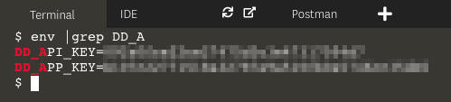
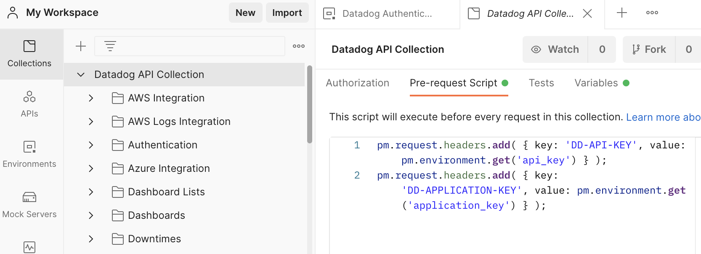
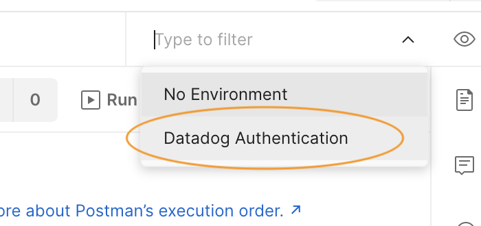

## Authentication
Requests to the Datadog API require authorization headers containing at least an API key. If the request reads from the API, it must also contain an application key. These values must be set in the HTTP headers of requests as `DD-API-KEY` and `DD-APPLICATION-KEY`.

Postman lets you set these values for each endpoint individually, or globally for *all* requests using Environments. The Datadog collection comes with a Datadog Authentication environment to automatically add these headers to your requests.

In Postman, click on the **Environments** menu item in the left-hand navigation:


Enter your application key and API key in the **INITIAL VALUE** column. A quick way to find these in the lab is to run this command in the terminal: `env |grep $DD_A`{{copy}}:



In the Datadog app, you can find your API keys under **Integrations > APIs**, and application keys under **Team > Application Keys**. Note that you can only see full application keys at the time of creation; if you forget an application key you will have to create a new one.

When you have added both keys, click the **Save** button: 

Note that any time you change the values in a Postman tab, an orange dot appears next to the tab title indicating that your changes are unsaved.

To see how the Datadog API and application keys are added to requests in Postman, click **Collections > Datadog API Collection > Pre-request Script**. This tab contains two JavaScript commands that will run before each request in the collection. These commands create the HTTP headers required by the Datadog API using the `api_key` and `application_key` environment variables you set:



Finally, enable the Datadog Authentication environment by clicking on the environment selector beside the **Environment quick look** icon, which looks like a human eye. Select **Datadog Authentication**: 



## Create an Event


**TODO**
- Explain how the Datadog environment works
- Walk learner through setting their API and APP keys
- Make first request with postman by pasting this into the body:
    ```
    {
      "title": "New Event",
      "text": "This event came from Postman!",
      "tags": [
        "env:api-course"
      ]
    }
    ```
 - Do the same to query for events and find the posted event in the response, using only `start` and `end` params

Click the **Continue** button to 


