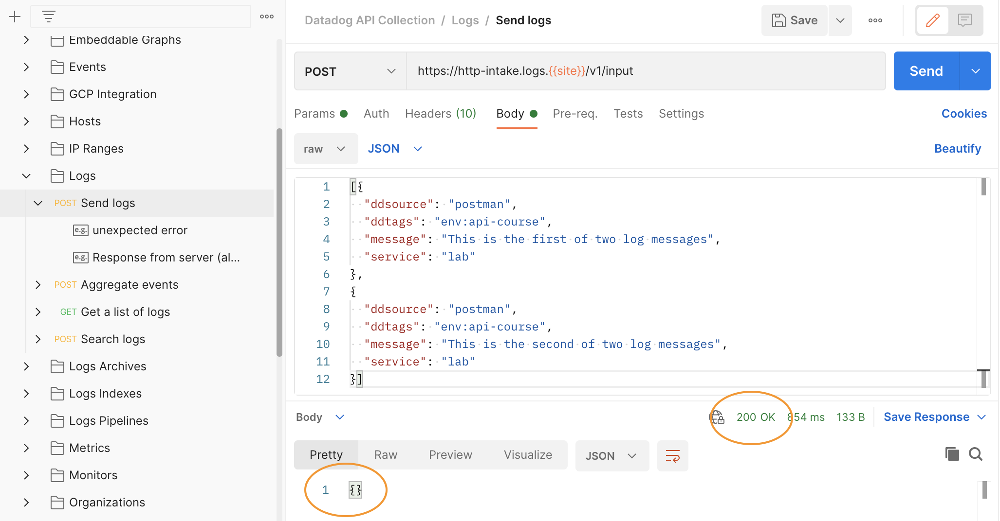
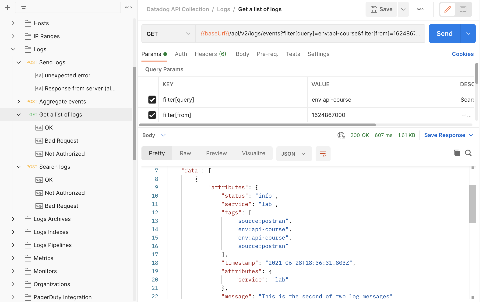

## Differences across endpoints
In this step of the lab, you're going to use Postman to call the Datadog API's Send logs and Search logs endpoints.

The API is designed to be uniform and idiomatic across all of its endpoints, so that you can communicate with it in an intuitive and predictable manner. However, there are exceptions, such as the logs endpoints.

Take a look at the documentation for the [Post an event](https://docs.datadoghq.com/api/latest/events/#post-an-event) endpoint again, and compare it with the documentation for [Send logs](https://docs.datadoghq.com/api/latest/logs/#send-logs).

The major differences between requests to these endpoints are:

- Post event expects tags in the field `tags` as an array of strings. Send logs expects tags in the field `ddtags` as comma-separated string
- Post event expects the data source in the field `source_type_name`. Send logs expects the data source in the field `ddsource`
- Post events expects the hostname in the field `host`. Send logs expects the hostname in the field `hostname`
- The Post an event endpoint accepts the parameter `ddtags` in the query string.

The logs endpoints are less idiomatic than other Datadog API endpoints for historical reasons. This difference underscores the importance of consulting the API Reference documentation when building queries!

## Post some logs
1. In Postman, navigate to **Collections > Datadog Collection > Logs** and click on **Send logs**
1. In the **Params** tab, uncheck the `ddtags`; you'll send those in the body
1. In the **Headers** tab, uncheck `Content-Encoding`
1. Click the **Body** tag and replace the placeholder JSON with the following:
   ```json
   [{
     "ddsource": "postman",
     "ddtags": "env:api-course",
     "message": "This is the first of two log messages",
     "service": "lab"
   },
   {
     "ddsource": "postman",
     "ddtags": "env:api-course",
     "message": "This is the second of two log messages",
     "service": "lab"
   }]
   ```{{copy}}

Click the **Send** button. You should receive a 200 OK response below the request builder, and the body should be an empty JSON object:



If you received any other response, go back and make sure that you have unchecked the `Content-Encoding` header, and that your API key is set correctly in the Datadog Environment.

## Query some logs
You may be tempted to look for these log entries in the Datadog app, but first query for them in Postman. You will search for all log entries tagged with `env:api-course` that have occurred since your lab started. You can get the POSIX timestamp of that moment by running this command in the lab terminal: `expr $(date +%s) - $SECONDS`{{execute}}.

1. In Postman, navigate to **Collections > Datadog Collection > Logs** and click on **Get a list of logs**
1. In the **Params** tab, uncheck all parameters except for `filter[query]` and `filter[from]`
1. Replace the placeholder value for `filter[query]` with `env:api-course`
1. Replace the placeholder value for `filter[from]` with the timestamp from the terminal
1. Click the **Send** button

You should receive a 200 OK response containing a JSON object with keys for `meta`, `data`, and `links`. 

In `data`, you should see the JSON representation of the log entries you created earlier:  



### Pagination
Note the value for `meta.page.after`. This value is used for pagination and is common throughout the API for responses that contain many results. If the number of results from the API exceeds the `page[limit]` value in the request, subsequent results can be retrieved by including the `page[cursor]` parameter in a new request.

To get all results, you would continue making requests with the `page[cursor]` parameter set to the `meta.page.after` value of the previous response. You would know that you received all of the requested results when a response's `data` value was an empty array.

Because the response to your query contains only two results, you don't have to worry about pagination for this response.

Click the **Continue** button to wrap up this section.
