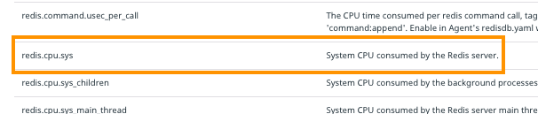
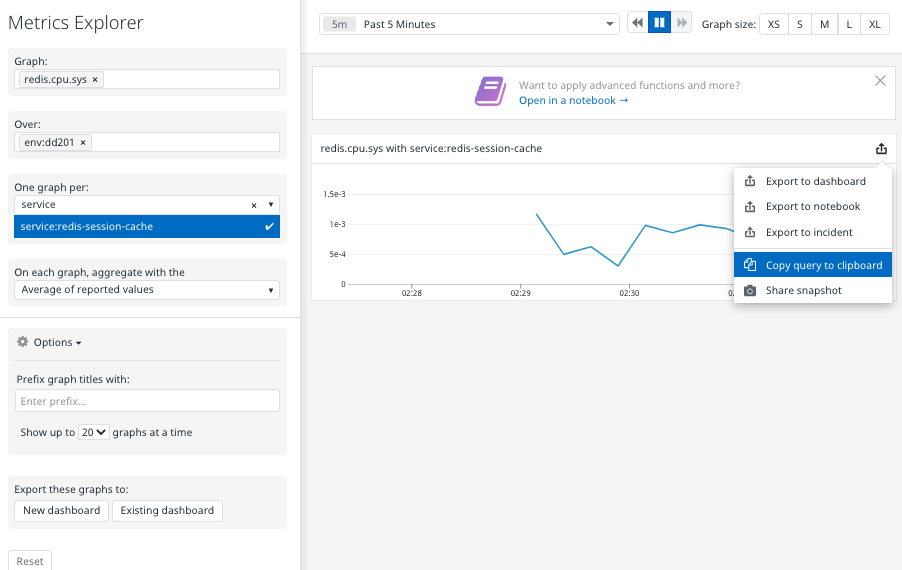

This is the architecture of the small Docker web application that you're going to provision and monitor:

| service  | service tag         | description                           |
| ---      | ---                 | ---                                   |
| stately  | stately-app         | a small Python Falcon web application |
| redis    | redis-session-cache | caches users' stately sessions        |
| agent    | agent               | Datadog agent                         |

The environment for this lab is `dd201`.

### Is redis running?
Suppose that it's important for your team to know when a new `redis-session-cache` service comes online.  There are many ways you could answer this question if a Datadog Agent knows about the service. For example, you could look at the Redis - Overview dashboard, search for its tags in recent logs, or look for its container in the Docker Overview dashboard. If you have access to the host it's running on, there are many more ways to find out. 

One way to find out from the comfort of the command line is to use curl to query the Datadog API. Start by looking at the [API Reference](https://docs.datadoghq.com/api/latest/) for helpful endpoints.

The Logs endpoint is a candidate, assuming that the service is logging. A better assumption is that the service will send metrics to Datadog through the Datadog Agent. Looking at the Metrics endpoints, [Query timeseries points](https://docs.datadoghq.com/api/latest/metrics/#query-timeseries-points) looks good. It will return an array of metric data points according to the query you specify. 

### Build the API URL
The documentation tells you the HTTP Method, the URL, the required query string parameters, and the response to expect. The URL with placeholders will be:

`https://api.datadoghq.com/api/v1/query?from=$FROM&to=$TO&query=$QUERY`

To determine the query string parameter values, determine what you want from this endpoint.  A good start is, "in the past minute, are there any core redis data points from the service redis-session-cache in the environment dd201?"

The command line utility `date` will help you figure out the UNIX timestamps for `$TO` when you run the command. `$FROM` will be 60 seconds before that.

`$QUERY` is a little tricky if you're new to Datadog metric queries. The main [Metrics documentation](https://docs.datadoghq.com/metrics/#querying-metrics) has a useful section about constructing queries.

The Datadog Metrics Explorer can also help you construct a query, if you know which metric you want. Looking at the **Metrics** tab of the [Redis integration](https://app.datadoghq.com/account/settings#integrations/redis), `redis.cpu.sys` stands out:

If Redis is using system CPU, it's definitely running! Plug the metric name and tags into the Metric Explorer:

(The service was running at the time the screenshot was created to provide a visual confirmation that it works. You won't see a graph because your service isn't running yet.)

You can click the **export icon** in the upper right corner of the graph and select **Copy query to clipboard**, and paste it into a text editor to see it:

`[{"q":"avg:redis.cpu.sys{env:dd201,service:redis-session-cache}","type":"line"}]`

Extracting the value for `q` from that JSON object, you can now assemble your full URL to the Datadog API. `$FROM` and `$TO` will be filled in later:

`https://api.datadoghq.com/api/v1/query?from=$FROM&to=$TO&query=avg:redis.cpu.sys{env:dd201,service:redis-session-cache}`

Click the **Continue** button to make call this URL with curl.