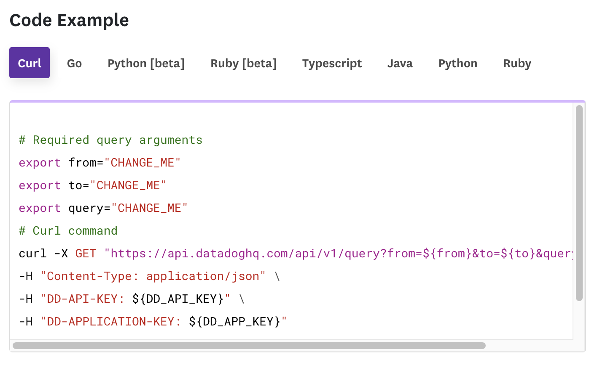
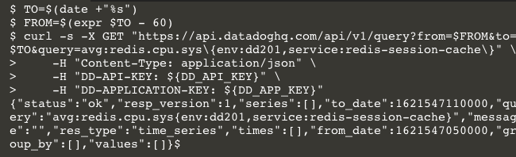
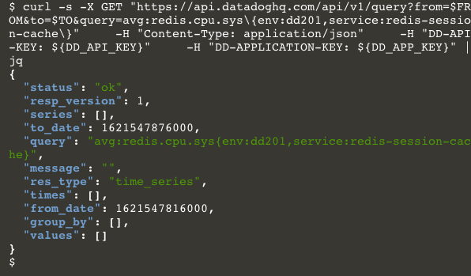
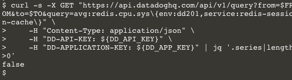

### Make the request
In the API Reference documentation for the **Query timeseries points** endpoint, scroll down to the **Code Example**  Note the tabs illustrating how to use language libraries to perform requests to this endpoint. This is a useful resource provided for every API endpoint in the documentation. 

Click on the **Curl** tab if it's not already selected:



Note that in addition to a URL, the request requires three HTTP headers: `Content-Type`, `DD-API-KEY`, and `DD-APPLICATION-KEY`. In the previous section of this course, Postman handled adding the authentication headers for you using the Datadog Authorization Environment. With curl, you will have to add these headers yourself with each request.

The `$DD_API_KEY` and `$DD_APP_KEY` variables are already set in your lab environment, but you will have to explicitly set the `$FROM` and `$TO` variables. Putting it all together:

```
TO=$(date +"%s")
FROM=$(expr $TO - 60)
curl -s -X GET "https://api.datadoghq.com/api/v1/query?from=$FROM&to=$TO&query=avg:redis.cpu.sys\{env:api-course,service:redis-session-cache\}" \
    -H "Content-Type: application/json" \
    -H "DD-API-KEY: ${DD_API_KEY}" \
    -H "DD-APPLICATION-KEY: ${DD_APP_KEY}"
```{{execute}}

Click the above code block to execute it in the terminal. You should receive an informative response:



The response from the API is JSON, formatted for efficiency rather than human readability. You can change that by piping the response to [jq](https://stedolan.github.io/jq/), a JSON processing utility. Recall the command by hitting the up arrow key and add `|jq`{{copy}} to the end of the command. Hit ENTER. You should see a much nicer response: 

```
curl -s -X GET "https://api.datadoghq.com/api/v1/query?from=$FROM&to=$TO&query=avg:redis.cpu.sys\{env:api-course,service:redis-session-cache\}" \
    -H "Content-Type: application/json" \
    -H "DD-API-KEY: ${DD_API_KEY}" \
    -H "DD-APPLICATION-KEY: ${DD_APP_KEY}" | jq
```{{execute}}



The response contains `"status" : "ok"`, so you know that the API received your valid query. According to the API documentation for this endpoint, the metrics should be in the `"series" : []` array, which is empty. That makes sense because the service isn't running yet. 

### Script it
You could provision the service and then run this script periodically until you see data in the `"series"` array. But you've got more important things to than repeatedly hitting up arrow and ENTER. If you can reduce this output to a boolean value, you can run it in a bash loop until it returns `true`.

In addition to making JSON pretty in the terminal, `jq` can traverse JSON and perform powerful operations on it. The expression to evaluate whether the `series` array has data is `.series|length>0`. Now run the command with this addition:

```
curl -s -X GET "https://api.datadoghq.com/api/v1/query?from=$FROM&to=$TO&query=avg:redis.cpu.sys\{env:api-course,service:redis-session-cache\}" \
    -H "Content-Type: application/json" \
    -H "DD-API-KEY: ${DD_API_KEY}" \
    -H "DD-APPLICATION-KEY: ${DD_APP_KEY}" |jq '.series|length>0'
```{{execute}}



Now you have something you can use with your shell script. Writing shell scripts is out of scope for this lab and often out of scope for one's serenity. Fortunately, this one has already been written. 

Click the **Continue** button to take a look at it.