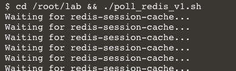
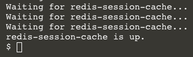
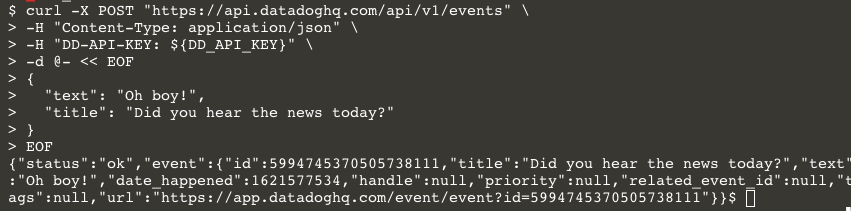
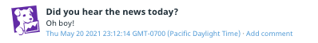
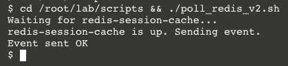
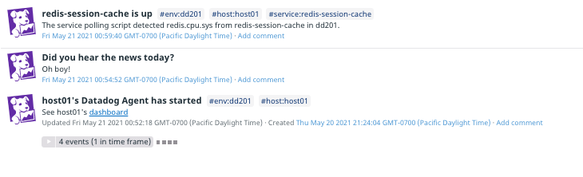

Click the IDE tab above the terminal and wait for it to load. Then open the file `lab/scripts/poll_redis.sh`{{open}}

This script loops over the same command you just ran. The boolean return value from the `curl` command gets assigned to `$REDIS_UP`. The `while` loop will terminate when `$REDIS_UP` evaluates to `true`. It also pauses for 2 seconds to be kind to the Datadog API endpoint. (Get familiar with the [[Datadog API rate limits](https://docs.datadoghq.com/api/latest/rate-limits/) so you can tune your automated scripts accordingly.)

Click on the first terminal tab and run this shell script: `cd /root/lab/scripts && ./poll_redis.sh`{{execute}}. It will tell you it's waiting for redis-session-cache:



Confirm that it will detect the `redis-session-cache` when it is provisioned and starts sending metrics to Datadog. Click the **Terminal 2** tab to open a new terminal. Then run `cd /root/lab && docker-compose up -d`{{execute}}

Click on the **Terminal** tab and wait for the shell script to inform you that the service is up:



### Post an event
What if this script posted and event when it detected the service? That way anyone in your organization can see it in the [event stream](https://app.datadoghq.com/event/stream). You could even create an [Event Monitor](https://docs.datadoghq.com/monitors/monitor_types/event/) to notify your team when the service comes up.

You created an event with Postman in the first section of this course, so you should be familiar with the request and response. Consult the [documentation](https://docs.datadoghq.com/api/latest/events/#post-an-event) for the Datadog API's Post an event endpoint, especially the **Curl** code example. Because you're sending information to the API, the method is `POST`. Also, the `DD-APPLICATION-KEY` key header is not required. 

Try it out:

```
curl -X POST "https://api.datadoghq.com/api/v1/events" \
-H "Content-Type: application/json" \
-H "DD-API-KEY: ${DD_API_KEY}" \
-d @- << EOF
{
  "text": "Oh boy!",
  "title": "Did you hear the news today?"
}
EOF
```{{execute}}

You will get a response confirming that the event was created:



Take a look at your [event stream](https://app.datadoghq.com/event/stream) to see the result: 



### Final version of the script
Click on the IDE tab and open the file `lab/scripts/poll_service.sh`{{open}}, which puts everything together.

This script adds the service and environment tags to the event, too, so you can filter it like other resources in your Datadog organization.

It also parameterized the previously hard-coded values to use environment variables for greater flexibility. You could run the same script for different services in different environments.

Return to the first terminal and set those environment variables now:

```
export DD_ENV="api-course"
export DD_SERVICE="redis-session-cache"
export DD_QUERY_METRIC="redis.cpu.sys"
```{{execute}}

Run the script to see it in action. Because your service is still running, it will detect it very quickly: `cd /root/lab/scripts && ./poll_service.sh`{{execute}}



And here it is in your stream:



### Conclusion
You should have a good idea of how to interact with the Datadog API, and how you can use curl in shell scripts to automate some useful actions.

Scripts like these could be part of your provisioning suite, but they don't have to run on the provisioning host. You ran them on the same host here because of the nature of our lab environment. But you could have run them from anywhere that you can make HTTP requests to the Datadog API.

Interacting with the Datadog API at a low level using curl and shell scripts gives you full access to all of the API's capabilities. In the next lab, you will use Dogshell, which greatly simplifies communicating with the Datadog API.

Click the **Continue** button.