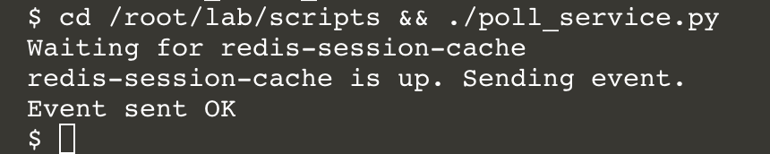
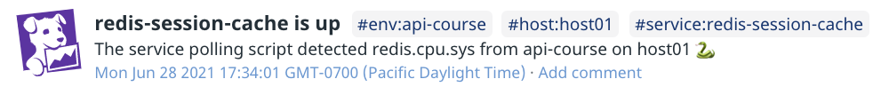

Datadog offers many open source client libraries for communicating with the Datadog API, including two for Python. The Datadog Python library, or dogpy, is mature, feature-rich, and representative of typical Datadog API libraries.  That's what you'll use in this step. You'll take a look at the other official Python client library in the next step.
## Examine a Python script
If you didn't install the Datadog Python library in the previous step, do so now:

`pip install datadog`{{execute}}

Also, set the environment variables for this new lab environment:
```
export DD_ENV="api-course"
export DD_SERVICE="redis-session-cache"
export DD_QUERY_METRIC="redis.cpu.sys"
```{{execute}}

Click the IDE tab and wait for it to fully load. Then open `lab/scripts/poll_service.py`{{open}}.

This is a python script that uses the official Datadog client library for Python. It performs the same function as `poll_service.sh` from earlier in the lab. 

On line 5, the script imports the `initialize()` function and the `api` object from the datadog client library. This is the library that you installed in the previous step that includes Dogshell.

On line 7, `initialize()` is called to configure the library. If no arguments are given to it, `initialize()` will look for your API and application keys in the current environment the same way Dogshell does.

On lines 11-21, environment variables are assigned to local variables. This makes the script flexible and useful for different services and contexts, as `poll_service.sh` did.

On lines 26-32, the script calls `api.Metric.query()` in a loop, passing in the same query used in `poll_service.sh`. If the `series` array of the JSON response contains values, the loop will break, and the script will continue exiting.

On lines 37-41, the script prepares the arguments for `api.Event.create()` and calls it. This will send the same event that `poll_service.sh` and Dogshell did. 

### Run the Python script
Now that you're familiar with how this script works, run it in the terminal:

`cd /root/lab/scripts && ./poll_service.py`{{execute}}

The experience and outcome will be similar to that of running `poll_service.sh`, with a bit more diagnostic information from the python script: 



The web application is automatically running in the background, so this script should detect the Redis metrics quickly.

You can check your events stream in the Datadog app to confirm that there's a new **redis-session-cache-is-up** event:



Click the **Continue** button to create log entries using the other Python client library.
