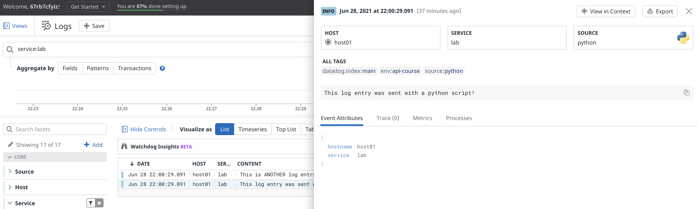
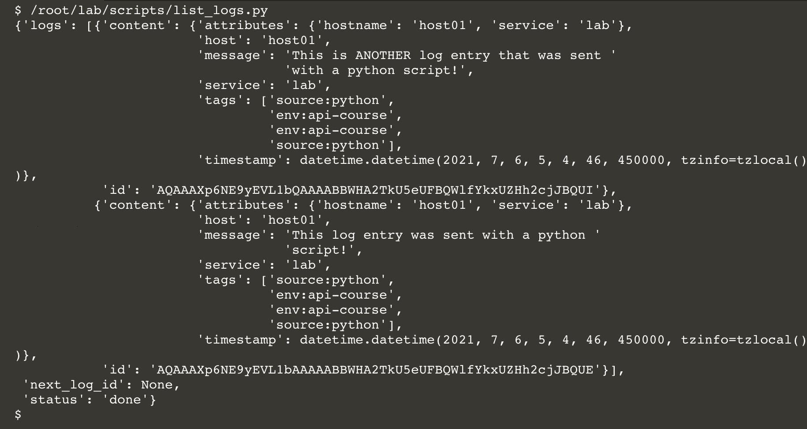

## A Tale of Two Libraries
Humans created the Datadog Python library that you used in the previous step in 2015. In addition to providing Python functions for most of the Datadog API, it comes with the Dogshell utility and modules for communicating with the Datadog Agent's DogStatsD metrics aggregation server. You can learn more about communicating with DogStatsD in the [library documentation](https://github.com/DataDog/datadogpy#dogstatsd).

It may seem odd to state that humans created the Datadog Python library, but this fact distinguishes it from the newer [datadog-api-client-python](https://github.com/DataDog/datadog-api-client-python).  datadog-api-client-python was programmatically generated from the Datadog API's OpenAPI specification, the same specification that generates the API Reference documentation. The advantage of generating the API client is that it is complete, predictable, and fully documented. An arguable disadvantage is that it can require more typing to use because it lacks the pithy nomenclature that humans are fond of. 

The documentation for the datadog-api-client-python [is here](https://datadog-api-client.readthedocs.io/en/latest/). The two functions you will look at in this lab are [`submit_log`](https://datadog-api-client.readthedocs.io/en/latest/v1/LogsApi/#submit_log) and [`list_logs`](https://datadog-api-client.readthedocs.io/en/latest/v1/LogsApi/#list_logs)

## Install datadog-api-client-python

Run this command in the terminal to install the library: `pip install git+https://github.com/DataDog/datadog-api-client-python.git`{{execute}}

## Posting log entries
Click on the IDE tab to the right and open `lab/scripts/submit_logs.py`{{open}} 

Lines 2-5 import the module dependencies.

Line 7 configures the client. Behind the scenes, `Configuration()` looks for `DD_API_KEY` and `DD_APP_KEY` in the environment to authenticate API calls. This is equivalent to `initialize()` in `poll_service.py` in the previous step.

Lines 9-10 set some local variables from the environment.

Lines 12-13 create a configured `LogsApi` instance.

Lines 14-29 create an `HTTPLog` instance containing two `HTTPLogItem` instances. You should recognize the `HTTPLogItem` arguments from the first lab, where you created log entries using Postman.

Line 33 brings everything together, calling `LogsApi.submit_log()` with the `HTTPLog` argument.

Lines 35-36 catch an `ApiException` and print its error message if the request fails.

Click on the Terminal tab and run the script: `/root/lab/scripts/submit_logs.py`{{execute}}

Take a look at your logs explorer to see the resulting log entries:

## Querying log entries
For an example for querying for log entries, click on the IDE tab to the right and open `lab/scripts/list_logs.py`{{open}} 

Lines 1-8 load the same client library modules that `submit_logs.py` did, as well as Python modules for date handling and output formatting.

Lines 12-13 set local variables from the environment.

Lines 15-16 create variables that will define the time range of the log entries to list. `now` is converted to Coordinated Universal Time (UTC) because Datadog uses UTC timestamps by default.

Lines 18-19 create a configured `LogsApi` instance.

Lines 20-26 create a `LogsListRequest`, setting `query` and `time` according to the [client library documentation](https://datadog-api-client.readthedocs.io/en/latest/v1/LogsListRequest/)]. 

The `query` syntax is exactly the same as in the Datadog logs explorer. Here, the query is filtering for the tags set by `submit_logs.py`

Note that the `time` parameter is a `LogsListRequestTime` object, which is instantiated in lines 22-25. This is where the `now` and `one_hour_ago` variables come into play, defining the `to` and `_from` of the time range, respectively. 

Lines 28-30 call `ApiClient.list_logs()`, passing the `LogsListRequest`. If the request succeeds, line 31 prints the response object to the terminal. If not, line 33 prints the error to the terminal.

Run the script by executing this command in the lab terminal: `/root/lab/scripts/list_logs.py`{{execute}}

After a moment, you should see the log entries that you posted using `submit_logs.py`:

If the script succeeds but returns no log entries, make sure that you have run the `submit_logs.py` script within the past hour.

Feel free to experiment with these scripts, or even create new scripts for different endpoints. 

## More about the Python libraries
Look at the [Python Client documentation](https://datadogpy.readthedocs.io/en/latest/) to learn about its capabilities. It's one of the few libraries that can communicate with both the Datadog API and [DogStatsD](https://docs.datadoghq.com/developers/dogstatsd), a metrics aggregation service bundled with the Datadog Agent. 

Documentation for the client library generated using the Open API specification, datadog-api-client-python, is [here](https://datadog-api-client.readthedocs.io/en/latest/v1).

## Other languages
Take a look at the [list of client libraries](https://docs.datadoghq.com/developers/libraries/) to see what's available for your language of choice. Also, note that there are many special purpose Datadog libraries, such as those for serverless, log management, Google Analytics, and even Jira, to name a small set. 

### Open API generated clients
More generated Open API client libraries are on the way. Because they're all generated from the same specification, they will work similarly in every language.  For example, take a look at the `LogsApi.ListLogs()` [usage example](https://github.com/DataDog/datadog-api-client-go/blob/master/api/v1/datadog/docs/LogsApi.md#example) for the GO client. You should be able to see the same usage pattern that you saw in `list_logs.py`.

Click the **Continue** button to wrap up this section.
