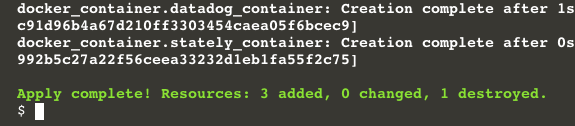
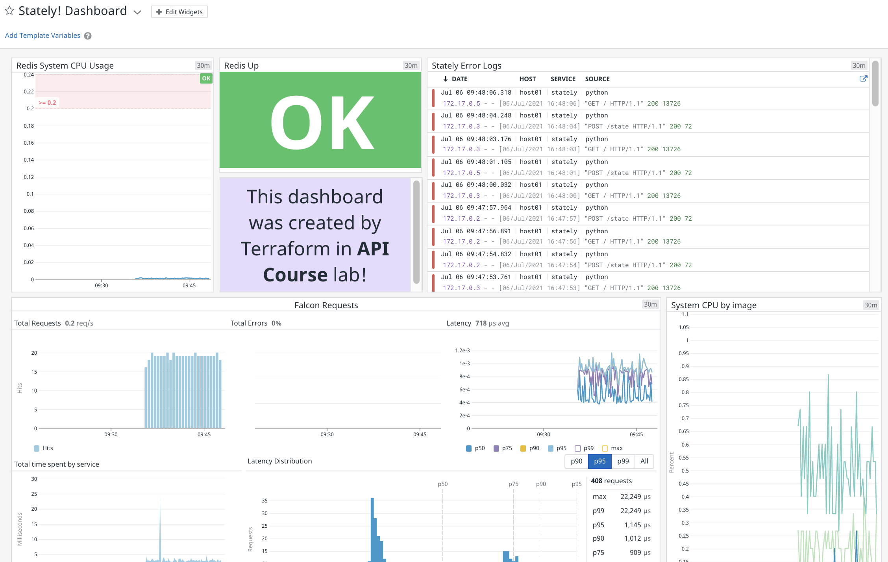

If you have only a small cloud footprint, rarely provision new services, or you’re a one-person team, interacting with our API from ad hoc scripts and shell one-liners may be as much automation as you need. If you’re a growing team without a well-established workflow, or your scale has outgrown your existing tooling, it's worth looking into an infrastructure-as-code (IaC) tool.

Terraform is a popular IaC tool for managing infrastructure across many providers, on and off the cloud. The Datadog provider for Terraform allows you to provision monitors and dashboards at the same time that you provision your system.

## Terraform configuration
Three Terraform files provision this application. Open the IDE and look at each of these files:

`lab/terraform/variables.tf`{{open}} brings your API and Application keys into scope from the environment. 

`lab/terraform/main.tf`{{open}} defines and configures the Datadog agent, Redis service, and Python application Docker containers. It's similar to the `docker-compose.yml` file that you used earlier in the lab. All of the Datadog container labels and environment variables are configured here.

`lab/terraform/datadog.tf`{{open}} creates a Datadog monitor and a dashboard for the application.

These files could have been combined into a single file or even broken down into even more files. Terraform will slurp up all the `.tf` files in the current directory and figure out what to do.

Take a look at `datadog.tf` in the IDE. This file defines two resources: 
  - A `datadog_monitor` that watches `redis.cpu.sys`
  - A dashboard containing 5 widgets

This is a more robust version of the monitor you created with Dogshell earlier in the lab. The `datadog_monitor` resource configuration closely matches the **Monitors > New Monitor** configuration in the Datadog app.

Each of the widget blocks follows the [Datadog API schema](https://docs.datadoghq.com/dashboards/widgets/) for its type. Each is accompanied by a `widget_layout` block defining its place on the dashboard.

Take a closer look at the `alert_graph` widget in the `datadog_dashboard` resource configuration. The `alert_id` value is `${datadog_monitor.redis_cpu.id}`, which references the id of the `datadog_monitor`. This id will become available after Terraform creates it, and the dashboard will be able to display it as an alert graph.

## Run Terraform
In the terminal, run `cd /root/lab/terraform && terraform init`{{execute}} so Terraform can download the Docker and Datadog providers declared at the top of `main.tf`.

Next, run `terraform apply --auto-approve`{{execute}} to get Stately! and the Datadog dashboard up and running. You should see a couple of pages of output from Terraform as it provisions Stately!, concluding with **Apply complete! ...**:

 If you see errors like the following:

> Error: Unable to create container: ...

Run the command `cd /root/lab && docker-compose down && cd -` and try again.

Take a look at the Datadog app and find **Average Redis System CPU Usage** under **Monitors > Manage Monitors**. Then find **Stately! Dashboard** under **Dashboards > Dashboard List**. 

Your newly created dashboard should look something like this:

Note that every time you run `terraform apply`, Terraform will do whatever it takes to bring the resources to their configured states. That means that if you make any changes to the dashboard, they will disappear when the dashboard reverts to its originally configured state. This is a good way to maintain an "official," permanent dashboard for resources provisioned by Terraform.

## Conclusion
You have seen how Datadog resources can be managed like any other IaC resource using Terraform. You can learn more about the Datadog Provider for Terraform by reading the [documentation](https://registry.terraform.io/providers/DataDog/datadog/latest/docs). 

Note that you can incorporate the other scripts that you have worked within this lab into Terraform. Terraform's [local-exec Provisioner](https://www.terraform.io/docs/language/resources/provisioners/local-exec.html) allows you to run commands on the provisioning host, opening up all of Datadog's API capabilities.

Click the **Continue** button to review what you have learned in this section of the course.
