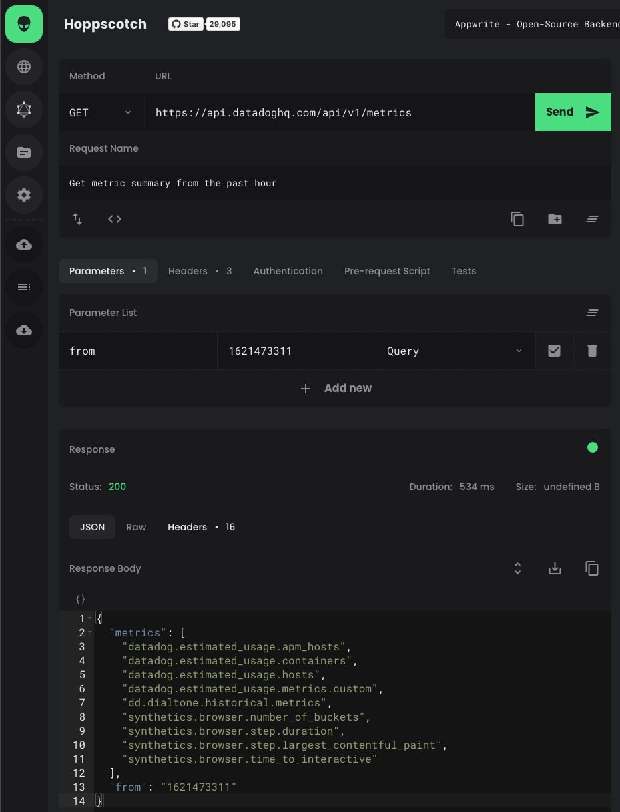
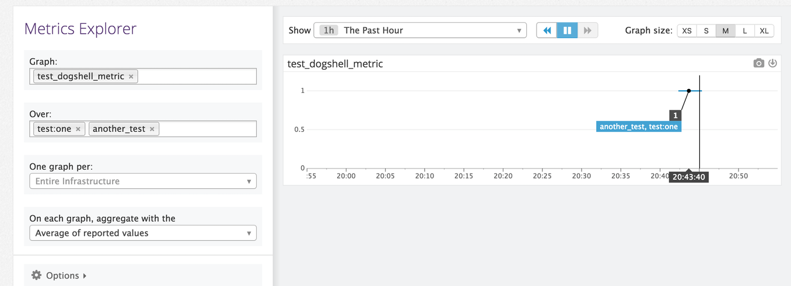

## Overview
Datadog's HTTP REST API supports automating many of the tasks you might perform by clicking through the Datadog UI, including creating and managing:

  - Monitors
  - Dashboards
  - Dashboard widgets
  - SLOs
  - Synthetic tests
  - Notebooks

But that's just a drop in the bucket. The API can do almost anything that a human can do in the Datadog app. You can see all of the API's capabilities in the [Datadog Docs API Reference](https://docs.datadoghq.com/api/latest/).

## Use cases
If there's something you do more than once in the Datadog app, consider automating it. Here are just a few ways that you can harness the power of the Datadog API to optimize your workflows:

  - Write a parameterized shell script to create a common monitor 
  - Write a utility that creates notebooks from internal documentation
  - Process custom data sources and stream it to Datadog logs
  - Create a suite of monitors when you need them, delete them when you don't
  - Fire off events to track the progress of provisioning new services
  - Automatically create a synthetic test when deploying new APIs and websites
  - Automated user creation when new folks join your organization or team. Automated user deletion when they leave.

The possibilities are limited only by your imagination. Can you think of repetitive or time-consuming Datadog tasks that you or your team performs that could be automated using the Datadog API?

## HTTP clients, libraries, and tools
There are several ways that you can communicate with the Datadog API. Below are some of the most common.

### HTTP clients
Because the Datadog API is an HTTP REST API, anything that speaks HTTP and allows you to set custom headers will work. cURL is a popular, cross-platform command-line HTTP client. 

Other general purpose HTTP tools include [Postman](https://www.postman.com/), and open source alternatives such as [Hoppscotch](https://hoppscotch.io) or [Insomnia](https://insomnia.rest/). Here's an example of using Hoppscotch's web interface to get a metric summary from the Datadog API:

### Libraries
There are many official and community contributed software libraries that enable communicating with the Datadog API at a higher level. There is probably at least one library for your favorite programming language. Take a look at the [API and DogStatsD client libraries](https://docs.datadoghq.com/developers/community/libraries/#api-and-dogstatsd-client-libraries) list to see what's available.

### Dogshell
One notable library is the officially supported [datadogpy Python library](https://github.com/DataDog/datadogpy). In addition to providing powerful Python functions for communicating with the Datadog API, this library provides the [dogshell command line utility](https://docs.datadoghq.com/developers/guide/dogshell-quickly-use-datadog-s-api-from-terminal-shell/). This utility allows you to communicate with the Datadog API with short, intuitive `dog` commands. For example to send a custom metric to Datadog:

`dog metric post test_dogshell_metric 1.0 --tags "test:one,another_test"`

You can find this metric in the Metric Explorer:

### Datadog provider for Terraform
[Terraform](https://www.terraform.io/intro/index.html) is a popular, open source, cloud-friendly tool for building and managing application infrastructure as code (IaC). Like other IaC tools, Terraform enables teams and organizations to manage their infrastructure with many of the same tools and processes they use to manage their software applications.

Terraform maintains a registry of [providers](https://registry.terraform.io/browse/providers) that integrate with a wide range of platforms, resources, and services.

The Datadog Provider for Terraform communicates with the Datadog API while provisioning infrastructure. This allows you to spin up your services and related Datadog resources at the same time. 

## The Lab
In the following labs, you're going to work with the Datadog API in a variety of ways while provisioning a small web application. You will:

  - Use Postman to:
    - explore the Datadog API collection
    - post and query log entries
  - Use cURL to:
    - detect metrics by type and service tag
    - publish events to Datadog to track provisioning progress
  - Use Dogshell to:
    - perform the above tasks
    - create a dashboard
  - Run Python scripts to perform many of the same actions 
  - Use Terraform to:
    - provision a small web application
    - simultaneously create a monitor and dashboard for the application

At the conclusion of this lab, you will understand how the Datadog API works, what it can do, and the variety of ways that you can communicate with it.

Click the **Next** button to get started.
