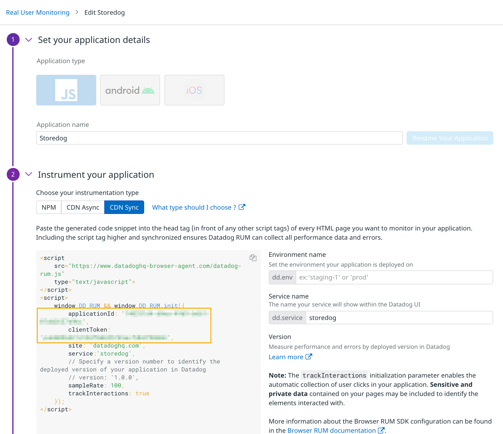

Datadog's Real User Monitoring uses a JavaScript library embedded in web pages to capture user actions and stream them to Datadog. When Datadog receives RUM metrics, it needs to associate them with the right organization and application. To do this, create a RUM Application for the Storedog frontend in the Datadog app:

1. Navigate to [UX Monitoring > RUM Applications](https://app.datadoghq.com/rum/list) 
1. Click the **New Application** button
1. Leave the default **Application type** of JavaScript
1. For **Application Name**, enter "Storedog"
1. Select **CDN Sync** for instrumentation type. 
1. Click the **Create New RUM Application** button.

You should see a block of code like this appear:

Make note of the highlighted area containing the `applicationId` and `clientToken`; you will need these in the next step.

Click the **Continue** button to set up the JavaScript library in the Storedog app.