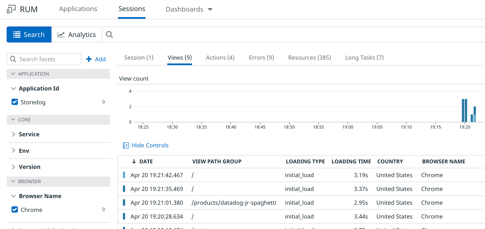

Storedog is already instrumented with the Datadog JavaScript RUM library. It just needs to be configured with an application id and client token. Take a look at how it works:

1. In the lab, click the **IDE** tab above the terminal. It can take a couple minutes to fully load.
1. Open the file `lab/store-frontend-instrumented-fixed/frontend/app/views/spree/layouts/spree_application.html.erb`{{open}}

The second `<script>` block contains code very similar to what you saw in the CDN Async instrumentation code in the previous step. Note the environment variables in place of literal application id and client token values. When this template is rendered these variables will be replaced with the actual values found in the Docker container's environment. 

Set these values in the first Terminal of your lab environment (without the `<` and `>` symbols). You can copy them here and then paste them into the terminal to update the placeholders:
`export DD_APPLICATION_ID=<applicationId>`{{copy}}  
`export DD_CLIENT_TOKEN=<clientToken>`{{copy}}  

Docker Compose will copy these environment variables into the frontend service container when it starts up.

Now run this command to start up the Storedog application:

`docker-compose up`{{execute}}

Once Docker Compose has started the Storedog app, you will see a stream of log output in the terminal.

You can interact with the Storedog app by clicking on the Storedog tab. It may take a minute or two to display. If you see a page displaying "Connecting to Port 3000," wait a little while and then refresh your browser.

Shortly after you first load a Storedog page in your browser, take a look at the Storedog RUM application in the Datadog app. Under **Verify your installation**, you should see that the "Waiting for data..." spinner has resolved to "Data is reporting successfully!":

It can take a while for this to happen. If it seems to be taking too long, ensure that you have set the environment variables correctly and that you have restarted the Storedog application after doing so.

Once Storedog is successfully reporting RUM data, get familiar with it. Either click the **Explore User Sessions** button, or navigate to **UX Monitoring > RUM Applications** and click the **Sessions** tab. Click on your user session, as well as the **Views**, **Actions**, and other tabs at the top of the page. 

Keep in mind that you are generating RUM metrics as you interact with Storedog, such as navigation events, click events, resource load times, and more. The more you interact with Storedog, the more RUM metrics you will generate!

Click the **Continue** button to automatically generate traffic to Storedog to create a good volume of non-RUM metrics.
