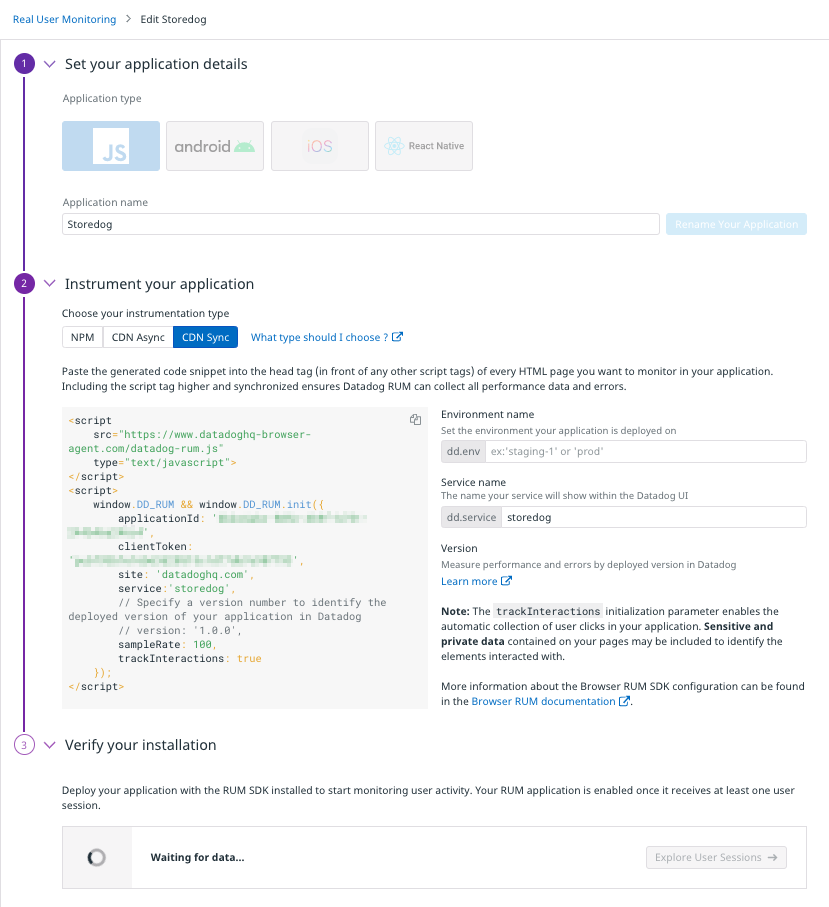

The executive dashboard you're going to create in this lab will depend on data created by users' interaction with the Storedog application. Datadog's Real User Monitoring, or RUM, uses a JavaScript library embedded in web pages to capture user actions and stream them to Datadog. To enable RUM for Storedog, you will do two things:
1. Create a RUM Application in the Datadog App to monitor Storedog user activity
2. Instrument Storedog by adding the Datadog RUM JavaScript library on every Storedog page

After enabling RUM you'll explore Storedog to generate some frontend user events. Then you'll run a couple commands to generate a lot of traffic to Storedog. This will give you plenty of metrics to work with in this course. 
### Create a RUM Application
To collect RUM metrics, you need to define a RUM application in Datadog. This will give create an application id and client token that Storedog will use to send metrics to your organization.

1. Navigate to [UX Monitoring > RUM Applications](https://app.datadoghq.com/rum/list) 
1. Click the **New Application** button
1. Leave the default **Application type** of JavaScript
1. For **Application Name**, enter "Storedog"
1. Select **CDN Sync** for instrumentation type. 
1. Click the **Create New RUM Application** button.

You should see a block of code like this appear:

Make note of the highlighted area containing the `applicationId` and `clientToken`; you will need these soon.
### Instrument Storedog
Each of the RUM JavaScript instrumentation types loads the Datadog library into a web application and configures it to your specification. Storedog is already instrumented using the the CDN Async method. Take a look at how it works:

1. In the lab, click the **IDE** tab above the terminal. It can take a couple minutes to fully load.
1. Open the file `lab/store-frontend-instrumented-fixed/frontend/app/views/spree/layouts/spree_application.html.erb`{{open}}

The second `<script>` block contains code very similar to what you saw in the CDN Async instrumentation code above. Note the environment variables in place of literal application id and client token values. When this template is rendered these variables will be replaced with the actual values found in the Docker container's environment. 

Set these values in the first Terminal of your lab environment (without the `<` and `>` symbols). You can copy them here and then paste them into the terminal to update the placeholders:
`export DD_APPLICATION_ID=<applicationId>`{{copy}}  
`export DD_CLIENT_TOKEN=<clientToken>`{{copy}}  

Docker Compose will copy these environment variables into the frontend service container when it starts up.

Now run this command to start up the Storedog application:

`docker-compose up`{{execute}}

Once Docker Compose has started the Storedog app, you will see a stream of log output in the terminal.

You can interact with the Storedog app by clicking on the Storedog tab. It may take a minute or two to display. If you see a page displaying "Connecting to Port 3000," wait a little while and then refresh your browser.

Shortly after you first load a Storedog page in your browser, take a look at the Storedog RUM application in the Datadog app. Under **Verify your installation**, you should see that the "Waiting for data..." spinner has resolved to "Data is reporting successfully!". It can take a while for this to happen. If it seems to be taking too long, ensure that you have set the environment variables correctly and that you have restarted the Storedog application after doing so.

Keep in mind that you are generating RUM metrics as you interact with Storedog, such as navigation events, click events, resource load times, and more. The more you interact with Storedog, the more RUM metrics you will generate!
### Generate More Metrics
Generate a useful volume of traffic to the Datadog app using the [GoReplay](https://github.com/buger/goreplay) utility:

`./gor --input-file-loop --input-file requests_0.gor --output-http "http://localhost:3000"`{{execute}}

In a few minutes you will see lots of data appear the Datadog app.

## Summary
The purpose of this lab was to show you how to instrument a web application from RUM while also getting familiar with Storedog. You also learned how this lab is automatically generating metrics for use in dashboards later. In future labs, all of this will be done for you so you can focus on the Datadog app.

Click the **Continue** button to start building executive dashboards.