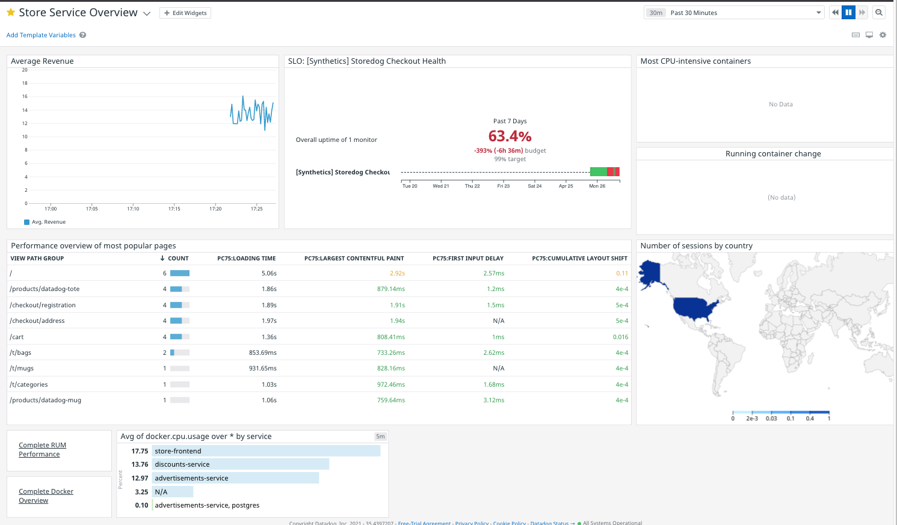

### Executive Dashboard Requirements
The Storedog CEO want's a single dashboard that they can glance at to get a solid view of the business KPIs. They want to see a mixture of revenue, user experience, and systems metrics. Specifically:

  - Average revenue by minute, with some indicator of the $12-$14/minute "sweetspot"
  - An indication of a Service Level Objective of 99% checkout success
  - Frontend performance metrics for the most popular Storedog pages
  - Where visitors are coming from in the world
  - Indication that all service containers are up and running 
  - Which service containers are using the most CPU
  - Quick links to drill down into RUM performance metrics and Docker container health.

When you're done, your Executive Dashboard will look something like this:

Aside from the Storedog-specific revenue graph and checkout SLO, most of these are readily available in pre-made dashboards provided by integrations. You'll start by copying those into a new dashboard. Then you will create the custom revenue metric and a synthetic browser test monitor for the checkout success SLO.

### Copy Preset Widgets

1. Create a new dashboard by clicking on **Dashboards > New Dashboard** in the global navigation.
1. Name your new dashboard "Storedog Executive Dashboard" and click **New Dashboard**.
1. Click the **star icon** to the left of the dashboard title. This will add the dashboard to your Favorites list for quick access. 
1. Find the RUM Performance preset dashboard by clicking on **Dashboards > Dashboard List** and typing "rum perf". Click on the dashboard **Rum - Performance Overview**. If you don't see any data in the graph widgets, visit Storedog by clicking on the **Storedog** tab above the terminal to the right. Click around to generate some RUM metrics.
1. Midway down the left side of the dashboard you will find the **Most viewed pages** section containing a table labeled **Performance overview of most popular pages**. This fits the bill for the frontend performance requirement. Click this widget and type CTRL+C (PC) or CMD+C (Mac). This will copy the widget into your Datadog Clipboard. 

   The first time you do this you will see a dialog telling you a little bit about this handy feature. 
   
   Click the **Done** button and look at the bottom of the dashboard where you'll see the Clipboard indicator. 

   Type CTRL+SHIFT+K (PC), or CMD+SHIFT+K (Mac) to open the clipboard.  You can copy and paste multiple "clips" of different types in and out of the clipboard. To learn more about its capabilities, see the [Datadog Clipboard documentation](https://docs.datadoghq.com/monitors/incident_management/datadog_clipboard/).
1. To find where users are located in the world, look at the **RUM - User Sessions** preset dashboard. Note that you can search for dashboards right in the global navigation! 

   In the lower left corner under **User demographics** you will see a geomap that displays visitor origins by country. Click on that widget and copy it to the clipboard.
1. Next, you can find the two container widgets on the **Docker - Overview** dashboard. In the upper right you will find **Running containers by image**. In the lower left you will find **Most CPU-intensive containers**. Copy both of those to your clipboard.

### Add Preset Widgets
Your clipboard should look something like this: 

You could paste these individually or as a group into the executive dashboard, but there's a shortcut in the clipboard. Click **Select All** and then click the **Add 4 Selected Item To...** dropdown.

Select **Storedog Executive Dashboard**. A notification will appear at the top of the window confirming your action: 

Click the **View Dashbord** link in the notification, or click the favorite link in **Dashboards** global navigation.

Your executive dashboard will look something like this: 

A couple of widgets are empty at the moment. Click the **Continue** button to fix this with template variables.