### Executive Dashboard Requirements
The Storedog CEO wants a single dashboard that they can glance at to get a solid view of the business Key Performance Indicators (KPIs). They want to see a mixture of revenue, user experience, and systems metrics. Specifically:

  - Average revenue by minute, with some indicator that Storedog is generating at least $8 a minute in revenue
  - A summary of a Service Level Objective (SLO): 99% checkout flow success over the past week
  - Frontend performance metrics for the most popular Storedog pages
  - Where visitors are coming from in the world
  - Indication that all service containers are up and running 
  - Which service containers are using the most CPU
  - Quick links to drill down into RUM performance metrics and Docker container health

Additionally, all timeseries widgets should display data from the same time period.

When you're done, your Executive Dashboard will look something like this:

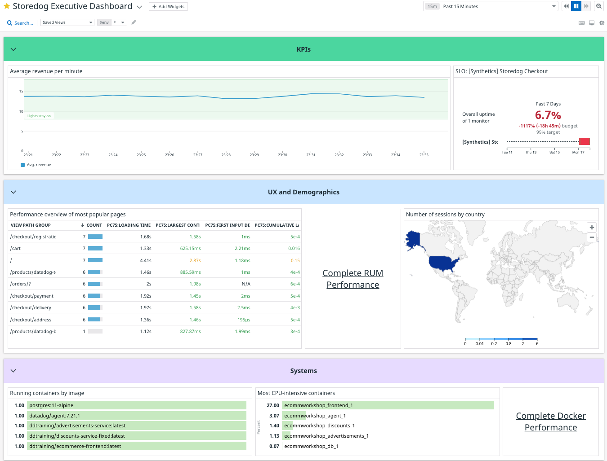

Aside from the Storedog-specific revenue graph and checkout SLO, most of these are readily available in pre-made dashboards provided by integrations. You'll start by copying those into a new dashboard. Then you will create the custom revenue metric and a synthetic browser test monitor for the checkout success SLO.

### Copy Preset Widgets

1. Create a new dashboard using the quick nav menu: type CTRL+K (PC) or CMD+K (macOS) to open the quick nav, then use the DOWN ARROW key to select **New Dashboard**, and hit ENTER.
   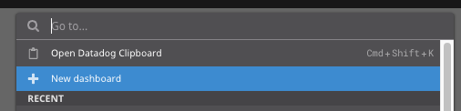
   
   This is equivalent to clicking on **Dashboards > New Dashboard** in the global navigation.
1. Name your new dashboard "Storedog Executive Dashboard" and click **New Dashboard**.
   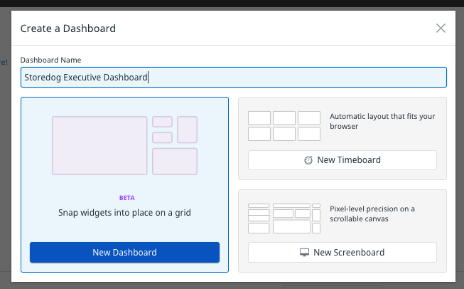

   Note that there are also options for traditional timeboards and screenboards. These will eventually be deprecated, as described in [this blog post](https://www.datadoghq.com/blog/datadog-dashboards/).
1. In the upper-right corner of the dashboard page, click the **High Density Mode** control, and select **Normal Density Mode**:
   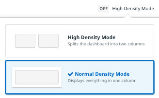

1. Click the **star icon** to the left of the dashboard title. This will add the dashboard to your Favorites list for quick access. 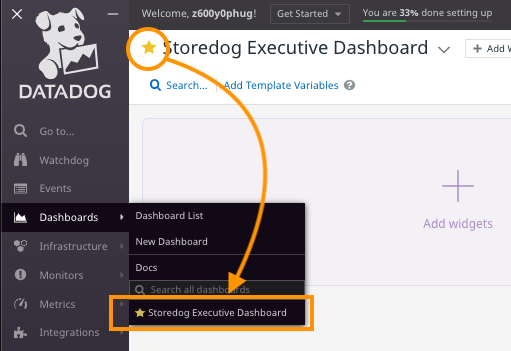
1. Find the RUM Performance preset dashboard by hovering over **Dashboards** in the global navigation and typing "rum perf" in the search field . Click on the dashboard **Rum - Performance Overview**.
   If you don't see any data in the graph widgets, visit Storedog by clicking on the **Storedog** tab above the terminal to the right. Click around to generate some RUM metrics.
1. Midway down the left side of the dashboard you will find the **Most viewed pages** section containing a table labeled **Performance overview of most popular pages**. This fits the bill for the frontend performance requirement. Click this widget and type CTRL+C (PC) or CMD+C (macOS). This will copy the widget into your Datadog Clipboard. 

   The first time you do this you will see a dialog telling you a little bit about this handy feature. 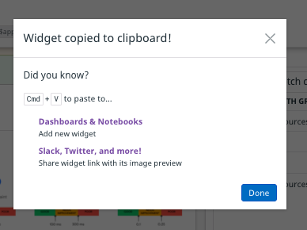
   
   Click the **Done** button and look at the bottom of the dashboard where you'll see the Clipboard indicator. 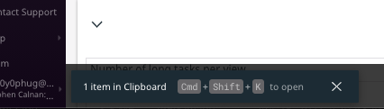

   Type CTRL+SHIFT+K (PC), or CMD+SHIFT+K (macOS) to open the clipboard. 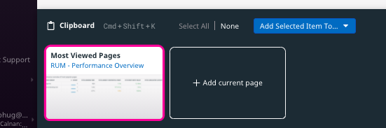 You can copy and paste multiple "clips" of different types in and out of the clipboard. To learn more about its capabilities, see the [Datadog Clipboard documentation](https://docs.datadoghq.com/monitors/incident_management/datadog_clipboard/).
1. To find where users are located in the world, look at the **RUM - User Sessions** preset dashboard. Note that you can search for dashboards right in the global navigation!
   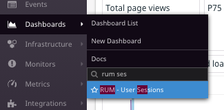

   In the lower left corner under **User demographics** you will see a geomap that displays visitor origins by country. Click on that widget and copy it to the clipboard.
1. Next, you can find the two container widgets on the **Docker - Overview** dashboard.
   If you cannot find this dashboard you may need to install the Docker integration: 
   
   1. Use the quick nav to navigate to the Integrations page. You may see that Docker is detected:

   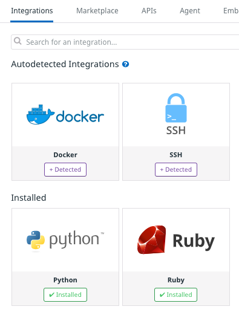

   If you don't see the Docker integration at the top of the page, scroll down to find the integration in the **Available** section.

   1. Click the **Detected** button to open the installation modal window
   1. Click the **Configuration** tab
      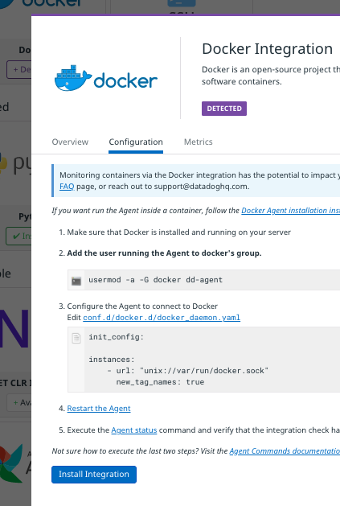
   1. Click the **Install Integration** button at the bottom of the window
   1. You should now be able to find the  **Docker - Overview** dashboard

1. In the upper right you will find the **Running containers by image** top list. (This is different than the nearby **Running containers by image** timeseries bar graph.) If you can't see it, try widening your browser window.

   In the lower left you will find **Most CPU-intensive containers**. Copy both of those to your clipboard.

### Add Preset Widgets
Your clipboard should look something like this: 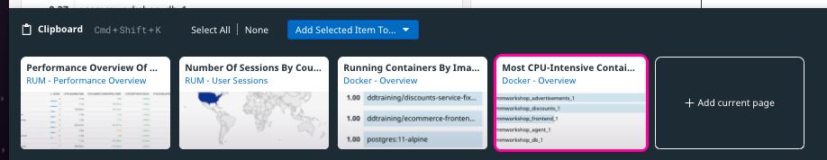

You could paste these individually or as a group into the executive dashboard, but there's a shortcut in the clipboard. Click **Select All** and then click the **Add 4 Selected Items To...** dropdown.

Select **Storedog Executive Dashboard**. A notification will appear at the top of the window confirming your action: 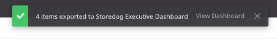

Click the **View Dashbord** link in the notification, or click the favorite link in **Dashboards** global navigation.

Your executive dashboard will look something like this: 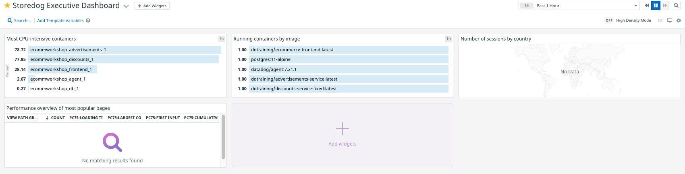

A couple of widgets are empty at the moment. Click the **Continue** button to fix this with template variables.