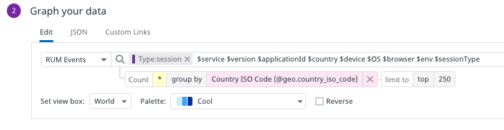
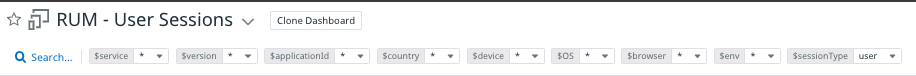
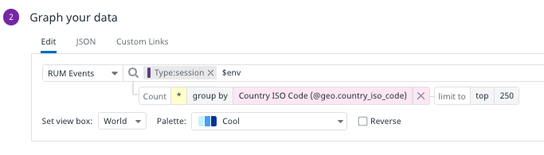
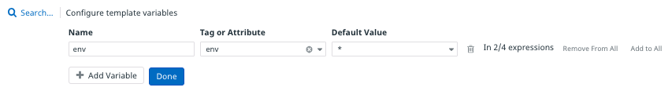

### Template Variables
There are a couple problems with the widgets you copied in the previous step. First, the RUM widgets seem to have lost their data. To find out why, hover over the **Number of sessions by country** widget and click the **pencil icon** to edit the widget. Under **Graph your data**, take a look at the query: 

The search query depends on several template variables, such as `$service`, `$version`, and so on. These variables were set to defaults in their native dashboard, and allowed users to select specific tag values by which to filter the underlying metrics. You can see the variable selectors at the top of the Rum - User Sessions dashboard: 

Storedog is such as small application that this level of filtering is unnecessary. Delete all of the variables except for `$env`. 

Click the **Save** button. 

Just under the dashboard title, click **Add Template Variables**. For **Name**, enter "env".

For **Tag or Attribute**, enter "env" again.  

Click the **Done** button.

Now you can set the dashboard view to either `*`, which will display metrics tagged with any `env` value, or `dd201`, which will display metrics tagged with the `env:dd201`. This is useful if you have used this account for other Learning Center labs with different `env` tag values. A real world use for this variable could be to switch between values tagged with `env:production`, `env:staging`, or `env:development`.

### Global Time
Another issue 

You have copied all of the useful preset widgets for the executive dashboard. Click the **Continue** button below to create a custom revenue metric from log lines.