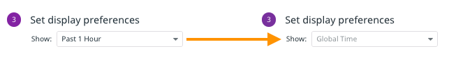

### Template Variables
There are a couple problems with the widgets you copied in the previous step. First, the RUM widgets seem to have lost their data. To find out why, hover over the **Number of sessions by country** widget and click the **pencil icon** to edit the widget. Under **Graph your data**, take a look at the query: 

The search query depends on several template variables, such as `$service`, `$version`, and so on. These variables were set to defaults in their native dashboard, and allowed users to select specific tag values by which to filter the underlying metrics. You can see the variable selectors at the top of the Rum - User Sessions dashboard: 

One option would be to add all of these template variables to the Storedog Executive Dashboard. But Storedog is such as small application that this level of filtering is unnecessary. Instead, delete all of the variables in the geomap query except for `$env`. 

Click the **Save** button. 

Now,  add the `env` template variable to the dashboard. Just under the dashboard title, click **Add Template Variables**. For **Name**, enter "env".

For **Tag or Attribute**, start typing "env" and then select **env** from the filtered list of tags.  

Click the **Done** button.

Now you can set the dashboard view to either `*`, which will display metrics tagged with *any* `env` value, or `dd201`, which will display metrics tagged *only* with `env:dd201`. This is useful if you have used this account for other Learning Center labs with different `env` tag values. A real world use for this variable could be to switch among values tagged with `env:production`, `env:staging`, or `env:development`.

Next, update the **Performance overview of most popular pages** widget to use only the `$env` template var: 

Click the **Save** button.

Finally, update the two Docker widgets. They don't use template variables by default, so in this case you will add `$env` to the **from** field under **Graph your data**:

Note that if you want to add an environment variable to many widgets at the same time, there is a handy **Add to All** option on the far right of the template variable configuration editor.

Click the **Save** button.

Now all of the widgets can easily display metrics from the specific environment selected at the top of the dashboard.

### Global Time
Another issue in this dashboard is that the Docker widgets will show metrics from the past hour, regardless of the time period you select in the global time selector: 

There are situations where this may be desirable, but the CEO wants all of the widgets to display data from the same time period. To achieve this, for each of the Docker widgets:

1. Click the **pencil** icon to edit the widget
1. Under **Set display preferences**, click on the **Show:** select menu and change **Past 1 Hour** to **Global Time** 
1. Click the **Save** button.

Now when you select a time frame in the global time selector, all of the widgets will display data from that time period.

You have copied all of the useful preset widgets for the executive dashboard and synchronized them to the same environment and time period. You can now move on to creating the custom widgets. Click the **Continue** button below to create a custom revenue metric and widget.