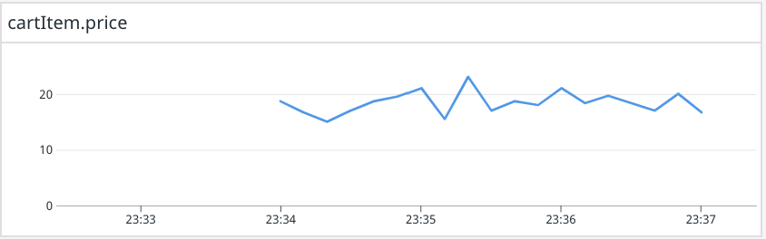
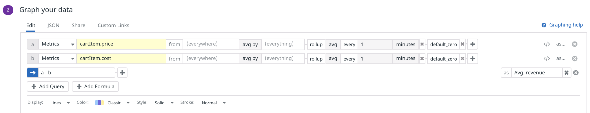
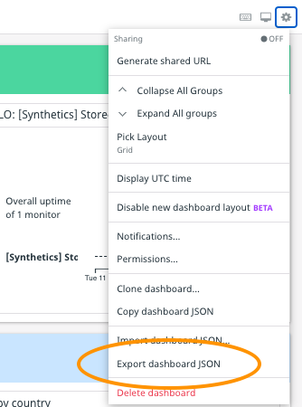

When a customer completes a purchase on Storedog a service called store-cartlogger uses the Datadog API to create a JSON log entry for each item purchased. Here's a formatted example:

```json
{
    "event" : "item_sold",
    "hostname" : "host01",
    "item" : {	
        "cost" : 2.15,
        "id" : "datadog-mug",
        "name" : "Datadog Mug",
        "price" : 13.99
    },
    "service" : "store-cartlogger"
}
```

These log lines contain the amount Storedog paid for the item as `cost`, and the amount Storedog's customer paid for the item as `price`. You can determine the revenue generated by the sale of the item by calculating the difference between these values.

Start by navigating to [Logs Explorer](https://app.datadoghq.com/logs) and searching for `service:store-cartlogger`{{copy}}. You should see several matching log lines. Then, to create the revenue metric:

1. Click on a `store-cartlogger` log line to look at the **Event Attributes**
1. Create a measure on **price** by clicking on it and selecting **Create measure for @item.price**. This will display the **Add facet** dialog:
   
1. Keep the default values and click the **Add** button
1. Repeat the previous two steps for **cost**

Now that you have defined measures on cost and price, Datadog can aggregate those values like any other metric. The next step is to tell Datadog how to aggregate those values:

1. Start by copying your query, `service:store-cartlogger`{{copy}}
1. Navigate to **Logs > Generate Metrics** in the global navigation
1. Click the  **New Metric** button in the upper right corner
1. Under **Define query**, paste your query `service:store-cartlogger`{{copy}}. You will see matching log lines appear in the **PREVIEW** area
1. For **Count**, select `item.price` from the list of measures 
1. In the **Name** field, enter `cartItem.price`
1. The metric configuration should look something like this:
   
1. Click the **Create Metric** button
1. Repeat these steps to generate a metric for `cartItem.cost` as well

Now that you’ve created your metrics for item price and cost you can start configuring a widget to display revenue. You'll start by creating a widget that simply graphs `cartItem.price` over time, and then configure it to display the necessary revenue graph.

1. Hover over the new **cartItem.price** row and click the **See in Metric Explorer** icon that appears to the right. It looks like a graph:
   
1. In the Metric Explorer, select **Past 5 Minutes** in the time selector
1. Within 5 minutes, you should see a graph form:
   
   (You don't need to wait for the graph to appear.)
1. Under **Export these graphs to:** in the lower left corner of the Metrics Explorer, click the **Existing dashboard** button
1. Select **Storedog Executive Dashboard** and click the **Export** button
1. Click the **View dashboard** link in the confirmation modal:
   
1. The new widget should look something like this: 
   

The carItem.price widget needs some more configuration to display the revenue per minute requested by the CEO. One strategy is to take the average `cartItem.price` values rolled-up per minute, and subtract the average `cartItem.cost` values rolled-up by the same minute.

1. Hover over the widget and click the **pencil icon**
1. In the **Graph your data** section, click the **plus icon** at the end of the `cartItem.price` metric query
1. Select **Rollup > Average** 
1. Set the **every** time period fields to `1 minutes`

The default interpolation strategy is "last," meaning that if no data is available for a time period, the graph will repeat the last value received. For this widget, the interpolation strategy should be "zero" because if there are no purchases there is no revenue.

1. Click the **plus icon** at the end of the `cartItem.price` metric query
1. Select **Interpolation > Fill zero**  

Now you will create the same query for `cartItem.cost` and use a formula to subtract the results from the `cartItem.price` results:

1. Click the **Advanced...** link at the far right of the metric query. This will display a **Formula** field, an **Add Query** button, and a **Add Formula** button below the `cartItem.price` query.
1. Click the **Add Query** button. This will replace the **Formula** field with a duplicate of the `cartItem.price` query 
1. Change the Metric value from `cartItem.price` to `cartItem.cost`. You will see second line appear on the graph:
   
   Notice that the two queries are preceded by the letters **a** and **b**. These are references that you can use to construct a formula
1. Click the **Add Formula** button and enter "a - b" in the **Formula** field. This will add a third line to the graph between `cartItem.price` and `cartItem.price.` 
   
   This is the revenue!

This widget almost meets the CEO's requirements. You need to do a little more configuration:

1. The CEO didn't say they wanted to know the price and cost per minute, just the revenue. Click the **a** and **b** labels on the two metric queries to hide them. (Their values are still available to the formula.)
1. As you can see in the above screenshot, when you hover over the revenue line, the entire formula is displayed. To make it clearer what this line represents, click the **as...** link on the far right of the **Formula** field. This will display an **as** field for creating an alias for the formula value
1. Enter "Avg. revenue" in the **as** field. Mouse over the line in the graph to confirm that the label is now human-friendly
1. Confirm that your **Graph your data** section looks like this: 
   

The CEO also wants an indication that Storedog is generating more than $8 per minute. A good indicator might be that everything above 8 on the graph is green:

1. Expand the **Markers** section under the metric queries
1. In the **A** select menu, choose **Range** 
1. For **from**, enter "8". Leave **to** at "infinity"
1. In the **Show as** select menus, choose **ok/green** and **solid**
1. Check the **label** field and enter "Lights stay on"
1. Your **Markers** section should look like this:
   

You should see the upper half of the graph turn light green with "Lights stay on" at **8** on the Y-axis.

Finally, under **Give your graph a title**, enter "Average revenue per minute" and click the **Save** button.

Your executive dashboard should look similar to this 

### Export as JSON

You put so much work into this dashboard that you should keep it. Click the **gear icon** in the upper-right corner and select **Export dashboard JSON**: 


This will download a JSON file to your computer that you can import into any account later.

**NOTE**: You will use this dashboard in other labs in this course. If your two week trial expires before you finish this course, you will have to recreate the dashboard under your next automatically-created trial account. Keep the exported dashboard JSON file safe so you can easily import it if necessary.

Click the **Continue** button to review what you learned in this module.