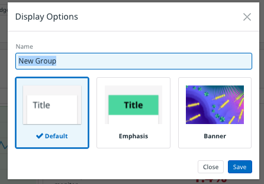
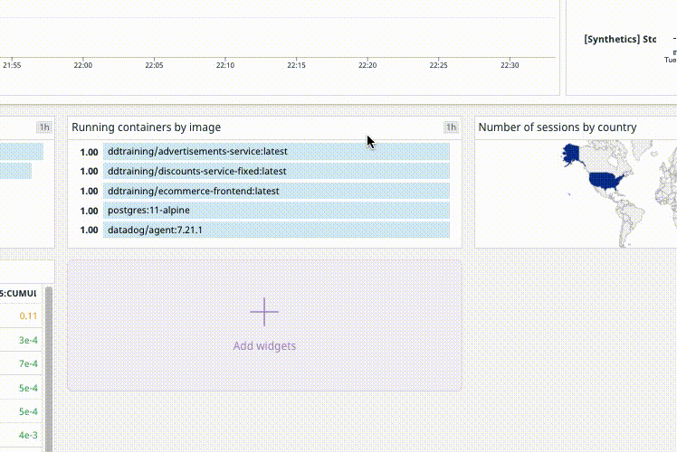
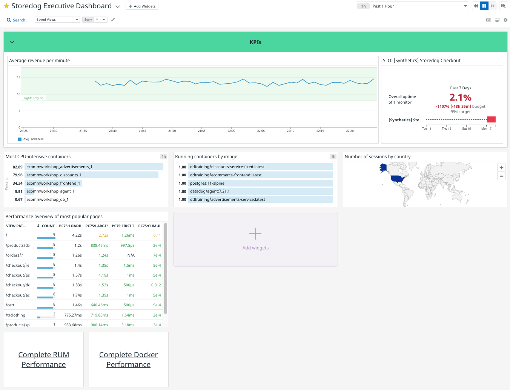
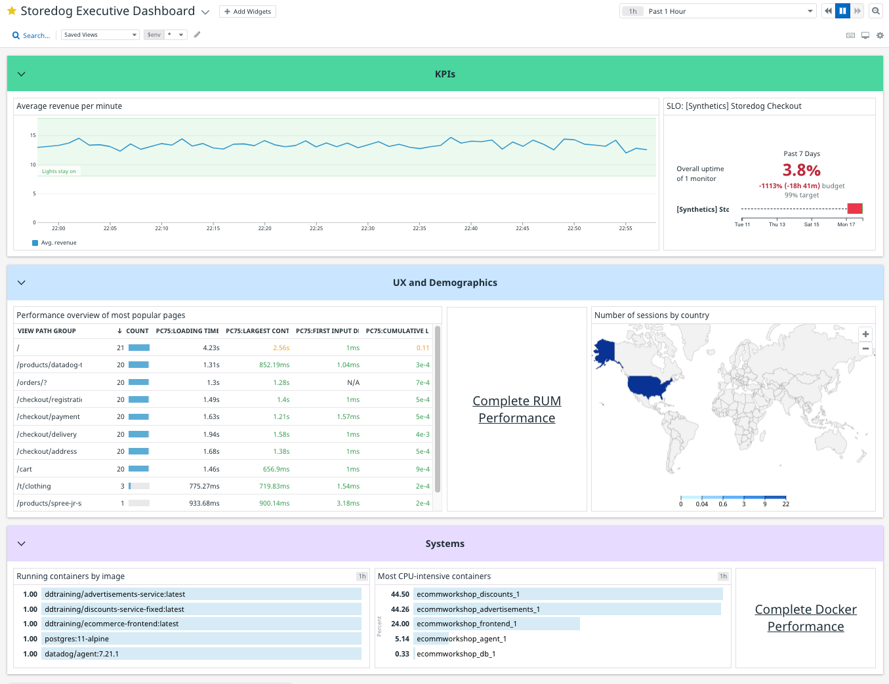
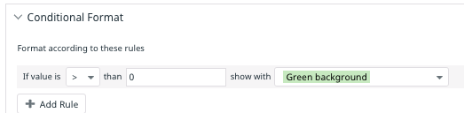
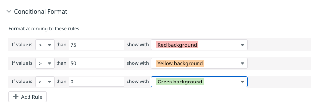
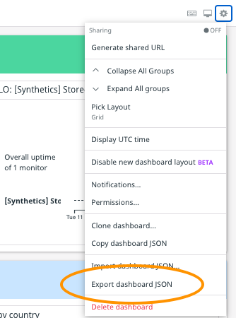

You have composed an executive dashboard that meets all of the CEO's requirements. With a bit more effort you can improve the user experience by grouping related widgets and adding some informative colors.

One way to organize the dashboard would be to group widgets into three categories:

  - KPIs: revenue per minute and checkout SLO
  - User Experience and Demographics: RUM performance overview and sessions geomap
  - Systems: Docker container widgets

Start by grouping **Average revenue per minute** and **SLO: \[Synthetics\] Storedog Checkout**:
1. Click the title bar of Average revenue per minute. You will see a dark blue outline indicating that the widget is selected
1. Hold the SHIFT key and click the title bar of **SLO: \[Synthetics\] Storedog Checkout**. A control panel displaying buttons for **Copy**, **Group**, and **Row** will appear:
   [Copy group and row buttons](./assets/copy_group_row_buttons.png)
1. Click the **Group** button, or type CTRL+G (PC) or CMD+G (macOS)
1. Hover over the group and click **pencil icon** in the upper right corner. This will open a **Display Options** modal for the group
    
1. For **Title**, enter "KPIs"
1. Select the **Emphasis** style
1. Optionally pick a different **Highlight Color**
1. Click the **Save Button**

Widgets can be freely resized and moved around the dashboard. To resize a widget, hover over its lower corners until your cursor turns into a two-pointed arrow. Click and hold a corner while moving the cursor. It will snap to the underlying grid and bump other widgets out of its way:

To move a widget, hover over the title bar until your cursor turns into a four-pointed arrow. Click and hold the title bar while moving the cursor. The widget will snap to the underlying grid and bump other widgets out of the way:

Drag and resize the widgets in the KPIs group so that the revenue widget takes up about 75% of the row, and the SLO widget takes up the rest. Reduce the height of the row a bit, too. Your dashboard should look something like this:

Do the same for the rest of the widgets:
1. Group the **Performance overview of most popular pages**, **Complete RUM Performance**, **Number of sessions by countery** widgets
1. Title this group "UX and Demographics" and place them below the **KPIs** group
1. Resize and move the widgets in the group so they are in a row
1. Group the **Running containers by image**, **Most CPU-intensive containers**, and **Complete Docker Performance** widgets
1. Title this group "Systems" and place them below the **UX and Demographics** group
1. Resize and move the widgets in the group so they are in a row

Your dashboard should now look something like this:

One last thing. It's hard to tell by glancing at the **Systems** widgets whether they're in a good or bad state. It's good if there are 5 containers running, and it's good if CPU usage is under 50 percent. Color code these widgets to indicate their states:

1. Hover over the **Running containers by image** widget and click the **pencil icon** to edit the widget
1. Under **Graph your data**, expand the **Conditional Format** panel
1. Click the **Add Rule** button
1. Enter "0" in the **than** field
1. Confirm that your **Conditional Format** configuration look this:
   
1. Click the **Save** button

Each item in the **Most CPU-intensive containers** top list will have a value between 0 and 100. Using multiple formatting rules, you can apply a range of colors to indicate their statuses:

1. Hover over the **Most CPU-intensive containers** widget and click the **pencil icon** to edit the widget
1. Under **Graph your data**, expand the **Conditional Format** panel
1. Click the **Add Rule** button
1. For the first rule, set **than** to 75, and select **Red background** 
1. Add another rule and set **than** to 50, and select **Yellow background** 
1. Add another rule and set **than** to 0, and select **Green background**
1. Confirm that your **Conditional Format** configuration look this:
   
1. Click the **Save** button

You're done! Your completed executive dashboard should look something like this:

One last thing *for real*. You put so much work into this dashboard that you should keep it. Click the **gear icon** in the upper-right corner and select **Export dashboard JSON**: 

This will download a JSON file to your computer that you can import into any account later.

**NOTE**: You will use this dashboard in the next module in this course. If your two week trial expires between now and then, you will have to recreate it under your next automatically created trial account. Keep the exported dashboard JSON file safe so you can easily import it if necessary.

Click the **Continue** button to review what you learned in this module.