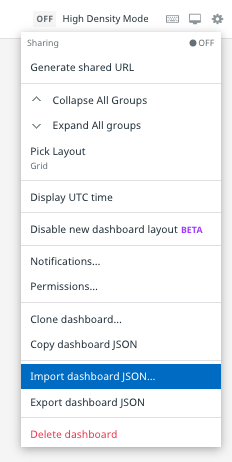
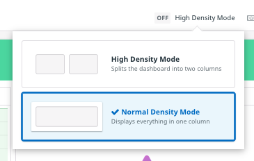

This lab depends upon the RUM application and executive dashboard that you created in the Executive Dashboards module of this course. If you are using the same trial account that you used for that module, you're all set and can click the **Continue** button to get started.

**If that trial account has expired**, go back and recreate the RUM application, being sure to name it "Storedog". If you didn't export the executive dashboard or if you no longer have the JSON file, return to that lab to recreate it.

If you exported the dashboard as JSON at the end of the executive dashboard module, you can import it to your new trial account:

1. In the Datadog app, click on **Dashboards** in the global navigation and select **New Dashboard**
1. Click the **New Dashboard** button
1. Click the **gear icon** in the upper right corner of the new dashboard
1. Select **Import dashboard JSON...**

   

1. Follow the instructions in the modal to import the JSON
1. In the confirmation modal about replacing the existing dashboard, click the **Yes, Replace** button
1. If the dashboard looks strangely organized it could be that high density mode is enabled. If so, click the **High Density Mode** control in the upper right corner of the dashboard and select **Normal Density Mode**:

   

Click the **Continue** button to get started with the Storedog runbook!