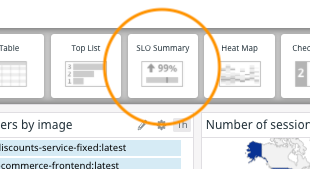

One way to measure the health of the Storedog checkout flow might be to track the proportion of successful checkouts to incomplete checkouts. But it would be difficult to determine if an incomplete checkout was due to an error. The best way to test frontend functionality is with clearly defined and reproducible synthetic browser tests.

You will use a synthetic browser test to monitor the Storedog checkout flow. Once that is up and running, you will create a monitor-based SLO with a target of 99%. You will then add an SLO status widget to the executive dashboard to prominently display the status of the checkout flow SLO.

Note that you must use Chrome for this step, and be able to install the Datadog Recorder extension. You can return to your preferred browser after you record the test.

### Create a Synthetic Browser Test

1. Navigate to **UX Monitoring > Synthetics Tests** in the global navigation
1. If this will be the first synthetic test in your trial account, you will see a welcome screen. Click **Get Started**
1. Choose **New Browser Test**
1. Under **Set your test details**, enter your Storedog URL in the **Starting URL** field: `https://[[HOST_SUBDOMAIN]]-3000-[[KATACODA_HOST]].environments.katacoda.com/`{{copy}}
   Note that if you refresh the this lab in your browser or return to it later, this URL will change. If you have problems running the browser test, make sure that the test **Starting URL** matches the URL above, and that Storedog is still running under that URL
1. For **Name**, enter "Storedog Checkout"
1. Under **Browsers & Devices**, deselect one browser. You can only select 2 browsers at a time in trial accounts
1. Under **Select locations** choose one or two locations from which to run the test
1. Under **Specify test frequency**, select **5 minutes**
1. Under **Define alert conditions**, set the triggering condition to 15 minutes from any 1 location
1. Leave the default values for the remaining fields and click **Save Details & Record Test**

If you don't already have the Datadog Test Recorder Chrome extension installed, the Edit Recording page will tell you to install it. 

#### Install the Chrome extension
1. Click the **Add the Extension** button to open the extension installation page on the Chrome Web Store. 
1. Click **Add to Chrome** 
1. You will see a Chrome dialog asking you to confirm installation. Click **Add extension**
1. Return to the synthetic browser test Edit Recording page, where you should now see Storedog on the right-hand side:

   

#### Record the checkout flow
Now you will record a simple path through the Storedog checkout flow. Datadog will replay your actions when it runs this test:

1. Click the **Start Recording** button in the upper-left hand corner of the Edit Browser Test screen
1. Click on the first product on the Storedog homepage, **Datadog Tote** for $15.99
1. Click the **Add to Cart** button
   **Note:** if the **Add to Cart** button or other functionality doesn't work correctly, click the **Open in Popup** button in the upper-right corner and record the test in that window instead
1. Click the **Checkout** button
1. Under **Checkout as a Guest**, enter "customer@example.com" in the **Email** field and click the **Continue** button
1. Fill out the required **Billing Address** fields with valid values. For example:

   

1. Click **Save and Continue**
1. Leave the default **Shipping Method** and click **Save and Continue**
1. Under **Payment Information**, select **Check** and click **Save and Continue**

#### Create assertions
The criteria for a successful checkout are that the confirmation page has an **Order** number up top, and order total of **$21.79** at the bottom. 

1. Click the **Assertion** button in the upper-left corner of the Edit Browser Test page
1. Click the **Test an element's content** button
1. Click on the **Order XXXXXXXXXX** element
1. Rename **Step Name** to "Test order number"
1. In the **Content** select menu, choose **should match regex**
1. In the **given value:** field, enter the regular expression `Order [A-Z0-9]{10}`{{copy}}
1. Click the **Apply** button

Finally, create a similar assertion for the order total:

1. Click the **Assertion** button in the upper-left corner of the Edit Browser Test page
1. Click the **Test an element's content** button
1. Click on the **$21.79** element to the right of **Order Total:**
1. Rename **Step Name** to "Test order total"
1. The total should have been automatically determined: 

   

1. Click the **Apply** button

Your completed browser test should look like this: 

Click the **Save Launch Test** button.

On the synthetic test details page, scroll down to the **Test Results** section. Results will automatically appear here after a test completes, but you can click the **Refresh** button if you're impatient.

When the results come in, you should see two results under **Test Results** at the very bottom of the page, and **21/21** under **Completed Steps**. 

If your test failed, click on the result to open the test result details to determine which step failed and why. Make sure that Storedog is still up and running at the test's **Starting URL**. If it is, edit the test by clicking on the **gear icon** in the upper-right corner, and reviewing the above steps to make sure your assertions are correct.

Once you're confident your test is dependable, click the **Resume Scheduling** button in the upper-right corner of the page to tell Datadog it can start running it at the configured frequency.

### Create an SLO
Now that you have a working synthetic browser test, create an SLO to set a target success rate of 99% over seven days:

1. Click on **Monitors > New SLO** in the global navigation
1. Under **Define the source**, click **Monitor Based**
1. In the **Search for monitors** select menu, choose **\[Synthetics\] Storedog Checkout**
1. Click the **New Target** button
1. Keep the remaining default values. Your New SLO configuration should look like this:

   

1. Click the **Save & Exit** button

### Add SLO Summary widget
Finally, add the SLO Summary widget for the synthetic test to the executive dashboard:

1. Navigate to the Storedog Executive Dashboard
1. Click the **Add Widgets** button at the top of the dashboard
1. Find the **SLO Summary** widget in the carousel at the top of the dashboard. You may need to click the left or right arrows and the ends of the carousel 

   

1. Click the **SLO Summary** to open the SLO Summary Editor
1. Under **Search and select SLO**, choose **\[Synthetics\] Storedog Checkout**
1. Because the CEO requested to see the SLO status over the past week, leave **7 Days** checked (rather than **Global time**)
1. Confirm that your New SLO Summary widget configuration looks like this:

   

   The monitor will be blank and will display a warning until the synthetic browser tests results start rolling in. Then, when the tests pass, the monitor will look like this:

    

1. Click the **Done** button

This executive dashboard is coming together nicely. There's plenty of space for some extra useful information. Click the **Continue** button to add some drill-downs and notes.
