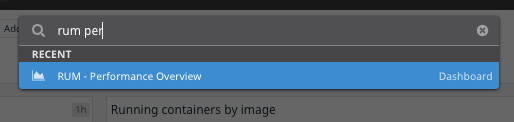
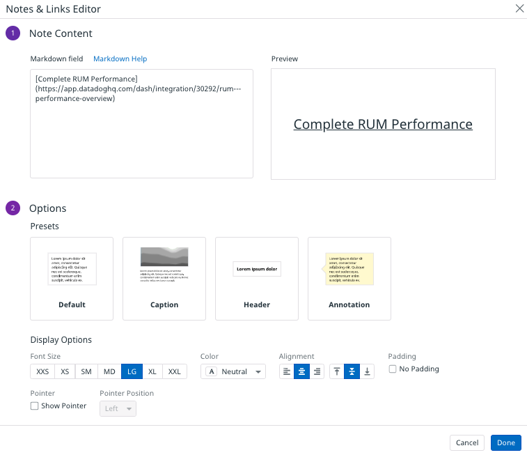
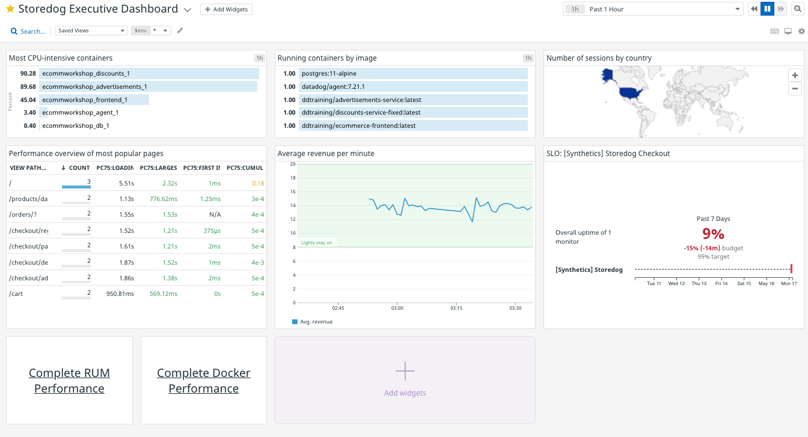

The executive dashboard displays all of the top-level metrics the CEO requested. What if they see something pop up on the dashboard that they want to investigate? Surely they would appreciate having convenient drill-down links to more detailed dashboards at their fingertips. Start with a link to a detailed RUM performance dashboard:

### Add a RUM performance drill-down
1. Navigate to the Storedog Executive Dashboard
1. Type CTRL-K (PC) or CMD-K (macOS) to open the quick nav menu
1. Type "rum perf" until you see **RUM - Performance Overview** dashboard link show up under **RECENT**: 
   
   This is a fast way to revisit areas in Datadog that you've been to recently
1. Right-click **RUM - Performance Overview** and select "Copy Link Address" from the context menu
1. Type ESC to close the quick nav menu
1. Click the **Add Widgets** button to the right of the dashboard title
1. Click the **Notes & Links** widget
1. In the Markdown field, enter the Markdown for a link using the URL you copied from the quick nav menu `[Complete RUM Performance](https://app.datadoghq.com/dash/integration/30292/rum---performance-overview)`{{copy}}
1. Under **Display Options**, for **Font  Size**, select **LG** 
1. For **Alignment**, select the **centered icon** and the **middle icon**
1. Your Notes & Links Editor should look like this:
   
1. Click the **Done** button

### Add a RUM docker overview drill-down
1. Perform the same steps as above for the  **Docker - Overview** dashboard. Use this Markdown: `[Complete Docker Performance](https://app.datadoghq.com/screen/integration/52/docker---overview)`{{copy}}
2. Click the **Close** button to the right of the dashboard title to exit edit mode
3. Confirm that your dashboard looks something like this:
   

Click the **Continue** button to apply some finishing touches to the dashboard.
