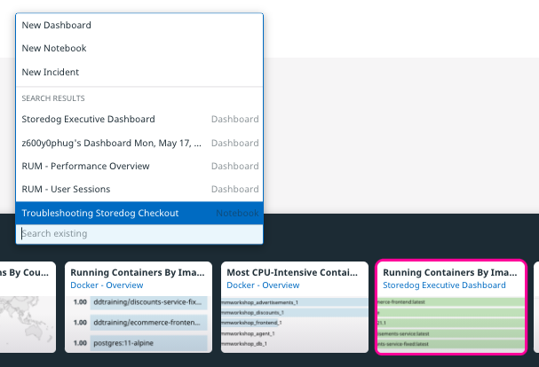
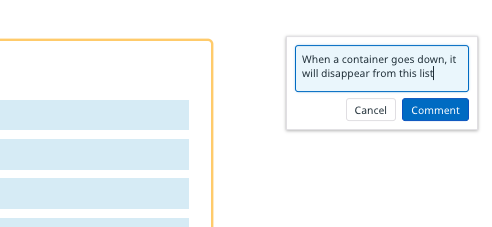
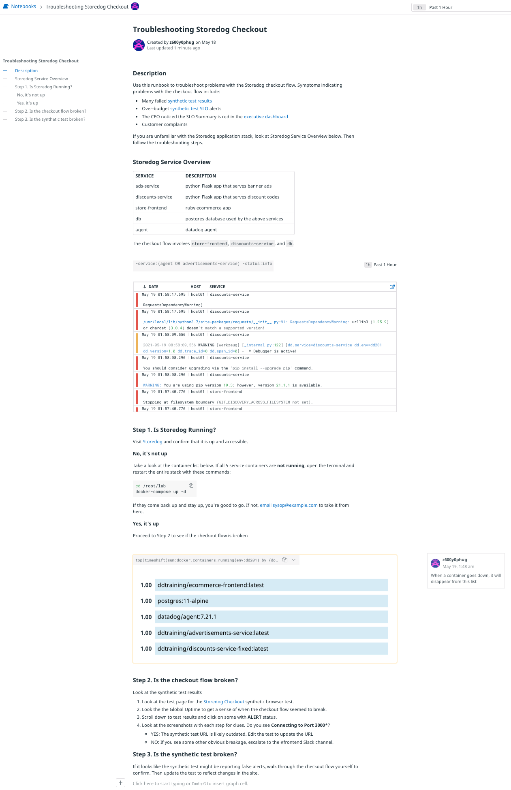
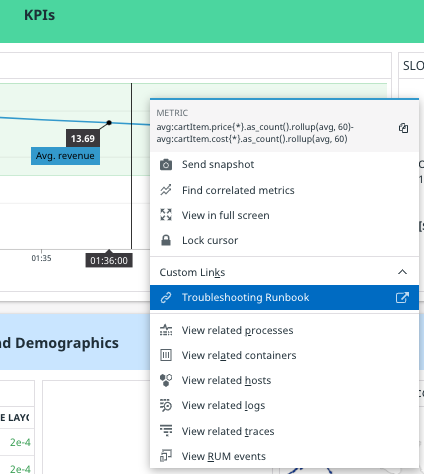

You are going to add some troubleshooting steps to diagnose and fix problems with the Storedog checkout flow. Start with the most common problems and solutions, and then move to less common problems and solutions.

As you navigate around Datadog to collect graphs and links for this runbook, remember that you can get back to the runbook using the quick nav. Type CTRL+K (PC) or CMD+K (macOS) and type "trouble". Then click on the full dashboard title under **RECENT**.

## Is the site running?
1. Type CTRL+M (PC) or CMD+M (macOS) to add a text cell to the runbook. ("M" is for Markdown.)
1. Paste this into the text cell: 
   <pre class="file" data-target="clipboard">
   ## Step 1. Is Storedog Running?
   Visit [Storedog](your-storedog-url) and confirm that it is up and accessible.

   ### No, it's not up
   Take a look at the container list below. If all 5 service containers are **not running**, open the terminal and restart the entire stack with these commands:

   ```bash
   cd /root/lab
   docker-compose up -d
   ```

   If they come back up and stay up, you're good to go. If not, [email sysop@example.com](mailto:sysop@example.com?subject%3DStoredog%20is%20down%26body%3DContainers%20won%27t%20come%20back%20up) to take it from here.

   ### Yes, it's up
   Proceed to Step 2 to see if the checkout flow is broken
   </pre>
1. Replace the **your-storedog-url** with your lab's Storedog URL. 
1. Click the **Done** button

Now add the graph referenced in the troubleshooting step:

1. Type CTRL+SHIFT+K (PC) or CMD+SHIFT+K (macOS) to display your clipboard. If you still have the **Running Containers By Image** widget, select it and then click the **Add Selected Item To...** menu. Click on **Troubleshooting Storedog Checkout**:
   
   The graph will appear at the bottom of the runbook, though it will be empty
1. If the widget is not in your clipboard, navigate to the Storedog Executive Dashboard to copy it, and the perform the above step.

The graph is not displaying anything because it uses template variables, which are not yet available in notebooks. The solution is to replace the template variables with hard-coded values:

1. Hover over the new graph and click the **Edit** button
1. In the query editor, replace `$env` with `env:dd201`
1. Click the **Done** button

The behavior of this top list might not be intuitive for everyone. Annotate it with a comment:

1. Hover over the cell until you see a **speech bubble icon** appear to its right
1. Click the icon and add a comment, `When a container goes down, it will disappear from this list`{{copy}};
   

## Is the checkout flow broken? Or the synthetic test?
1. Add a new text cell to the bottom of the notebook
1. Paste this into the text cell: 
   <pre class="file" data-target="clipboard">
   ## Step 2. Is the checkout flow broken?

   Look at the synthetic test results
   1. Look at the test page for the [Storedog Checkout](synthetic-test-url) synthetic browser test. 
   1. Look the the Global Uptime to get a sense of when the checkout flow seemed to break.
   1. Scroll down to test results and click on some with **ALERT** status.
   1. Look at the screenshots with each step for clues. Do you see **Connecting to Port 3000***?
      - YES: The synthetic test URL is likely outdated. Edit the test to update the URL
      - NO: If you see some other obvious breakage, escalate to the #frontend Slack channel.

   ## Step 3. Is the synthetic test broken? 
   If it looks like the synthetic test might be reporting false alerts, walk through the checkout flow yourself to confirm. Then update the test to reflect changes in the site.
   </pre>
1. Replace the **synthetic-test-url** placeholder with the URL of the Storedog Checkout synthetic test page
1. Click the **Done** button

Notice that the table of contents on the left hand side is based on the Markdown heading levels in text cells, regardless of which cells they are in.

Your runbook should look something like this:


## Link to this runbook
To make it easy for colleagues to find this runbook, link to it from places where symptoms are likely to occur:

### Storedog Checkout SLO
Colleagues may notice that the checkout SLO is over budget. Drop an handy link to the runbook so they can take action:
1. Copy the URL to the runbook
1. Navigate to the \[Synthetics\] Storedog Checkout SLO
1. Hover over the SLO row and click the **pencil icon** to edit it
1. Under **Add name and tags**, enter the following to link to the runbook: `If this SLO drops below 99%, consult the [troubleshooting runbook](link-to-runbook) to investigate and correct.`{{copy}}
    Replace  the **link-to-runbook** placeholder with the URL to the runbook
1. Click the **Save & Exit** button

### Executive Dashboard
Many widgets support Custom Links for quick access to related Datadog resources. Because trouble with the checkout flow would likely affect Storedog's revenue, a link to the runbook from the Storedog Executive Dashboard's **Average revenue per minute** would be useful:
1. Navigate to the Storedog Executive Dashboard
1. Hover over the **Average revenue per minute** widget and click the **gear icon**
1. Click **Create custom links** 
1. Under **Graph your data**, in the **Custom Links** tab, click the **New Custom Link** button
1. Paste the runbook URL into the **URL** field
1. In the **Label** field, enter `Troubleshooting Runbook for {{$env.value}}`{{copy}}
   Note the variables you can use to add query parameters to Datadog URLs. The runbook doesn't use variables, but these would be useful when linking to other dashboards or metrics. Your custom link configuration should look something like this:
   
1. Click the **Done** button
1. Click the **Save** button

Now when you click in the **Average revenue per minute** graph, you will see a handy link to the troubleshooting runbook:


This is a good start for a runbook. Because notebooks are collaborative, this runbook can evolve over time as it is used in the field by different people. Great work! Click on the **Continue** button to review what you have learned in this module.