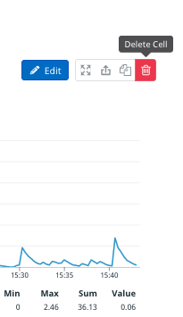
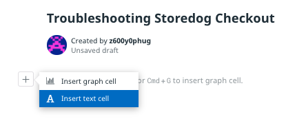

This runbook is going to guide your colleagues through troubleshooting problems with the Storedog checkout flow. You'll start by creating a new notebook and adding some context about the application.

First, a bit of notebook anatomy. A notebook is a column of text and graph cells. Text cells contain Markdown documents. Graph cells contain a subset of Datadog widgets: 

  - Timeseries
  - Top List
  - Heat Map
  - Distribution
  - Log Stream

You can copy any of these widget types from elsewhere in Datadog into a notebook. 

## Create a Notebook
1. Navigate to **Notebooks > New Notebook** in the global navigation. Or, type CTRL+K (PC) or CMD+K (macOS) to open the quick nav and type **new note** and hit ENTER.
1. Your notebook comes with a Timeseries graph by default. Delete this by clicking the trash can in the upper right corner of the cell: 
   
1. Rename the notebook by clicking on the automatically generated title. Enter "Troubleshooting Storedog Checkout"
1. Click the **plus icon** and select **Insert text cell**:
   
1. Add some helpful information about the Storedog stack. Copy the Markdown below and paste it into the new text cell:
   <pre class="file" data-target="clipboard">
   ## Service Overview
   | ---               | ---                                          |           
   | ads-service       | python Flask app that serves banner ads      |
   | discounts-service | python Flask app that serves discount codes  |
   | store-frontend    | ruby ecommerce app                           |
   | db                | postgres database used by the above services | 
   | agent             | datadog agent                                | 
   </pre>

 
## Custom Troubleshooting
Next, let's link to a dashboard that will help debug your service. Since we just added graphs from RUM performance, we can link to the [RUM Performance Overview](https://app.datadoghq.com/screen/integration/30292/rum---performance-overview?live=true) dashboard.
 
This is an out-of-the-box dashboard for real-user-monitoring (RUM) that monitors metrics like page views and frontend errors. We can clone it to make changes.  
 
For our spree services, we know that problems often happen in the production environment with frontend errors. Let’s set our template variable `env` to `prod`. This updates our dashboard URL.  
 
We can link to this dashboard in our runbook and add some context around it. Paste this into your runbook or add your own context:  
 
<pre class="file" data-target="clipboard">
[RUM Performance Overview for Prod](https://app.datadoghq.com/screen/integration/30292/rum---performance-overview?live=true&tpl_var_env=prod)
</pre>
