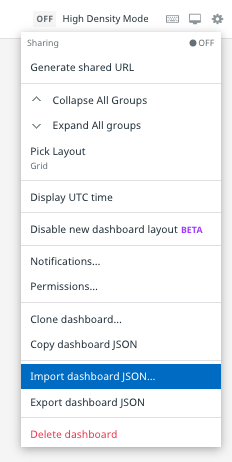
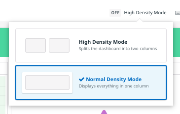

This lab depends upon the synthetic browser test, SLO, and executive dashboard that you created in the Executive Dashboard module of this course. If you are using the same trial account you used for that module, you're all set and can click the **Continue** button to get started.

If you have been reissued a trial account, you will have to recreate those resources.

If you exported the the executive dashboard as JSON, you can import it to your new trial account:

1. In the Datadog app, click on **Dashboards** in the global navigation and select **New Dashboard**
1. Click the **New Dashboard** button
1. Click the **gear icon** in the upper right corner of the new dashboard
1. Select **Import dashboard JSON...**
   
1. Follow the instructions in the modal to import the JSON
1. In the confirmation modal about replacing the existing dashboard, click the **Yes, Replace** button
1. If the dashbord looks strangely organized it could be that high density mode is enabled. If so, click the **High Density Mode** control in the upper right corner of the dashboard and select **Normal Density Mode**:

Now you have the option to go back to the previous module and recreate the synthetic browser test and SLO. You can then update the SLO Summary widget in the Dashboard to reference the new SLO.

You can complete this module without recreating these resources, but your runbook will be markedly less exciting without live data. 😊

Click the **Continue** button to get started with the Storedog runbook!