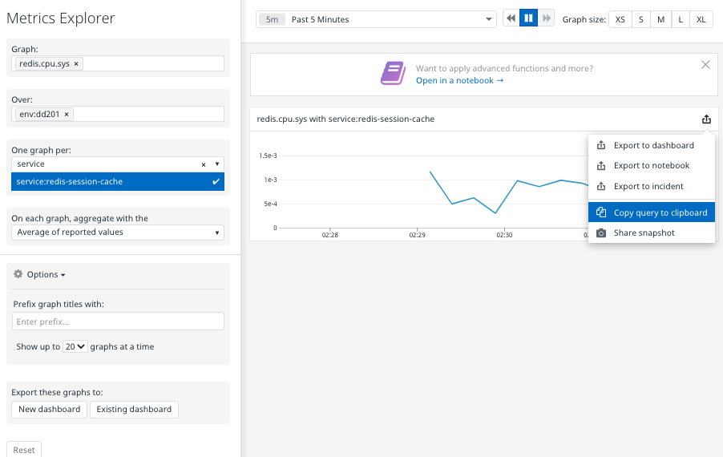
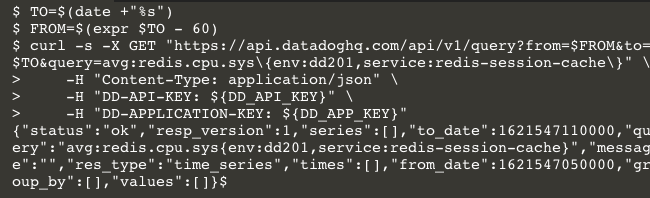
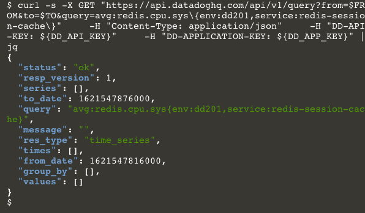
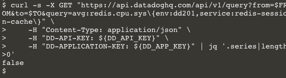
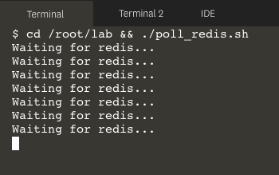
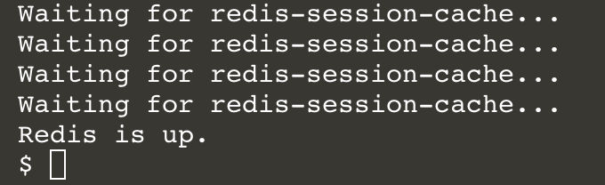
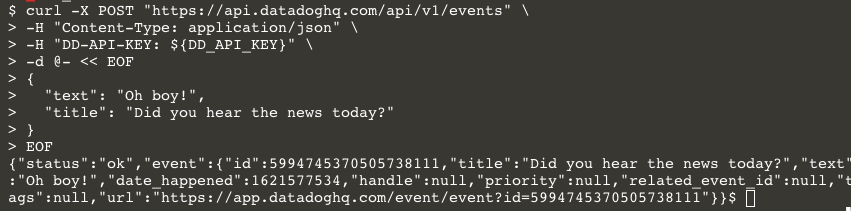
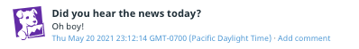
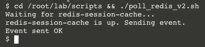
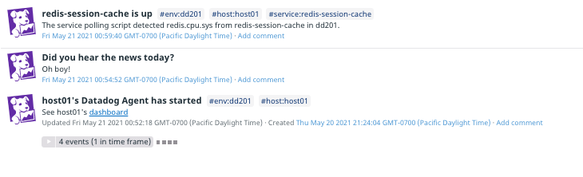

Get familiar with the Datadog API by using cURL to query for metrics and post to the event stream.

This is the architecture of the small Docker web application that you're going to provision and monitor:

| service  | service tag         | description                           |
| ---      | ---                 | ---                                   |
| stately  | stately-app         | a small Python Falcon web application |
| redis    | redis-session-cache | caches users' stately sessions        |
| agent    | agent               | Datadog agent                         |

The environment for this lab is `dd201`.

### Is redis running?
Suppose that it's important for your team to know when a new `redis-session-cache` service comes online.  There are many ways you could answer this question if a Datadog Agent knows about the service. For example, you could look at the Redis - Overview dashboard, search for its tags in recent logs, or look for its container in the Docker Overview dashboard. If you have access to the host it's running on, there are many more ways to find out. 

One way to find out from the comfort of the command line is to use cURL to query the Datadog API. Start by looking at the [API Reference](https://docs.datadoghq.com/api/latest/) for a helpful endpoints.

The Logs endpoint is a candidate, assuming that the service is logging. A better assumption is that the service will send metrics to Datadog through the Datadog Agent. Looking at the Metrics endpoints, [Query timeseries points](https://docs.datadoghq.com/api/latest/metrics/#query-timeseries-points) looks good. It will return an array of metric data points according to the query you specify. 

### Build the API URL
The documentation tells you the HTTP Method, the URL, the required query string parameters, and the response to expect. The URL with placeholders will be:

`https://api.datadoghq.com/api/v1/query?from=$FROM&to=$TO&query=$QUERY`

To determine the query string parameter values, determine what you want from this endpoint.  A good start is, "in the past minute, are there any core redis data points from the service redis-session-cache in the environment dd201?"

The command line utility `date` will help you figure out the UNIX timestamps for `$TO` when you run the command. `$FROM` will be 60 seconds before that.

`$QUERY` is a little tricky if you're new to Datadog metric queries. The main [Metrics documentation](https://docs.datadoghq.com/metrics/#querying-metrics) has a useful section about constructing queries.

The Datadog Metrics Explorer can also help you construct a query, if you know which metric you want. Looking at the **Metrics** tab of the [Redis integration](https://app.datadoghq.com/account/settings#integrations/redis), `redis.cpu.sys` stands out:


If Redis is using system CPU, it's definitely running! Plug the metric name and tags into the Metric Explorer:



(The service was running at the time the screenshot was created to provide a visual confirmation that it works. You won't see a graph because your service isn't running yet.)

You can click the **export icon** in the upper right corner of the graph and select **Copy query to clipboard**, and paste it into a text editor to see it:

`[{"q":"avg:redis.cpu.sys{env:dd201,service:redis-session-cache}","type":"line"}]`

Extracting the value for `q` from that JSON object, you can now assemble your full URL to the Datadog API. `$FROM` and `$TO` will be filled in later:

`https://api.datadoghq.com/api/v1/query?from=$FROM&to=$TO&query=avg:redis.cpu.sys{env:dd201,service:redis-session-cache}`

### Make the request
Scroll down to the **Code Example** in the API documentation for the **Query timeseries points** endpoint. Note the tabs illustrating how to use language libraries to perform requests to this endpoint. This is a useful resource provided for every API endpoint in the documentation. 

Click on the **Curl** tab if it's not already selected. Note that in addition to a URL, the requests requires three HTTP headers: `Content-Type`, `DD-API-KEY`, and `DD-APPLICATION-KEY`. This is true for most API requests, though many do not require the application key header.

The `$DD_API_KEY` and `$DD_APP_KEY` variables are already set in your lab environment, but you will have to set the `$FROM` and `$TO` variables explicitly. Putting it all together:

```
TO=$(date +"%s")
FROM=$(expr $TO - 60)
curl -s -X GET "https://api.datadoghq.com/api/v1/query?from=$FROM&to=$TO&query=avg:redis.cpu.sys\{env:dd201,service:redis-session-cache\}" \
    -H "Content-Type: application/json" \
    -H "DD-API-KEY: ${DD_API_KEY}" \
    -H "DD-APPLICATION-KEY: ${DD_APP_KEY}"
```{{execute}}

Click the above code block to execute it in the terminal. You should receive an informative response:



The response from the API is JSON, formatted for efficiency rather than human readability. You can change that by piping the response to [jq](https://stedolan.github.io/jq/), a JSON processing utility. Recall the command by hitting the up arrow key and add `|jq`{{copy}} to the end of the command. Hit ENTER. You should see a much nicer response: 

```
curl -s -X GET "https://api.datadoghq.com/api/v1/query?from=$FROM&to=$TO&query=avg:redis.cpu.sys\{env:dd201,service:redis-session-cache\}" \
    -H "Content-Type: application/json" \
    -H "DD-API-KEY: ${DD_API_KEY}" \
    -H "DD-APPLICATION-KEY: ${DD_APP_KEY}" | jq
```{{execute}}



The response contains `"status" : "ok"`, so you know that the API received your valid query. According to the API documentation for this endpoint, the metrics should be in the `"series" : []` array, which is empty. That makes sense, because the service isn't running yet. 

### Script it
You could provision the service and then run this script periodically until you see data in the `"series"` array. But you've got more important things to than repeatedly hitting up arrow and ENTER. If you can reduce this output to a boolean value, you can run it in a bash loop until it returns `true`.

In addition to making JSON pretty in the terminal, `jq` can traverse JSON and perform powerful operations on it. The expression to evaluate whether the `series` array has data is `.series|length>0`. Now run the command with this addition:

```
curl -s -X GET "https://api.datadoghq.com/api/v1/query?from=$FROM&to=$TO&query=avg:redis.cpu.sys\{env:dd201,service:redis-session-cache\}" \
    -H "Content-Type: application/json" \
    -H "DD-API-KEY: ${DD_API_KEY}" \
    -H "DD-APPLICATION-KEY: ${DD_APP_KEY}" |jq '.series|length>0'
```{{execute}}



Now you have something a shell script can work with. Writing shell scripts is out of scope for this lab, and often out of scope for one's serenity. Fortunately, it has already been written. Click the IDE tab above the terminal and wait for it to load. Then open the file `lab/scripts/poll_redis.sh`{{open}}

This script runs loops over the same command you just ran. The boolean return value from the `curl` command gets assigned to `$REDIS_UP`. The `while` loop will terminate when `$REDIS_UP` evaluates to `true`. It also pauses for 2 seconds to be kind to the Datadog API endpoint. (Get familiar with the [[Datadog API rate limits](https://docs.datadoghq.com/api/latest/rate-limits/) so you can tune your automated scripts accordingly.)

Click on the first terminal tab and run this shell script: `cd /root/lab/scripts && ./poll_redis.sh`{{execute}}. It will tell you it's waiting for redis-session-cache:



Confirm that it will detect the `redis-session-cache` when it is provisioned and starts sending metrics to Datadog. Click the **Terminal 2** tab to open a new terminal. Then run `cd /root/lab && docker-compose up -d`{{execute}}

Click on the **Terminal** tab and wait for the shell script to inform you that the service is up:



### Post an event
What if this script posted and event when it detected the service? That way anyone in your organization can see it in the [event stream](https://app.datadoghq.com/event/stream). You could even create an [Event Monitor](https://docs.datadoghq.com/monitors/monitor_types/event/) to notify your team when the service comes up.

Consult the [documentation](https://docs.datadoghq.com/api/latest/events/#post-an-event) for the Datadog API's events endpoint, especially the **Curl** code example. Because you're sending information to the API, the method is `POST`. Also, the `DD-APPLICATION-KEY` key header is not required. 

Try it out:

```
curl -X POST "https://api.datadoghq.com/api/v1/events" \
-H "Content-Type: application/json" \
-H "DD-API-KEY: ${DD_API_KEY}" \
-d @- << EOF
{
  "text": "Oh boy!",
  "title": "Did you hear the news today?"
}
EOF
```{{execute}}

You will get a response confirming that the event was created:



Take a look at your [event stream](https://app.datadoghq.com/event/stream) to see the result: 



### Final version of the script
Click on the IDE tab and open the file `lab/scripts/poll_service.sh`{{open}}, which puts everything together.

This script adds the service and environment tags to the event, too, so you can filter it like other resources in your Datadog organization.

It also parameterized the previously hard-coded values to use environment variables for greater flexibility. You could run the same script for different services in different environments.

Return to the first terminal and set those environment variables now:

```
export DD_ENV="dd201"
export DD_SERVICE="redis-session-cache"
export DD_QUERY_METRIC="redis.cpu.sys"
```{{execute}}

Run the script to see it in action. Because your service is still running, it will detect it automatically: `cd /root/lab/scripts && ./poll_service.sh`{{execute}}



And here it is in your stream:



### Conclusion
You should have a good idea of how to interact with the Datadog API, and how you can use cURL in shell scripts to automate some useful actions.

Scripts like these could be part of your provisioning suite, but they don't have to run on the provisioning host. You ran them on the same host here because of the nature of our lab environment. But you could have run them from anywhere that you can make HTTP requests to the Datadog API.

Interacting with the Datadog API at a low level using cURL and shell scripts gives you full access to all of the API's capabilities. In the next lab, you will use Dogshell, which greatly simplifies communicating with the Datadog API.

Click the **Continue** button.