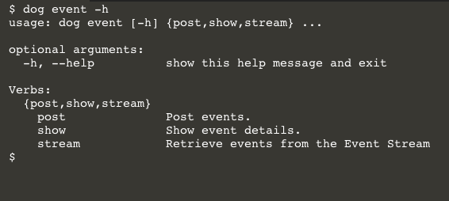
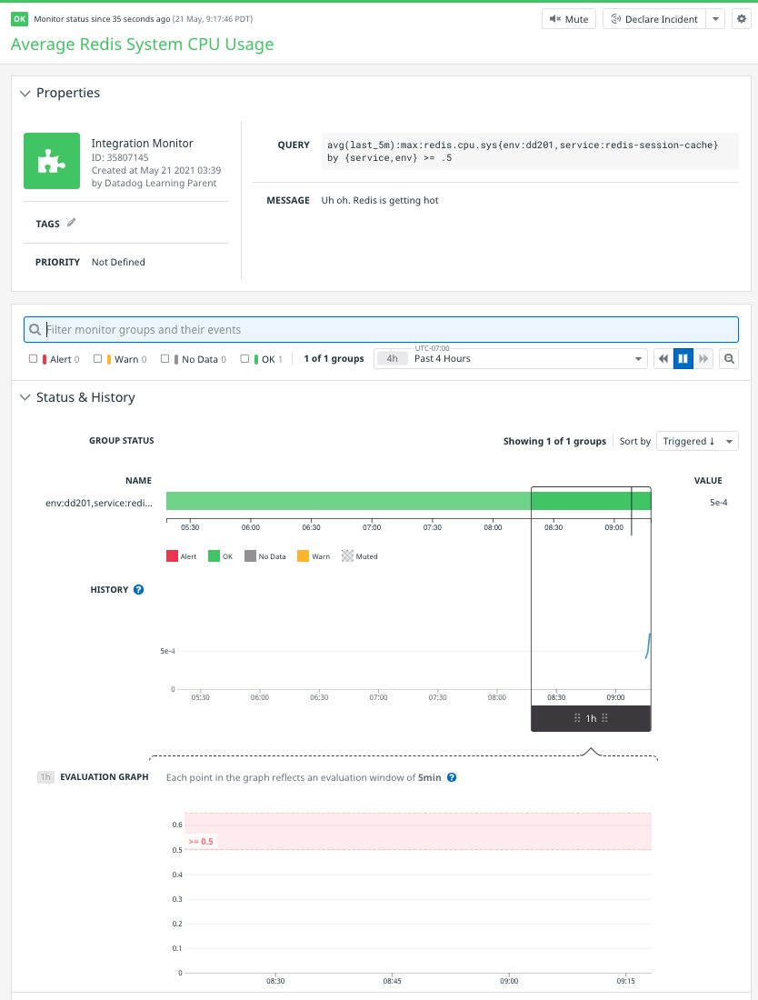

Dogshell is a command line client to the Datadog API. It comes with the Datadog for Python library, which is very easy to install. Run this command in the first terminal:

`pip install datadog`{{execute}}

Now run this command:

`dog -h`{{execute}}

This will show you all of the API operations Dogshell supports. It's a limited set. For example, you can search for metric names, but you can't query for metric values over a timeframe as you did with cURL in the previous step. You can post events quite easily, though. To find out how, run the following command:

`dog event -h`

This shows you helpful information specifically for the event command:



You can drill down through many Dogshell commands this way, adding an `-h` with each new subcommand to learn more about it. Execute this command to see all of the options for posting an event:

`dog event post -h`

Using this information, you can recreate the event from the previous step thusly:

```
dog event post --tags "env:$DD_ENV,service:$DD_SERVICE" \
  --host $(hostname) \
  "$DD_SERVICE is up" \
  "The service polling script detected $DD_QUERY_METRIC from $DD_ENV on $(hostname)"
```{{execute}}

You should see an event like this appear in your event stream:


See if you can create a new metric alert monitor using Dogshell. Start by executing `dogshell monitor post -h`{{execute}} to build the command. Here are the specs:

  - name should be "Redis System CPU Usage"
  - type should be "metric alert"
  - message should be "Uh oh. Redis is getting hot"
  - query is `avg(last_5m):max:redis.cpu.sys{env:dd201,service:redis-session-cache} by {service,env} >= .5`

If Dogshell successfully creates the monitor, you will see a JSON response printed to the terminal.

<details>
  <summary>Click here to reveal the solution</summary>
```
dogshell monitor post --name "Average Redis System CPU Usage" \
  --message "Uh oh. Redis is getting hot" \
  'metric alert' \
  'avg(last_5m):max:redis.cpu.sys{env:dd201,service:redis-session-cache} by {service,env} >= .5'
```
</details>

Here's the new monitor in Datadog:



### Conclusion
Dogshell is a handy utility that would work well for infrequent and one-off tasks. Its convenience and simplicity come at the price of narrower capabilities. Like cURL commands, Dogshell can be automated and even run on your laptop. See the [Dogshell docs](https://docs.datadoghq.com/developers/guide/dogshell-quickly-use-datadog-s-api-from-terminal-shell/) to learn more.

Click the **Continue** button to look at libraries that enable communicating with the Datadog API using with popular programming languages.