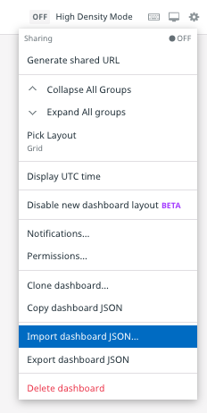
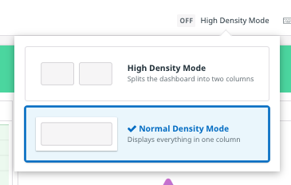

This lab depends upon the RUM application, synthetic browser test, SLO, and executive dashboard that you created in the Executive Dashboards module of this course. If you are using the same trial account that you used for that module, you're all set and can click the **Continue** button to get started.

**If that trial account has expired**, go back and recreate at least the RUM application and the executive dashboard (or import it, as described below). You will have a richer experience if you also recreate the synthetic browser test and the SLO.

If you exported the dashboard as JSON at the end of the executive dashboard module, you can import it to your new trial account:

1. In the Datadog app, click on **Dashboards** in the global navigation and select **New Dashboard**
1. Click the **New Dashboard** button
1. Click the **gear icon** in the upper right corner of the new dashboard
1. Select **Import dashboard JSON...**

   

1. Follow the instructions in the modal to import the JSON
1. In the confirmation modal about replacing the existing dashboard, click the **Yes, Replace** button
1. If the dashbord looks strangely organized it could be that high density mode is enabled. If so, click the **High Density Mode** control in the upper right corner of the dashboard and select **Normal Density Mode**:

The recreated RUM application must be named "Storedog". To sync this lab with the application, restart the lab environment by refreshing this page in your browser.

Click the **Continue** button to get started with the Storedog runbook!