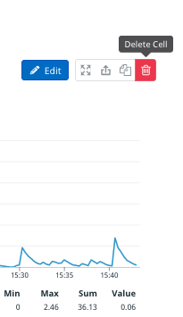
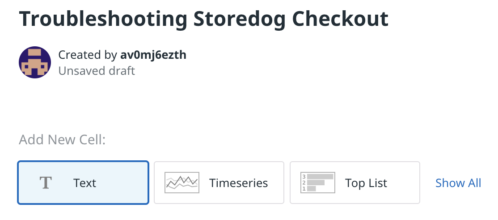
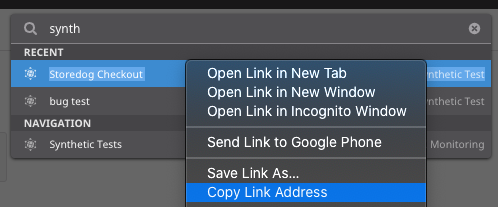
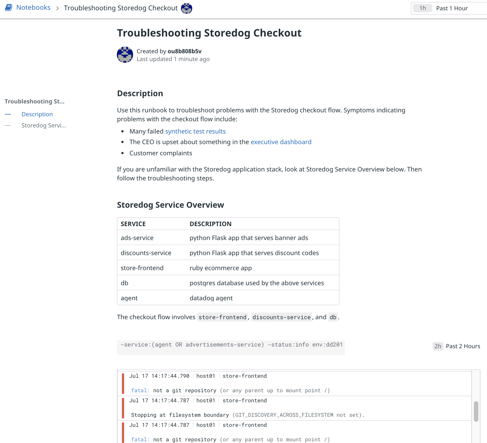

This runbook is going to guide your colleagues through troubleshooting problems with the Storedog checkout flow. You'll start by creating a new notebook and adding some context about the application.

First, a bit of notebook anatomy. A notebook is a column of text and graph cells. Text cells contain Markdown documents. Graph cells contain one of these Datadog widgets: 

  - Timeseries
  - Top List
  - Heat Map
  - Distribution
  - Log Stream

You can copy any of these widget types from elsewhere in Datadog into a notebook. 

## Create a Notebook
1. Navigate to **Notebooks > New Notebook** in the global navigation. Or, type CTRL+K (PC) or CMD+K (macOS) to open the quick nav and type **new note** and hit ENTER.
1. Your notebook comes with a Timeseries graph by default. Delete this by clicking the trash can in the upper right corner of the cell: 

   

1. Rename the notebook by clicking on the automatically generated title. Enter "Troubleshooting Storedog Checkout"

## Add a description
1. Click the **Text button** to add a new text cell:

  

1. Copy the following Markdown add paste it into the text cell:
   <pre class="file" data-target="clipboard">
   ## Description
   Use this runbook to troubleshoot problems with the Storedog checkout flow. Symptoms indicating problems with the checkout flow include:

   - Many failed [synthetic test results](link-to-resource)
   - The CEO is upset about something in the [executive dashboard](link-to-resource)
   - Customer complaints

   If you are unfamiliar with the Storedog application stack, look at Storedog Service Overview below.
   Then follow the troubleshooting steps.
   </pre>
1. Don't hit **Done** yet; you're going to replace the URLs in those links in a moment.

## Link to drill-down resources
The description links to many useful resources for drilling down into more information. For each one, replace the **link-to-resource** placeholder with the resource's URL. You can use the quick nav to copy some URLs without leaving the runbook:

1. To get the URL to the synthetic test results, type CTRL+K (PC) or CMD+K (macOS), and type "synth"
1. The **Storedog Checkout** synthetic test should appear under **RECENT**
1. Right-click **Storedog Checkout** and select **Copy Link Address** in your system's contextual menu:

   

1. Select the first **link-to-resource** placeholder
1. Type CTRL+V (PC) or CMD+V (macOS) to paste the URL over the placeholder
1. Repeat this process for the executive dashboard, typing "exec" into the quick nav
1. If at any point the text cell exits edit mode before you're done, hover over the text cell and click the **Edit** button
1. Type ESC or click the **Done** button to save the text cell

## Add some context
The lucky engineer who will use this runbook to troubleshoot the Storedog checkout might not be an expert on the application. It's a good idea to add some context to help them understand the application infrastructure they're working with.

1. Insert a new text cell.
1. Add some helpful information about the Storedog stack. Copy the Markdown below and paste it into the new text cell:
   <pre class="file" data-target="clipboard">
   ## Storedog Service Overview

   | service           | description                                  |
   | ---               | ---                                          |           
   | ads-service       | python Flask app that serves banner ads      |
   | discounts-service | python Flask app that serves discount codes  |
   | store-frontend    | ruby ecommerce app                           |
   | db                | postgres database used by the above services | 
   | agent             | datadog agent                                | 

   The checkout flow involves `store-frontend`, `discounts-service`, and `db`.
   </pre>
1. Click the **Done** button.

It would be useful to have a log stream here that displays warnings and errors for the services associated with the checkout flow:

1. Type CTRL+G (PC) or CMD+G (macOS) to add a graph cell
1. In the graph type select menu, choose **Log Stream**
1. Click the **</>** icon to enter query edit mode
1. Paste this log query into the query field, which display log lines of warning-level or above for critical services: `-service:(agent OR advertisements-service) -status:info env:dd201`{{copy}}
1. Click the **Done** button
1. Click **Save Notebook** at the top of the page

Your runbook should look something like this:

You have added a good amount of background information and context to the runbook. Click the **Continue** button add specific troubleshooting steps.
