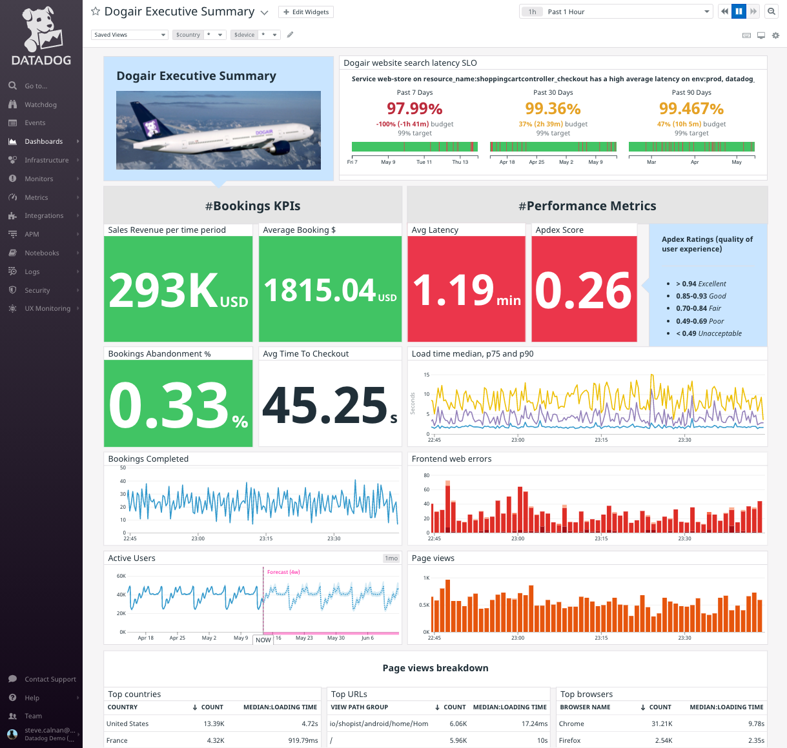
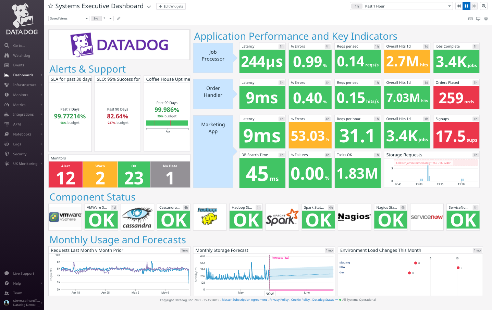

A dashboard connected to real-time data is a powerful tool for guiding conversations with managers and executives. A good executive dashboard can show that you are working on the most important things, how much a service is costing you, or whether you’re progressing toward goals, meeting your SLOs, and scaling effectively. Executive dashboards are most effective when they answer these questions at the highest level and are interconnected to drill down into the answer.

Here is an example executive dashboard for an e-commerce site that displays a mix of revenue, user experience, and traffic metrics:

A glance at this dashboard provides valuable information about how the site frontend is performing. It answers questions such as:

  - Are the business KPIs on track at the moment? Yes, all those **Booking KPIs** blocks are green
  - How are business KPIs trending? Pretty good, as there are no anomalous negative events or trends in the **Bookings Completed** or **Active Users** time series graphs
  - What's the user experience for customers at the moment? Bad! The **Avg Latency** is red and the **Apdex Score** is **Unacceptable**
  - How long has this been happening? The **Load time median, p75 and p90** graph indicates at least an hour consistently
  - Why is this happening? There is a very high number of **Frontend web errors** during this period that is worth investigating

What to do with this information is up to the executive. They have good data readily available to make decisions with confidence.

Here is an executive dashboard that focuses on systems performance metrics:

A glance at this dashboard provides valuable information about how three applications are performing. With the exception of **Orders Placed** and **Signups**, this dashboard provides little insight into business level metrics. It answers questions such as:

  - How are the applications doing? Generally very good, except for the warning about errors in the Marketing App. The business-level metrics for the Order Handler and Marketing app are at alert level, but there is no obvious correlation with systems metrics.
  - How are the underlying services doing? Great. All are green and OK.
  - What about the 35 monitors? Disturbing. 12 are in alert state and should be investigated.

Each of the widgets under **Alerts & Support** links to the relevant SLO or monitor in Datadog for quickly diving in to the underlying data.

Consider your organization's KPIs and SLOs. What high-level metrics and indicators could you assemble into an executive dashboard? What metrics and indicators would be useful for an executive view of your business unit?

Creating Executive Dashboards
---

Executive dashboards needn't be built from scratch. You can clone any of Datadog's pre-made dashboards and customize them to fit your use case. You can even cherry-pick specific graphs and views from all across Datadog to include in your Executive dashboard. You can then fill in the gaps with custom widgets that answer your executive-level questions.

In the following lab, you're going to use a variety of techniques to create an executive dashboard for the storedog e-commerce web site. 

Once you have composed a dashboard from out-of-the-box dashboards and graphs, you will tailor it for Storedog's executives. You will learn how to:

  - Add custom revenue metrics from log lines
  - Create a Synthetic Test and add its monitor
  - Create and add an SLO
  - Add advanced queries
  - Use color and markers to enhance visualizations

Click the **Next** button below to get started.

