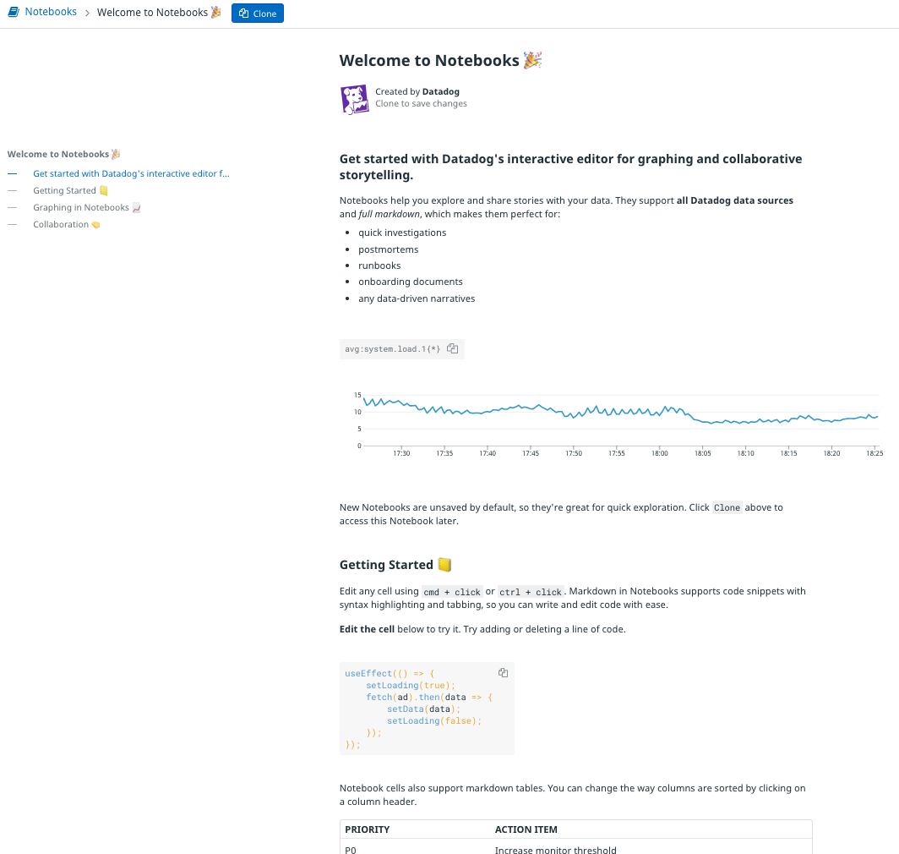
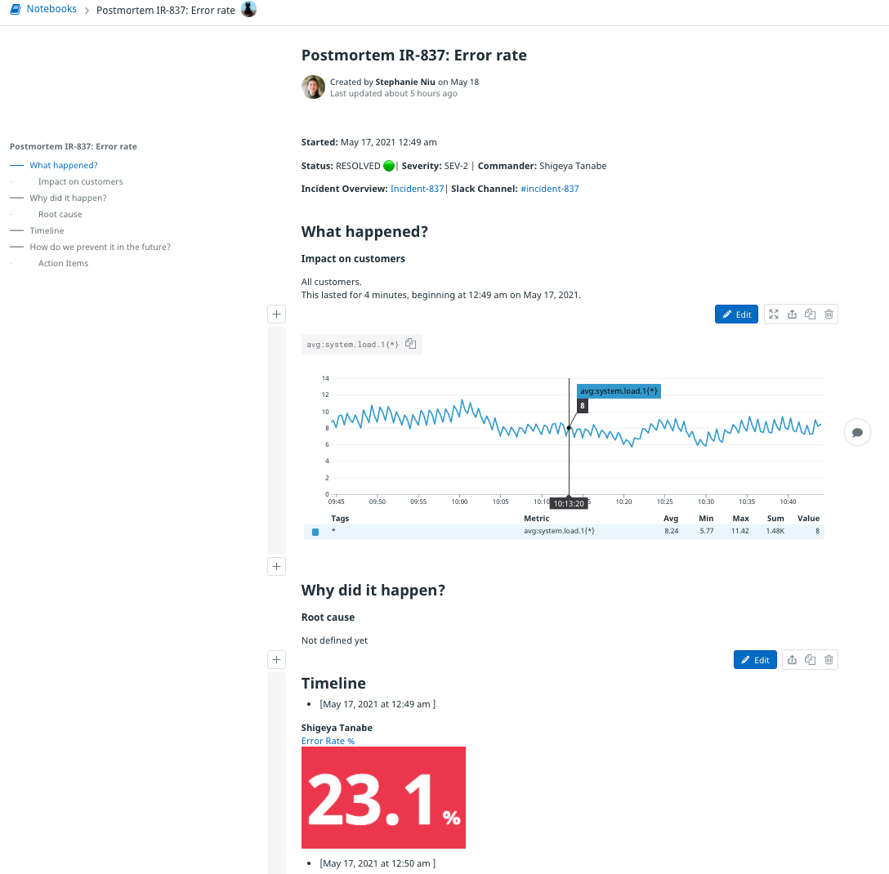
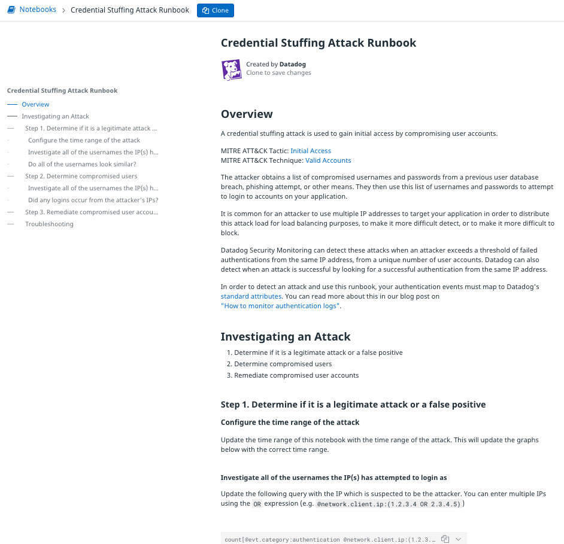

## Notebooks
Notebooks allow you to collect knowledge, links, images, and almost any Datadog widget, graph, or log into a single place. Notebooks help you build collaborative, living documentation that is tied directly to the resources you monitor with Datadog. 

Datadog provides interactive tutorials that demonstrate the features of notebooks. If you're new to notebooks, explore the [Welcome to Notebooks](https://app.datadoghq.com/notebook/template/1/welcome-to-notebooks-%F0%9F%8E%89) notebook, pictured below:

### Incidents and postmortems
Notebooks are powerful tools for incident management. They enable multiple people to communicate about an incident as it unfolds and document resolution efforts in [real time](https://docs.datadoghq.com/notebooks/#live-collaboration).

When an incident has been resolved, you can automatically create a postmortem notebook.  Take a look at the [Datadog Postmortem Template](https://app.datadoghq.com/notebook/template/7/postmortem-ir-xxxx-outage-name) notebook to get a sense of the information and data typically captured in a postmortem.

Here's an example of a postmortem notebook that is linked to an incident:

See the [incident management documentation](https://docs.datadoghq.com/monitors/incident_management/#update-the-incident-and-generate-a-postmortem) for more information about using notebooks in this context.

### Runbooks
Like postmortems, runbooks are special-purpose notebooks. They help members of your team respond to issues by providing them with detailed instructions and historical context. They are like incident-specific troubleshooting manuals based on past experience.  

Here's an example of a runbook to investgate a credential stuffing attack:

You can look at this runbook in your own Datadog account with [this link to the template](https://app.datadoghq.com/notebook/template/4/credential-stuffing-attack-runbook).

## Storedog runbook
In the following lab, you're going to create a runbook for investigating and fixing issues with the Storedog checkout flow. You will:

  - Create a new notebook 
  - Copy the SLO summary widget from the previous module into the notebook
  - Add a table listing the most recent synthetic browser test results that the SLO monitors
  - Enumerate troubleshooting steps
  - Describe a common mitigation strategy
  - Link to to the runbook from the SLO and the executive dashboard

When you're done your runbook will look like this: 

### Prerequisites
This module depends on the executive dashboard, synthetic browser test, and SLO that you created in the previous [Executive Dashboards]() module. If it has been a while since you completed the previous module, your 2-week trial account may have expired. If you exported your dashboard as recommended at the end of the module, you can import it into your new trial account. However, you will need to recreate the synthetic browser test and SLO.

Click the **Next** button to get started.
