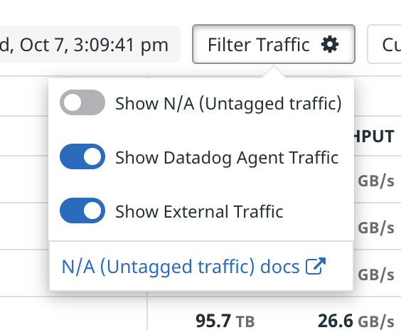
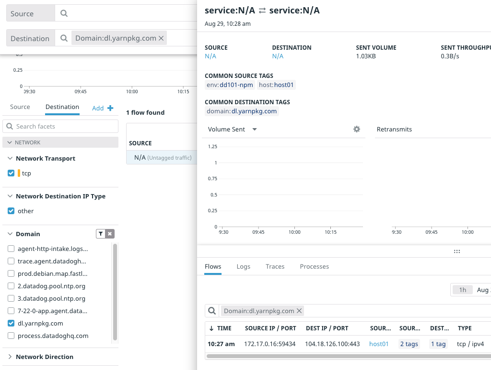
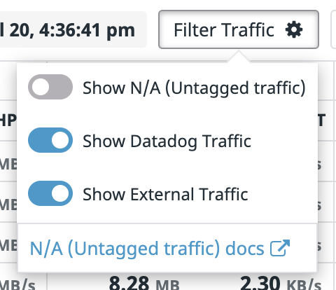
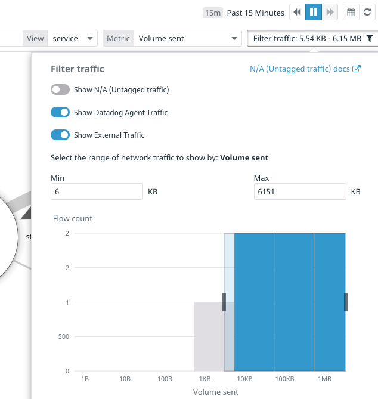

# Explore the Application

Once you see "Provisioning Complete" in the terminal, click the **Storedog** tab to the right of the IDE tab. This will open the application in a new browser window. It will take a little while for the first page to load. When it does, click around to get familiar with this e-commerce shop. Feel free to add items to your shopping cart and treat it like a real online store.

You may run into errors, such as `Net::OpenTimeout in Spree::HomeController#index`. This is a problem we're going to troubleshoot later!

Since you started this lab a background process has been automatically making requests to the Storedog app. Between this traffic and the traffic you created while clicking around Storedog, we should have a good amount of network traffic to look at in the Datadog App.

# Observe the Network Metrics

Log in the the [Datadog App](https://app.datadoghq.com/) and select **Infrastructure > Network** from the global navigation. You will probably see the Discover Network Performance Monitoring introductory screen. This page is displayed until the first NPM data is process by Datadog, which can take up to 15 minutes. Note that you should not refresh this page to see if NPM data is available; click on the **Infrastructure > Network** menu item to check for updates.

Here you'll see network *flows* that Datadog has detected between the application services. A flow is a network connection between any two tagged objects--from services to availability zones, or from Kubernetes pods to security groups. 

@todo screenshot

The data represented in this page are updated every 5 minutes. *If you don't see anything yet, you may need to wait until the next update.* This would be a good time to read the Datadog [documentation about the Network Page](https://docs.datadoghq.com/network_performance_monitoring/network_page/).

For our Storedog application, you should see four flows between `advertisements-service`, `store-frontend`, and `discounts-service`. Each flow represents the network communication among these services where one is the Source, and another is the Destination. 

You may see flows where the source and destination are **N/A**. This represents traffic to or from an "untagged" resource, which is a client or server that is not running the Datadog Agent. In our case, this includes the GoReplay script running on the Docker host and your Storedog browser activity routed through the lab network. You can hide or display untagged traffic using the **Show N/A (Untagged traffic)** toggle in the **Filter Traffic** settings menu.

NPM can provide details of network traffic that is untagged. Expand the **Domain** facet to the left of the flow table and you'll see all the domains that NPM was able to resolve during the current time period. If you click on one of the domains, the flow table will filter the related flows. You can then click on the flow to see details about that flow.

You can hide untagged traffic by clicking on the **Filter Traffic** button, and turning off **Show N/A**. 

To visualize these flows, navigate to **Infrastructure > Network Map**. This is a diagram of the same flows, where each service's size is scaled relative to the volume of network traffic it has sent. The connections between each service are also scaled to indicate what proportion of that volume was sent to each destination.

You can choose other metrics to scale the diagram using the **Metric** field in the upper-right hand corner. Select some other metrics to see how they affect the diagram, and what that diagram tells you about the application.

You can filter traffic on the Netowrk Map page by clicking the filter button in the upper-right corner. In addition to filtering based on traffic type, you can also set the range of the chosen metric that is displayed.

In the next step, we'll create some network problems and see how they appear on the Network page.

