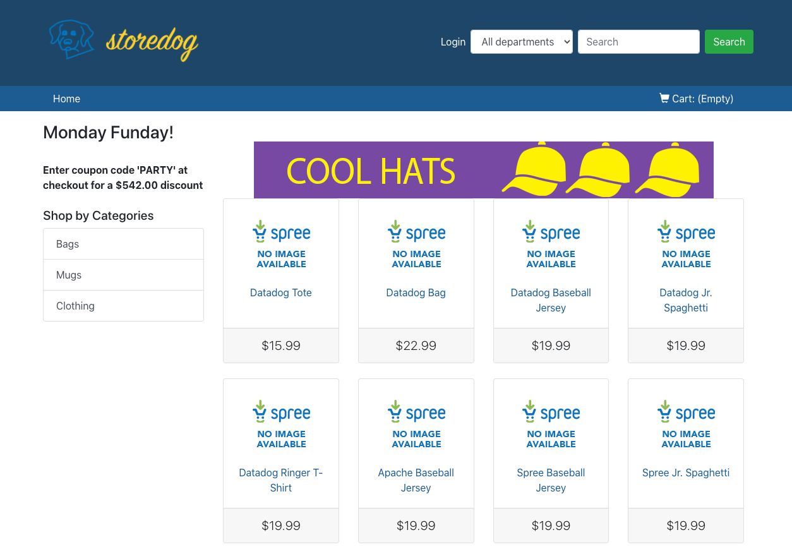
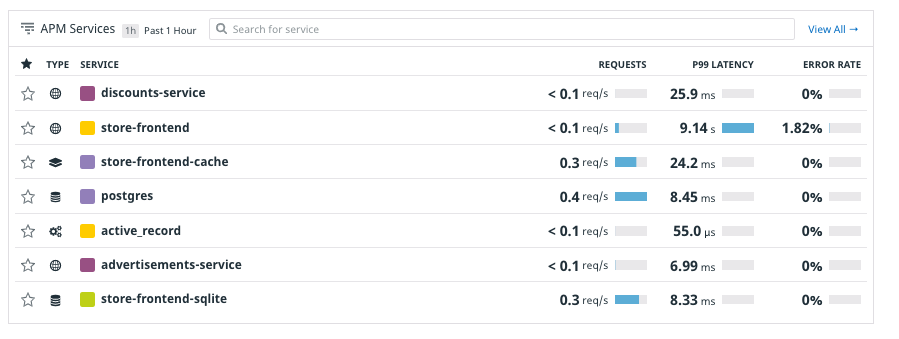
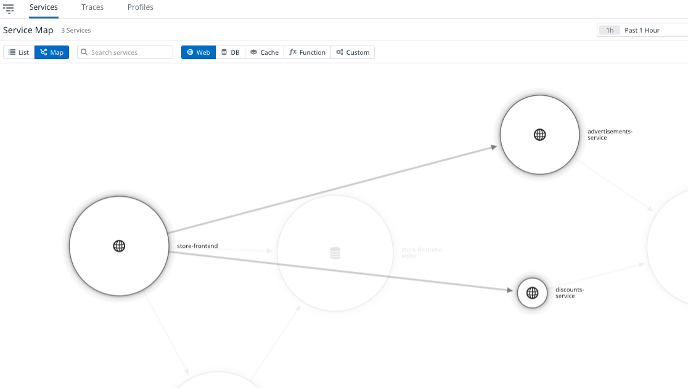
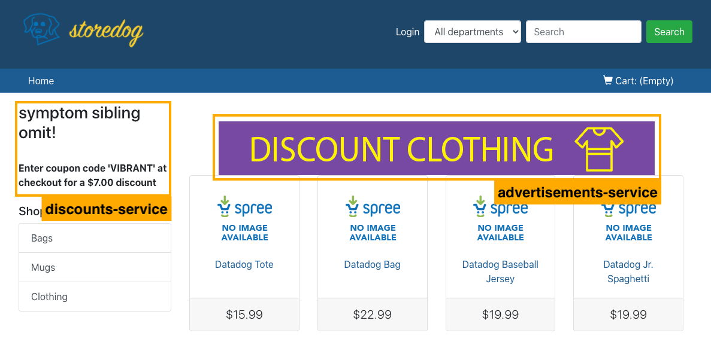

# The Storedog Application
In this Lab, you'll write Synthetic tests for Storedog, a basic, containerized e-commerce application running with Docker Compose. The lab is automatically provisioning the application, and you'll know that it's ready when you see "Provisioning Complete" in the terminal. You should also see the trial Datadog credentials the lab created for you in the terminal. Copy the username and password somewhere handy because' you'll need them shortly. You can display these credentials any time by entering the command `creds`{{execute}} in the terminal.

When provisioning is complete, you can click on the **Storedog** tab above the terminal to interact with the application. 

Click around Storedog as you would with a real e-commerce site. You can even add items to your shopping cart and check out, but Storedog won't actually ship you anything or charge your credit card. While you're getting familiar with the application the Datadog Agent container is sending metrics to Datadog.

## Datadog Metrics

Log in to [Datadog](https://app.datadoghq.com) using the trial credentials the lab created for you. You will see the Application Performance Monitoring (APM) Services page listing all of the services the Datadog Agent is reporting from the lab. 

To see how these services interact with each other, navigate to APM > Service Map. By filtering **Web** services, you can see that store-frontend communicates with advertisements-service and discounts-service. 

Storedog's frontend-service runs the web application. It makes requests to discounts-service to display promotional coupon codes to shoppers. It also uses this service to validate coupon codes that shoppers use during checkout. frontend-service makes requests to advertisements-service to display product ads on the home page and on product pages. You can see a coupon code and an advertisement outlined in this screenshot:

