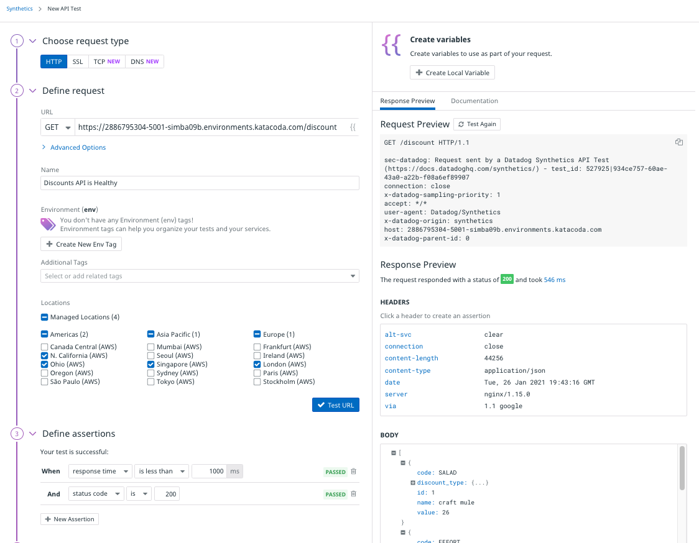
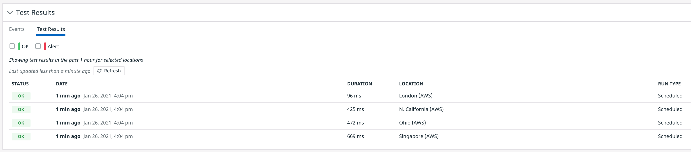
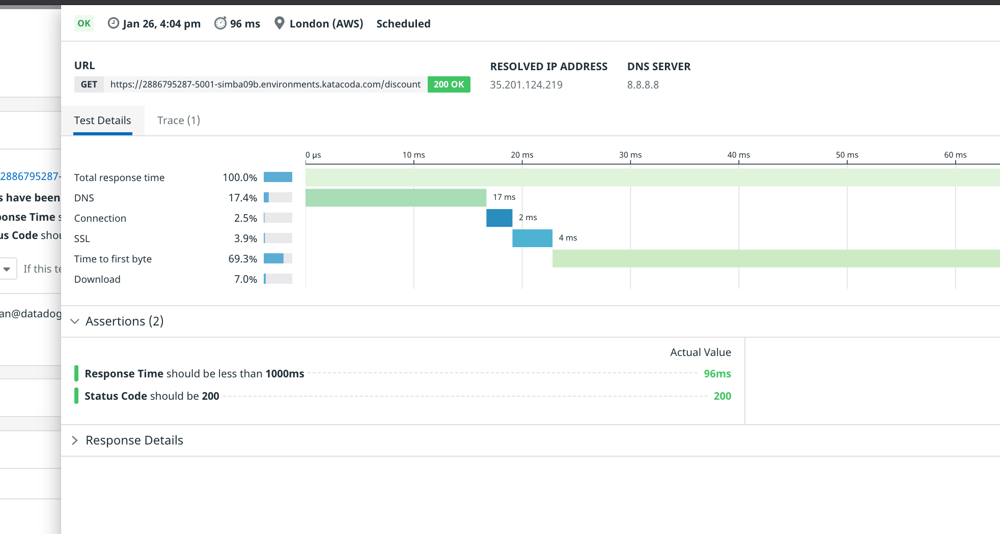
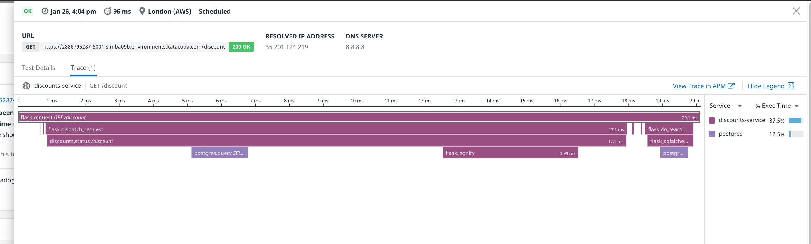

In this step, you're going to create an API test ensure that the discounts service continues to function properly across deployments. You'll start with a simple test to ensure that the service returns a response, and then improve the test to ensure that the service returns a *valid* response.
## About the Discounts Service
To understand what `discounts-service` provides, you can make an HTTP GET request to it using `curl` in the terminal: `curl http://localhost:5001/discount`{{execute}}. Alternatively, you can also click on the **Discounts API** tab above the terminal to see the results in your browser. Either way, the response will be a JSON document containing 206 discounts that look like this this:

```json
  {
    "code": "VIBRANT", 
    "discount_type": {
      "discount_query": "price * 0.660373", 
      "id": 2, 
      "name": "hello"
    }, 
    "id": 2, 
    "name": "symptom sibling omit", 
    "value": 7
  }
```
The store-frontend service picks a random discount from the response and creates a coupon section in the upper-left corner of the Storedog homepage. 


You can see that `name` maps to the title of the coupon section of the home page, "symptom sibling omit" in this example. `code` can be found in the instructions below the title, VIBRANT, and  `value` is formatted to the dollar value "$7.00." (Note that these discounts are generated randomly for each lab, so you won't see this specific discount in your results.)

Now that you know what a healthy discounts-service should serve, you can create an API test to monitor it its health.

## Create a Basic API Test
1. Log in to the Datadog app using the credentials created for you. (Run the `creds`{{execute}} command if you don't have them handy.) Navigate to **Synthetic Tests** in the global navigation, under **UX Monitoring**. You will see the Get started with Datadog Synthetics introduction page. Click the **Get Started** button and then the **New API Test** button in the resulting modal dialog.

    You will create a new HTTP test, which is selected by default. Note that API tests can also monitor SSL, TCP, and DNS services. You can read more about those in the [API Tests documentation](https://docs.datadoghq.com/synthetics/api_tests/).

2. In the **Define request** section, enter your discount service URL, which is `https://[[HOST_SUBDOMAIN]]-5001-[[KATACODA_HOST]].environments.katacoda.com/discount`{{copy}} 
3. You can keep the auto-generated **Name**, or replace it with something like "Discounts API is Healthy."
4. Choose one or more **Locations** from which to run the test.
5. Click the **Test URL** button to ensure that the URL is correct and yields the expected response. The **Response Preview** tab on the right-hand side of the page displays a lot of information about the request and response. If you do not see the **Response Preview** tab, widen your browser window.

    Under **BODY**, you should see the JSON document containing 206 discount codes. Click the **+** beside a collapsed JSON object to expand it and see its values. Your New API Test page should look something like this:

    

    A synthetic test must have at least one assertion to determine whether it has passed or failed. When Datadog tested the discounts URL, it created two baseline assertions for you: the response time is under 1 second, and the HTTP response code is 200 OK. It is likely that these assertions passed on your test run. If they didn't, make sure that **URL** is correct, and that the discounts service is still running correctly in the lab. You can see these at the bottom of the previous screenshot.

6. Next, set **Specify test frequency** to **1hr**, as you will be running this test on-demand in this lab. 
7. Leave the default values under **Define alert conditions**, which will ensure an immediate alert on the first test failure.
8. Under **Notify your team**, pick an email address you would like to use to receive alerts, and reference it in the text area.  For example, `@myemail@example.com`. Take a look at the [Notifications documentation](https://docs.datadoghq.com/monitors/notifications) to learn more about notification syntax and capabilities.
9. Click **Create Test** to see your new test in the Synthetics Test Details page. The test will automatically run the first time when you click the button, and the results will appear in the **Test Results** section at the bottom of the page. You should see a green **OK** within a couple minutes corresponding to each location from which the test was run:

    
## Examine the Test Results
Synthetic test results contain a wealth of information. Click one of the results under **Test Results**. A panel will slide out displaying the details of the test result. Up top, you see the date and time that the test was run, the duration of the test, the location from which it was run, the DNS server used and the IP address it resolved for the test URL. Below that are two tabs, **Test Details** and **Trace**.

**Test Details** features a waterfall graph illustrating the time consumed by each step of the test request, from DNS resolution to Download. Below the waterfall graph is the **Assertions** section, detailing the results of each assertion run by the test. Below that is the **Response Details** section that will provide information about the response headers and body for failed tests.



**Trace** displays an Application Performance Monitoring (APM) flame graph illustrating the resources used by the server to handle the test request. Because Storedog is running the Datadog Agent, we can see how much time the discounts service spent handling the test request across Python Flask and PostgreSQL processes. You can click on **View Trace in APM** to see fine-grained details about what happened on the server. See the [APM documentation](https://docs.datadoghq.com/tracing/) for more information about this powerful tool.



Click **Continue** to make this test more useful.