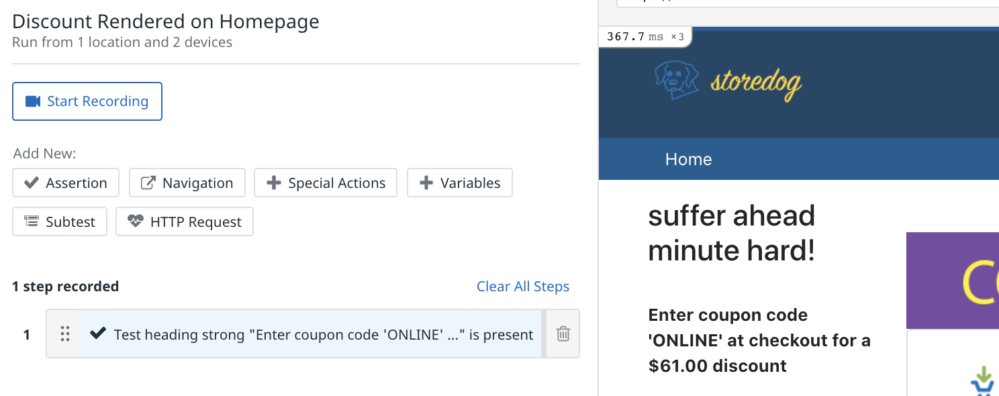
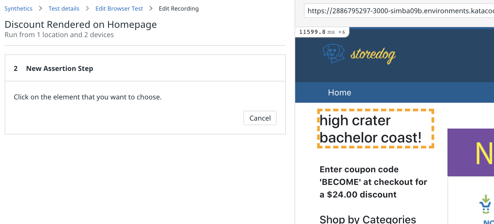

You now have API tests to monitor the availability, performance, and functionality of the Storedog discounts service. For the rest of this course, you'll work with Browser Tests to monitor Storedog's frontend to ensure a good user experience. 

Earlier in this lab you saw how the Storedog frontend displays the response from the discounts service in the upper-left corner of the home page as a "coupon block":


API tests make assertions about the raw content of HTTP responses, and browser tests make powerful assertions about the Document Object Model (DOM) as rendered by a browser.  For example, "This specific element is in the upper-left corner of the homepage," or "This heading is not empty and is displayed with the Helvetica font at 20 pixels."

The business requirements for the coupon block are:
1. It's displayed on the home page
2. It displays a heading
3. It contains a valid coupon code 

By the way, you may have noticed that the domain language for the discounts service is getting a little hazy. The Storedog frontend folks refer to discounts as "coupon codes," because that's how discounts are modeled for customers. So keep in mind that "discount code" and "coupon code" are synonymous, as well as "discount value" and "coupon value", and "discount name" and "coupon heading." This terminology inconsistency will give you a good scenario to troubleshoot in the second part of this course! 

**Note:** *To create and edit browser tests, you must use Google Chrome and be able to install an extension from the Chrome Web Store. You may return to your preferred browser after you have created browser tests. The Datadog App will prompt you to install the extension.*

Now you can turn these frontend business requirements into a browser test.

## Create a Simple Browser Test
In the Datadog App, navigate to **UX Monitoring > New Test** and click on **New Browser Test**. Browser tests are configured in two parts. First, you configure the details common to synthetic tests. Then, you will record the specific actions the test should perform on the web application to satisfy assertions.

Before you proceed, create a new Global Variable for your lab's Storedog frontend URL. Follow the procedure you used to create `DISCOUNT_URL` in the previous step. Name the new Global Variable `FRONTEND_URL`, and give it the value `https://[[HOST_SUBDOMAIN]]-3000-[[KATACODA_HOST]].environments.katacoda.com/`{{copy}}.

### Test Details
1. For **Starting URL**, enter the global variable `{{ FRONTEND_URL }}`.
1. For **Name**, enter something like "Discount Rendered on Homepage".
1. Under **Browsers & Devices**, leave the defaults. These parameters are unique to browser tests and you should tailor them to suit your web application's typical visitor. Note that each selection will result in a separate test.
1. Under **Locations**, choose one or more regions from which to run the test. 
1. Under **Specify test frequency**, select **1w**, as you will run this test on demand in this course.
1. You can leave the defaults for **Define alert conditions** and **Notify your team**, as the notifications are the same as those from API tests.
1. Click **Save Details & Edit Recording** to move to the next step.

### Install the Test Recorder Extension
If you have already installed the Datadog Test Recorder extension, skip down to Edit the Browser Test. If not, you will see "Add our Chrome extension" and a **Add the Extension** button. 
1. Click the **Add the Extension** button to open the Chrome Web Store. 
1. On the **Datadog test recorder** page, click the **Add to Chrome** button.
1. Chrome will prompt you to confirm the installation. Click **Add extension**
1. You will see a dialog pop-up at the top of Chrome confirming that the extension is installed. It will say "Use this extension by clicking on this icon," but that is not necessary; the Datadog App will activate it when necessary.
1. Click Chrome's **Back** button to return to the Edit Browser Test page.

### Edit the Browser Test
If you have installed the Datadog Test Recorder extension, it will automatically make a request to the **Starting URL** you provided and display the results in the right-hand pane. You should see the Storedog homepage there now. You will now record a test to cover business requirement #1, "the coupon code block is displayed in the upper-left of the home page."

There is a tantalizing **Start Recording** button at the top of the left-hand pane. This is useful if the assertions you will make require user interaction to alter the page state, such as typing into a form or navigating to another page. You'll record interactions later.

1. Under **Add New**, click **Assertion**.
1. Click **Test that an element is present**. 
    
1. Hover over the coupon block content, under the heading. It is the text that begins, "Enter the coupon code..." You will see a dashed outline surrounding the DOM element that Datadog detects. Move your cursor around to see what other elements Datadog detects.
1. Click on the coupon block content. You will see a new assertion appear on the left:
    
1. Click on the new assertion. Note that you can update **Step Name** and configure **Advanced Options**. Leave the defaults and click **Cancel**.
1. This is a good start. Click **Save & Quit** to view the test details page.

Run this test manually to see the results:

1. Click **Run Test Now** in the upper-right corner of the test details page.
1. Scroll down to the **Test Results** section and click the **Refresh** button to see the results. You should see a result for every browser and device you configured. Click on one to view the test result details.
1. Click on the first result. You will see a result for each assertion in your browser test, with Step 0 always being "Navigate to start URL":
    
Each step created in a browser test will produce a result here. The result will have a screenshot of what Datadog saw when it executed the step, a summary of the step details, indicators for browser errors detected and resources downloaded, and a waterfall graph segment indicating when the step ran and how long it took.
1. Click on the **1 Error** indicator in Step 0. This will display a panel similar to a web browser's developer tools:
    
Here you will see any errors, warnings, or messages that a web application logs to a browser's console. In Step 0, you can see the Console error, "Client Token is not configured, we will not send any data." You can ignore this.
1. Click on the **Resources** tab, or close the panel and click on the **Resources** indicator in the Step 0 results. This displays all of the resources that the browser downloaded to render the page:
    
Here you can search resources, or filter them by toggling the types to the right of the search field.
1. Click on the **Traces** tab to see the Application Performance Monitoring (APM) traces collected during this step. You will see "No traces associated with this step." Datadog does not automatically associate APM traces with browser tests, and must be configured to do so:
    1. Navigate to **UX Monitoring > Settings** and click on the **Default Settings** tab.
    1. Under **APM integration for Browser Tests**, add this wildcard URL for Storedog running in your lab environment. The exact URL will change if your session expires, if you refresh your browser, or when you start the second part of this course. This wildcard should continue to work in all cases.
        
    1. While you're here, note that you can also set **Default Locations** for future API and browser tests.
    1. Return to the browser test page and click **Run Test Now** to get results including APM traces.

    When APM traces for browser tests are configured, you will see a flame graph for all APM-enabled services that did some work in this step of the browser test:
    

    You can click the **View Trace in APM** link to dig deeper into the traces. See the Datadog Documentation to learn more about [APM traces in synthetic tests](https://docs.datadoghq.com/synthetics/apm).

Now that you have a basic browser test covering the first business requirement for the coupon block, you can add more steps to cover the remaining requirements.

## Complete the Browser test
Business requirement #2 is "the coupon code block displays a heading." This is similar to the the first requirement. In the browser test, this step will make assertions about an element's content, rather than about its existence on the page:

1. On the Discount Rendered on Homepage test page, click the **gear icon** in the upper-right corner and select **Edit recording**.
1. Under **Add New**, click **Assertion**
1. Click **Test an element's content**, and then click on the heading of the coupon code block.
    
1. The default assertion is too specific. This heading contains the discount name, which is unique to each discount. Because discounts are chosen randomly for the coupon block, these words will be different for each request. You could match the content against a regular expression, but for now just ensure that the heading is not empty. For **Value**, Select **should not be empty**:
    
1. Click **Apply**, and then **Save & Quit**
1. Click **Run Test Now**, then scroll down to **Test Results** and click the **Refresh** button.
1. Click on one of the new results to see the details of the test. You should see that Step 2 passed. 

    

    There are a couple of interesting details to note in these test results. As expected in Step 2, the assertion expected different text than it received. That's OK, because you set the condition to simply "not empty."

    The other interesting detail is in Step 1. The assertion is is that "test heading strong 'Enter coupon code..." is present. Yet the coupon code in the screenshot for this step is different than expected. Again, because the condition is simply "is present," this is good enough. Datadog is smart enough to know that this is the same element, even if the content is different.

### Validate the Coupon Code
Business requirement #3 is that "the coupon block contains a valid coupon code." You *could* use a regular expression to ensure that a sequence of upper-case letters is found in the coupon block content element. This would add some assurance that something that *looks like* a coupon code is displayed. But how can you confirm that it's valid?

Browser tests offer some advanced functionality, including variable extraction from step results and making additional HTTP requests within steps. By combining these functions, you can extract the coupon code in one step, and then query the discounts service directly in another. You can then determine if the coupon code exists in the discounts service response.

1. On the Discount Rendered on Homepage test page, click the **gear icon** in the upper-right corner and select **Edit recording**.
1. Under **Add New**, click on the **Variables** button.
1. In the **Create variable from** select menu, choose **JavaScript**.
1. For **Variable Name**, enter `DISCOUNT_CODE`.
    
1. Click **Add Variable**. This will display an **Extract from JavaScript** step configuration form.
1. Click the **Select** button and select the coupon code content block, as you did in Step 1.
1. You can now write a JavaScript function to extract the discount code from the element. The function will receive two arguments: all global and local variables as `vars`, and a reference to the selected DOM element as `element`. Paste the following into The **function (vars, element) {}** text area.
    ```JavaScript
    // regex capturing the discount code
    const regex = /^Enter coupon code '([A-Z]{3,8})' at checkout/
    const [full, code] = element.innerText.match(regex)
    return code
    ```

    Your step configuration should look like this: 
1. Click the **Apply** button, and then **Save & Quit**
1. To test the new step, run the test manually using the **Run Test Now** button.
1. In the test results you should see that a discount code was successfully extracted from the coupon block:
    

Now that you are able to extract the discount code from the coupon block element on the Storedog homepage, you can create an HTTP request step to validate it.

Remember when you made a Global Variable for your lab's discount service URL? It will continue to pay dividends of convenience because you're about to use again. However, Global Variables are not *truly* global in the context of HTTP Requests; you must import it first:

1. On the Discount Rendered on Homepage test page, click the **gear icon** in the upper-right corner and select **Edit recording**.
1. Under **Add New**, click **Variables**.
1. For **Create variable from** select **Global Variable**.
1. You will see the two Global Variables you have created. Click the **plus icon** to the right of `DISCOUNT_URL` to import it into the recording context. The **plus icon** will change to **Variable exists**: 
1. Click the **Ok** button.
1. Expand the **2 variables available** section to confirm that `DISCOUNT_URL` is now available, along with the `DISCOUNT_CODE` you extracted in Step 3: 

Now that you can access the `DISCOUNT_URL` global variable, create a new HTTP Request to validate the `DISCOUNT_CODE`: 
1. On the Discount Rendered on Homepage test page, click the **gear icon** in the upper-right corner and select **Edit recording**.
1. Under **Add New**, click on the **HTTP Request** button.
1. For **URL**, enter `{{ DISCOUNT_URL }}`. 
1. If you click the **Test URL** button, you will see a warning that only some variables may be used in "fast tests." You can ignore this warning.
1. Click the **+ New Assertion** button.
1. For **assertion type**, select **body**.
1. For value, enter the variable you extracted from the previous step, `{{ DISCOUNT_CODE }}`
1. The HTTP step configuration should look like this: 
1. Click the **Apply** button, and then **Save & Quit**
1. To test the new step, run the test manually using the **Run Test Now** button.
1. In the test result details, you should see that Step 4 passed. Click on the result, and you will see the specific assertion made for this test under **Assertions**: 

You now have a solid browser test to ensure that the coupon block appears correctly on the home page, and that it displays a valid discount code and value. Click **Continue** below to review what you've learned so far.