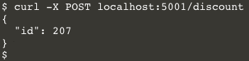
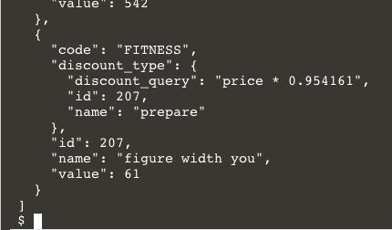
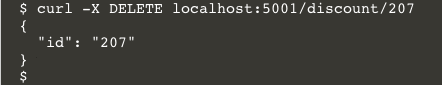

You're confident that the API test you created will alert you when the discounts service is down, slow to respond, or returning something other than well-formed JSON objects from the GET /discounts endpoint. But there's also a POST /discounts endpoint for creating new discounts. And a DELETE /discounts endpoint, too! You should make sure that these functions will be monitored for deployment regressions, too. Fortunately, a synthetic multistep API test can cover both of them.

## About the POST and DELETE Endpoints
When a discounts service receives a POST request, it automatically creates a random discount and adds it to the database. The response will be a JSON document containing the id of the newly created discount. You can try this out in the lab terminal with the command `curl -X POST localhost:5001/discount`{{execute}}. You should see something like the following screenshot:

You can make a GET request to see all the discounts, the last of which will be the one you just created: `curl localhost:5001/discount`{{execute}}

The DELETE endpoint takes the id of the discount you would like to delete. If the deletion is successful, it will return a JSON document containing the id of the deleted discount. Assuming that the id of the newly created discount is `207`, the `curl` command to delete it would be `curl -X DELETE localhost:/5001/discount/207`{{execute}}. You should see something like this:

You can make a GET request to the endpoint now and you'll see that the record you deleted is absent from the results.

You have just manually tested the discount service's POST and DELETE endpoints. You should do this after every deployment to make sure they work correctly. But don't do it manually! You can create a multistep API test that automatically does this for you.

## Automate the Tests
