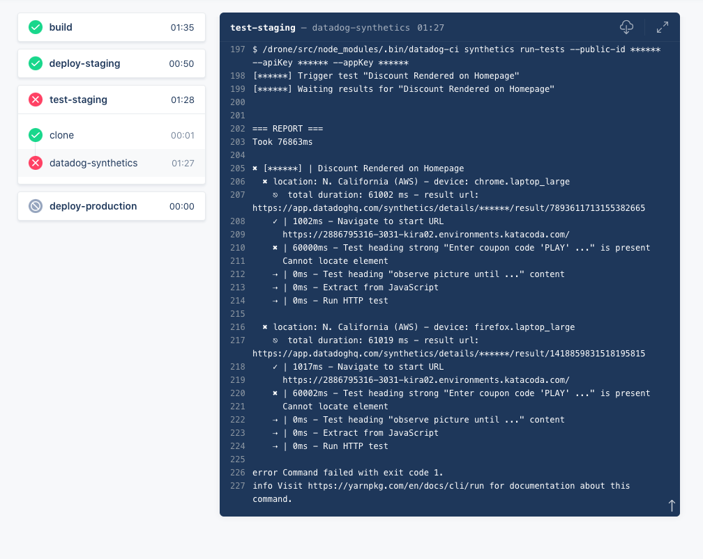
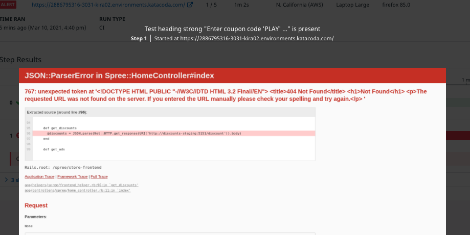

# Introduce a Regression
It's reassuring to see a column of green check marks in your CI/CD pipeline! But for full reassurance, you should make sure that regressions won't make it past the staging site when they occur. In this last step of the course, you'll introduce a regression to hte discounts service and send it through the pipeline. The synthetic test should fail, and the pipeline should halt before deploying the buggy discounts service to production.

Remember how Storedog engineers use "discount" and "coupon code" interchangeably? Now you can simulate the inevitable outcome of a fractured domain language! You'll rename the discounts service's GET endpoint to `coupon/` and "accidentally" push the change to the repository before getting other teams onboard. 

1. In the terminal, execute `cd /root/lab/discounts-service`{{execute}}
2. Execute `patch discounts.py /root/lab/regression.patch`{{execute}} 
3. Execute `git diff` to see the results
4. Execute `git commit -am "corrected coupon code endpoint name" && git push`

Return to the discounts service activity feed in Drone and click on the newest item. Watch as `test-staging` fails, halting the pipeline and protecting production from the regression.

You can view the screenshot that Datadog took when it performed this test in the test result details. When storedog can't resolve the URL of the discounts service endpoint, it breaks. This is what your visitors would have seen if your pipeline didn't hadn't stopped when this error occurred:

You can confirm that production is OK by clicking on the **Production** tab above the terminal in the lab. Clicking on the **Staging** tab will reveal that it is indeed broken. 

Now you can rest assured that production is protected from regressions in the discounts service. From here, you could go on to test any number of features and user journeys. For example, ensure that ads display correctly, or that a multi-page checkout flow works as expected. You can call API tests with `datadog-ci`, too, to test services in isolation.
# Further Reading
`datadog-ci` allows you to configure and override synthetic tests using global configuration files as well as test-specific overrides. This grants you significant flexibility in how you integrate synthetic tests into your pipeline. For example, you can override test variables (such as `FRONTEND_URL` and `DISCOUNT_URL` used in this lab) to run the same test against multiple hosts, such as staging *and* production. Read more about configuring synthetic tests in the [documentation](https://docs.datadoghq.com/synthetics/ci/?tab=apitest#configure-tests).

Click the **Continue** button below to review what you learned in this half of the course.