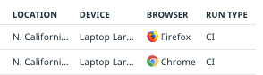
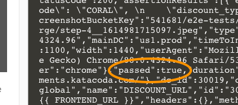
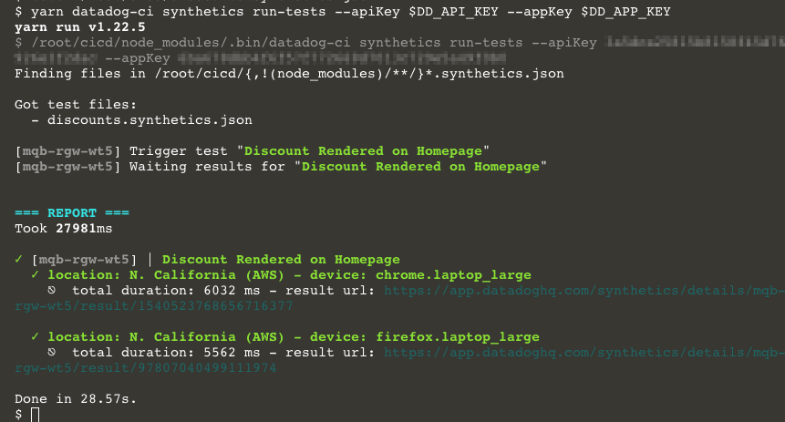
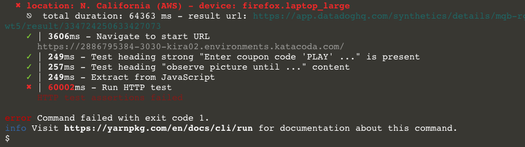

# Trigger the Browser Test
## Update the Test URLs
You're going to manually trigger the browser test you created in the first part of this course in a couple of different ways. Because this is a new lab, the Storedog frontend and discounts service URLs have changed. Update the global variables you created to store these values:
1. In the Datadog app, navigate to the [Synthetics Global Variables Page](https://app.datadoghq.com/synthetics/settings/variables)
1. Hover over the **FRONTEND_URL** variable and click on the pencil icon that appears on the far right
1. Under **Define variable**, change **Value** to the new Storedog frontend staging URL: `https://[[HOST_SUBDOMAIN]]-3031-[[KATACODA_HOST]].environments.katacoda.com/`{{copy}}
1. Click the **Save** button
1. Hover over the **DISCOUNT_URL** variable and click on the pencil icon that appears on the far right
1. Under **Define variable**, change **Value** to the new discounts service staging URL: `https://[[HOST_SUBDOMAIN]]-5151-[[KATACODA_HOST]].environments.katacoda.com/discount`{{copy}}
1. Click the **Save** button

Run the browser test now to confirm that it works with the new URL:
1. Navigate to **UX Monitoring > Synthetic Tests**
1. Click on the browser test you created in the first part of this course.
1. Click the **Run Test Now** button in the upper-right corner
1. Scroll down to **Test Results** and await the results.

## Get the Browser Test Id
Synthetic tests have alphanumeric public ids in the form of `abc-def-ghi`. You're going to need this id to trigger the test using the API. You can find it in the URL of the details page. For example, in the URL `https://app.datadoghq.com/synthetics/details/vn7-5ys-8jw`, the public id is `vn7-5ys-8jw`. 

`export DD_TEST_PUBLIC_ID=abc-def-ghi`

Note that the following steps assume that the environment variable `DD_API_KEY` is set to your API key, and `DD_APP_KEY` is set to your Application key. The lab already has these variables set. You can find your API key in the Datadog app under **Integrations > API Keys**. You can find the Application key under **Team > Application Keys**.

## Trigger The Test (The Hard Way)
First, trigger the browser test using cURL. This will illustrate how the API works at a low level. The workflow is to POST a request to trigger a test, and then to GET the results of the test. Click the following block of code to execute this request for your browser test:

```bash
curl -X POST \
-H 'Content-Type: application/json' \
-H "DD-API-KEY: ${DD_API_KEY}" \
-H "DD-APPLICATION-KEY: ${DD_APP_KEY}" \
-d "{
    \"tests\": [
        {
            \"public_id\": \"${DD_TEST_PUBLIC_ID}\"
        }
    ]
}" "https://api.datadoghq.com/api/v1/synthetics/tests/trigger/ci"
```
{{execute}}

The response will look something like this:

```json
{"batch_id":null,"results":[{"device":"chrome.laptop_large","result_id":"7425966295343615430","public_id":"vn7-5ys-8jw","location":30019},{"device":"firefox.laptop_large","result_id":"5281194447760414433","public_id":"vn7-5ys-8jw","location":30019}],"triggered_check_ids":["vn7-5ys-8jw"],"locations":[{"display_name":"N. California (AWS)","name":"aws:us-west-1","region":"Americas","is_active":true,"is_public":true,"id":30019}]}
```

This response contains information about how the test was run. If you look at the `results` array, you will see that a test was run for each device/location pair that you configured. There is a `result_id` for each test that you will need for the next step. Grab the first one and assign it to an environment variable:

`export DD_TEST_RESULT_ID=0123456789`

Next, you need to make another call to get the results of the test:

```bash
curl -G \
    "https://api.datadoghq.com/api/v1/synthetics/tests/poll_results" \
    -H "DD-API-KEY: ${DD_API_KEY}" \
    -H "DD-APPLICATION-KEY: ${DD_APP_KEY}" \
    -d "result_ids=[${DD_TEST_RESULT_ID}]"
```{{execute}}

If hasn't completed, the `result` key in the response will contain `{"eventType": "created"}`, and you should repeat the request until it is complete.

When the test is complete, the results from this request will be quite large, containing all of the test details. 
Visit the synthetic test's details page and find the result under **Test Results**. You will see that the **RUN TYPE** will be **CI**:



Back in the terminal, the most important key in the API result will is `passed`, a boolean value:

You could halt the pipeline if this is `false`, or continue deploying if this is `true`.

You can read more about the variety of API endpoints, parameters, and responses in the [Datadog API Reference for Synthetics](https://docs.datadoghq.com/api/latest/synthetics/).

The synthetics API opens the opportunity for custom test monitoring, triggering, and reporting. But working with it this way is not ideal for a lean, flexible, and easy to maintain pipeline. Fortunately, Datadog developed an open source CLI client to easily incorporate synthetic tests into CI/CD pipelines!

## Trigger The Test (The Easy Way)
The Datadog CLI client is a Node Package Manager module called [@datadog/datadog-ci](https://www.npmjs.com/package/@datadog/datadog-ci). It's already installed in the lab, so you can start using it immediately. 

In the terminal, run the command `cd /root/lab/cicd`{{execute}} and run the following command:
```shell
yarn datadog-ci synthetics run-tests \
--public-id $DD_TEST_PUBLIC_ID \
--apiKey $DD_API_KEY \
--appKey $DD_APP_KEY
```{{execute}}

You will start seeing nicely formatted output as `datadog-ci` triggers the test and fetches the results. 



If your test passed, you will see the results in green font colors, with green check marks next to each test run.



If your test failed, you will see the results in red font colors, with red X's next to each test run, as well as one very important terminal message:

> error Command failed with exit code 1

By default, the CI/CD pipeline will halt when a command returns an error code. If you insert this test after the pipeline deploys to staging, it will halt without deploying to production.

Click the **Continue** button below to set that up.