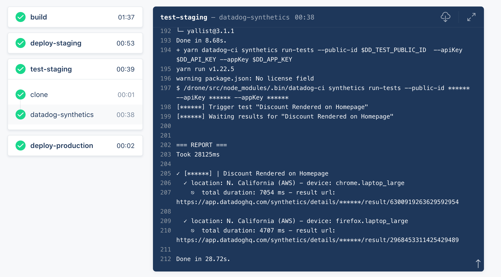

You now have a mechanism to halt the production deployment of the Storedog discounts service if a build doesn't pass a synthetic browser test. The next step is to integrate it into your pipeline.

Drone stores its configuration with the source code that it builds, in a file named `.drone.yml`. When it receives the webhook event from Gogs, it checks out the affected repository and reads this file. Click on the IDE tab and open the file `lab/discounts-service/.drone.yml`{{open}}.

The file consists of three sections divided by dashed lines. You will recognize these sections from the Drone activity details page: `build`, `deploy-staging`, and `deploy-production`. The `build` section builds the discounts service Docker image and pushes it to the local registry. The `deploy-staging` and `deploy-production` sections simply restart the respective `discounts-staging` and `discounts` containers, which will pull the newly built image. You don't need to know anything else about Drone specifically; each CI/CD tool is configured differently, but the concepts are the same. 

By default, Drone halts when it encounters an error. As you saw in the previous step, `datadog-ci` will exit with an error code if the synthetic test it runs doesn't pass. With this in mind, where would be a good place in the pipeline to run the browser test to protect production from regressions?

A good place to test is between `deploy-staging` and `deploy-production`. Take a look at a configuration file that adds a `test-staging` section to the pipeline. In the IDE, open `lab/cicd/drone-staging.yml`{{open}} to see the details. 

The new `test-staging` section starts at line 38. Drone's `docker` section type works by running the configured steps in an isolated Docker container. Because the `datadog-ci` utility requires Node, one of the official light-weight Node images is suitable. After getting the environment set up and ensuring that the restarted discounts services is ready, Drone will run the familiar `datadog-ci` command on line 59. 

Return to the terminal and copy the new configuration file into the `discounts-service` source code with the command `cp /root/lab/cicd/drone-staging.yml /root/lab/discounts-service/.drone.yml`{{execute}}. 

This file is tracked by git, so committing it will trigger a new build with this configuration. But first, you need to make the required environment variables available to the Docker container that will perform the test. You *could* hard-code the Datadog API key, APP key, and test public id into that configuration file, but it's sensitive information that should not be stored in your source code.

Like most CI/CD build systems, Drone can store configuration data as "secrets" and make it globally available to the pipeline. You could configure secrets manually using the Drone UI (**Settings** tab for the repository). But there's a useful script in the lab that can do it for you:

`sh /root/lab/cicd/set_secrets.sh`{{execute}}

You're now ready to commit the new Drone configuration file to the discounts service repository:

```
cd /root/lab/discounts-service \
&& git commit -am "updated drone configuration" \
&& git push 
```{{execute}}

Now click on the **Drone** tab above the terminal and watch the build in the Activity Feed. When the pipeline reaches the `test-staging` section, you will eventually see the same output you saw when you ran the test using `datadog-ci` (though less colorful). You'll also see the test pass, and the pipeline will move on to the `deploy-production` section.



Click the **Continue** button see what happens with we introduce a regression during the next discounts service deployment!
