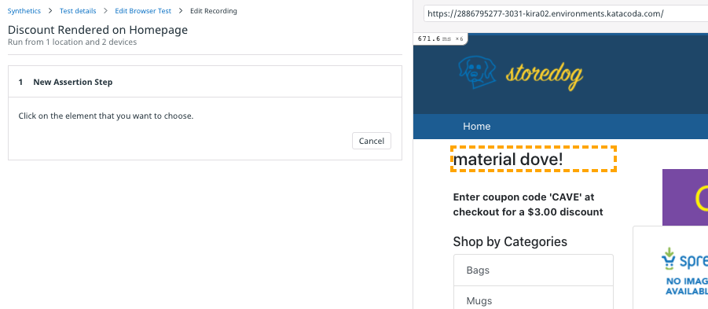
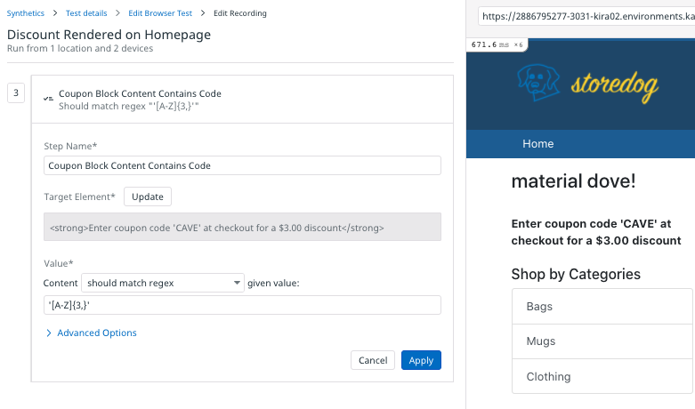

# Create a Browser Test
If you have completed the Introduction To Synthetics course you may likely have a browser test ready to go. If you haven't, or if that trial account has expired, follow the below steps to create a new one. 

This test will monitor the coupon block in the upper-left corner of the Storedog app. The content for the block comes from Storedog's discounts service, so this test will ensure that the coupon block continues to display correctly when new versions of the discounts service are deployed.

You will create a browser test to ensure that:

- the coupon block title is present and not empty
- the coupon code content is present and not empty
- the coupon code content contains a coupon code

To create this test, you must use Chrome and install the Test Recorder Extension, which is covered below. Once you have created this browser test you can return to your preferred browser.

### Test Details
1. For **Starting URL**, enter the URL to Storedog, `https://[[HOST_SUBDOMAIN]]-3000-[[KATACODA_HOST]].environments.katacoda.com/`{{copy}}
1. For **Name**, enter something like "Discount Rendered on Homepage".
1. Under **Browsers & Devices**, leave the defaults. These parameters are unique to browser tests and you should tailor them to suit your web application's typical visitor. Note that each selection will result in a separate test.
1. Under **Locations**, choose one or more regions from which to run the test. 
1. Under **Specify test frequency**, select **1w**, as you will run this test on demand in this course.
1. You can leave the defaults for **Define alert conditions** and **Notify your team**, as the notifications are the same as those from API tests.
1. Click **Save Details & Edit Recording** to move to the next step.

### Install the Test Recorder Extension
If you have already installed the Datadog Test Recorder extension, skip down to Edit the Browser Test. If not, you will see "Add our Chrome extension" and a **Add the Extension** button. 
1. Click the **Add the Extension** button to open the Chrome Web Store. 
1. On the **Datadog test recorder** page, click the **Add to Chrome** button.
1. Chrome will prompt you to confirm the installation. Click **Add extension**
1. You will see a dialog pop-up at the top of Chrome confirming that the extension is installed. It will say "Use this extension by clicking on this icon," but that is not necessary; the Datadog App will activate it when necessary.
1. Click Chrome's **Back** button to return to the Edit Browser Test page.

### Edit the Browser Test
If you have installed the Datadog Test Recorder extension, it will automatically make a request to the **Starting URL** you provided and display the results in the right-hand pane. You should see the Storedog homepage there now. 

#### Heading Exists
1. Under **Add New**, click **Assertion**
1. Click **Test an element's content**, and then click on the heading of the coupon code block.
    
1. The default assertion is too specific. This heading contains the discount name, which is unique to each discount. Because discounts are chosen randomly for the coupon block, these words will be different for each request. You could match the content against a regular expression, but for now just ensure that the heading is not empty. For **Value**, select **should not be empty**:
    
1. Click the **Apply** button.
#### Content Exists
1. Under **Add New**, click **Assertion**.
1. Click **Test that an element is present**. 
    
1. Hover over the coupon block content, under the heading. It is the text that begins, "Enter the coupon code..." You will see a dashed outline surrounding the DOM element that Datadog detects.
1. Click on the coupon block content. You will see a new assertion appear on the left:
    
1. Click the **Apply** button.
#### Content Contains a Coupon Code
1. Under **Add New**, click **Assertion**
1. Click **Test an element's content**, and click the coupon block content again.
1. For **Value**, select **should match regex**.
1. For **give value**, enter `'[A-Z]{3,}'` which will match string of all-caps words 3 characters or longer:
    
1. Click the **Apply** button.
1. Click **Save & Quit** to view the test details page.

### Test the Browser Test
Make sure the test works as expected. Click the **Run Test Now** button in the upper-right corner of the test details page. Then scroll down to **Test Results** and click the **Refresh** button to see the results. 

If the test failed, click on the row to look at the screenshots and error messages. You should be able to determine the cause of failure and update the test so that it passes.

Click the **Continue** button below to explore Datadog's Synthetic Tests API.