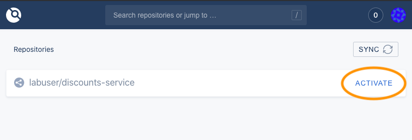

# Explore the Pipeline
Above the terminal to your right, you will see four tabs:
  - **Production** is the production instance of Storedog.
  - **Staging** is running the staging instances of the Storedog frontend and discounts services. Right now it is identical to the "production" Storedog instance.
  - **Gogs** is the user interface to the git repository running in this lab. You are not required to use this, but you may log in and explore the discounts service codebase if you're curious. The username is "labuser" and the password is "password".
  - **Drone** is the user interface to the Drone.io CI/CD tool running in this lab. There isn't much to explore right now, but it will get more interesting when you kick off a new discounts service build in a minute. The login credentials are the same as those for Gogs: the username is "labuser" and the password is "password".

If you don't see all of these tabs, increase your browser window size and drag the vertical separator to widen the the right-hand side.

It will take a few minutes for all of these services to come online. Feel free to read ahead to familiarize yourself with the activities in this lab, or look at the Datadog Docs for [Synthetic CI/CD Testing](https://docs.datadoghq.com/synthetics/ci/?tab=apitest).

## Link Gogs and Drone
To start, you must activate the Gogs git repository in the Drone interface. This will create the Gogs webhook that Drone will listen for to kick off the build process.
1. Click on the **Drone** tab above the terminal
1. Login as "labuser" with the password "password"
1. Click the **ACTIVATE** link to the right of **labuser/discounts-service** 
1. On the discounts-service repository page, click the **Activate Repository** button 
1. Click on the **Activity Feed** tab; you'll come back here shortly to watch pipeline activity.

## Trigger a Build
To see this pipeline in action, make a minor change to the discounts service code to trigger a deployment. 

1. Click on the **IDE** tab above the terminal and give the editor a minute to start up. 
2. In the file tree, expand `lab/discounts-service`. This is a clone of the discounts service code stored in the local Gogs server. 
3. Open `lab/discounts-service/discounts.py`{{open}} and scroll to the bottom of the file. After the last line in the file, add a comment such as `# I added new code!`. The editor saves files automatically.

Now that you have updated the discounts service code, you must push it to the repository to trigger a build. 

1. Click on the **Terminal** tab and run the command `cd /root/lab/discounts-service`{{execute}}.
2. Execute `git diff`{{execute}} to confirm that git sees the new line you added
4. Execute `git commit -am "Added a comment"`{{execute}}
5. Execute `git push`{{execute}}

After updating the git repository, Gogs will notify Drone that a `push` event occurred. Drone will immediately clone the repository and start building. To see this in action:
1. Click the **Drone** tab above the terminal.
3. On the `discounts-service` [Activity Feed](https://[[HOST_SUBDOMAIN]]-8800-[[KATACODA_HOST]].environments.katacoda.com/labuser/discounts-service/), you will see an entry corresponding to your git comment, "#1 Added a comment". Click on that entry.
4. On the left-hand side is a list of steps Drone is configured to execute on this repository, along with their statuses. On the right-hand side, you can see the detailed progress of each step.

It will take a few minutes for the build and deployment to complete. Click on each step as it activates to see the work that Drone is doing. Make special note of the **deploy-staging** and **deploy-production** steps, which are currently identical. In the next step, you will configure Drone to run a browser test before deploying to production.

Click the **Continue** button below to create the browser test that will monitor the Storedog homepage following discounts service deployments.
