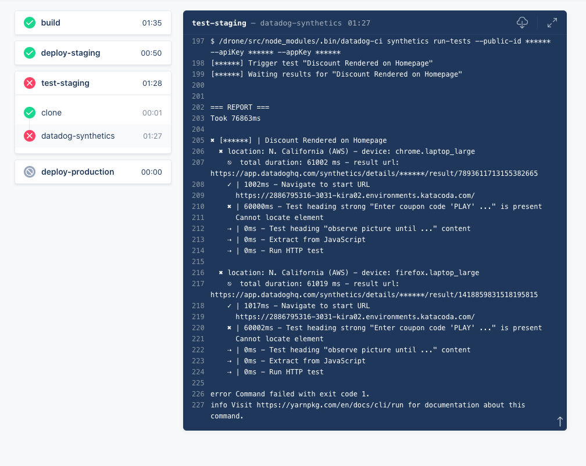

It's reassuring to see a column of green check marks in your CI/CD pipeline! But for full reassurance, you should make sure that regressions won't make it past the staging site when they occur. In this last step of the course, you'll introduce a regression to the discounts service and send it through the pipeline. The synthetic test should fail, and the pipeline should halt before deploying the buggy discounts service to production.

For one reason or another, some Storedog engineers call discounts "coupon codes", and it causes confusion. (It's a long story stemming from Storedog's early days.) Now you can simulate the inevitable outcome of a fractured domain language! You'll rename the discounts service's GET endpoint to `coupon/` and "accidentally" push the change to the repository before getting other teams onboard. 

1. In the terminal, execute `cd /root/lab/discounts-service`{{execute}}
2. Execute `patch discounts.py /root/lab/regression.patch`{{execute}} 
3. Execute `git diff`{{execute}} to see the results
4. Execute `git commit -am "corrected coupon code endpoint name" && git push`{{execute}}

Return to the discounts service activity feed in Drone and click on the newest item. Watch as `test-staging` fails, halting the pipeline and protecting production from the regression.

Note that you can click on the **result url** URL in the test output stream to view the test result in the Datadog app.

You can view the screenshot that Datadog took when it performed this test in the test result details. When storedog can't resolve the URL of the discounts service endpoint, it breaks. This is what your visitors would have seen if your pipeline hadn't stopped when this error occurred:

You can confirm that production is OK by clicking on the **Production** tab above the terminal in the lab. Clicking on the **Staging** tab will reveal that it is indeed broken. 

Now you can rest assured that production is protected from regressions in the discounts service. From here, you could go on to test any number of features and user journeys. For example, ensure that ads display correctly, or that a multi-page checkout flow works as expected. You can call API tests with datadog-ci, too, to test services in isolation.

You can have datadog-ci run as many synthetic tests as you like by passing in multiple test public ids. For example:

`datadog-ci synthetics run-tests --public-id pub-lic-id1 --public-id pub-lic-id2`

You can also use configuration files to do this and much more. See the link in Further Reading, below, to learn more.

## Further Reading
### Flexible Configuration
Because CI environments often come with specificities, datadog-ci allows you to configure and override synthetic test configuration both at the global and at the test level. This grants you significant flexibility in how you integrate synthetic tests into your pipeline. For example, you can override test variables or start URLs to run the same test against multiple hosts, such as staging and production. Read more about configuring synthetic tests in the [documentation](https://docs.datadoghq.com/synthetics/ci/?tab=apitest#configure-tests).

### Internal Applications Testing
In this lab, the staging instance was open to the public. In the real world, you would probably want this instance private. Datadog supports running synthetic tests on internal-facing applications or any private URLs. See the [documentation for Private Locations](https://docs.datadoghq.com/getting_started/synthetics/private_location/) for more information.

In this lab, the staging instance was open to the public. In the real world, you would probably want this instance private. Datadog supports running synthetic tests on internal-facing applications or any private URLs. This can be done either using private locations or the testing tunnel, depending on your needs. You can read more about these two options on this [blog post](https://datadoghq.com/blog/internal-application-testing-with-datadog).

Click the **Continue** button below to review what you learned in this half of the course.