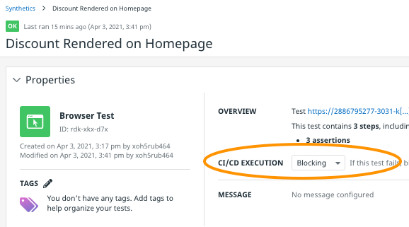
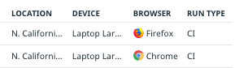
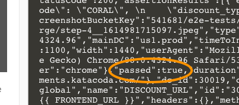
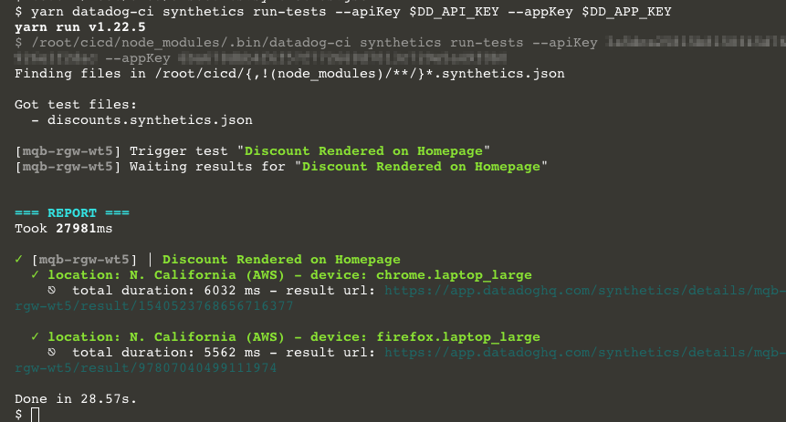
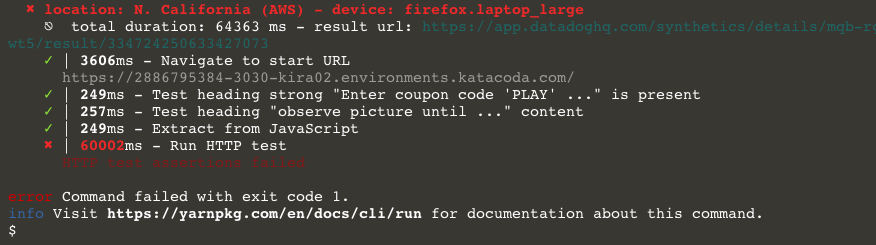

Now that you have an end-to-end test, you can experiment with triggering it on demand. First, you'll use cURL to make requests to the synthetics API directly. Then, you'll use datadog-ci to do the heavy lifting for you.
## Get the Browser Test Id
Synthetic tests have alphanumeric public ids in the form of `abc-def-ghi`. You're going to need this id to trigger the test using the API. You can find it in the URL in a couple places on the synthetic test details page:

1. In the URL. For example, in `https://app.datadoghq.com/synthetics/details/rdk-xkx-d7x`, the public id is `rdk-xkx-d7x`. 
1. Under **Properties** in the upper-left corner of the page: 
    

When you have the public id for your browser test, set it as an environment variable in the lab terminal, replacing `abc-def-ghi` with your public id:

`export DD_TEST_PUBLIC_ID=abc-def-ghi`

Note that the following steps assume that the environment variable `DD_API_KEY` is set to your API key, and `DD_APP_KEY` is set to your Application key. The lab already has these variables set. You can find your API key in the Datadog app under **Integrations > API Keys**. You can find the Application key under **Team > Application Keys**.

## Trigger The Test Using the API
First, trigger the browser test using cURL. This will illustrate how the API works at a low level. The workflow is to POST a request to trigger a test, and then to GET the results of the test. 

Click the following block of code to execute this request for your browser test:

```
curl -X POST \
-H 'Content-Type: application/json' \
-H "DD-API-KEY: ${DD_API_KEY}" \
-H "DD-APPLICATION-KEY: ${DD_APP_KEY}" \
-d "{
    \"tests\": [
        {
            \"public_id\": \"${DD_TEST_PUBLIC_ID}\"
        }
    ]
}" "https://api.datadoghq.com/api/v1/synthetics/tests/trigger/ci"
```{{execute}}

The response will look something like this:

```
{"batch_id":null,"results":[{"device":"chrome.laptop_large","result_id":"7425966295343615430","public_id":"vn7-5ys-8jw","location":30019},{"device":"firefox.laptop_large","result_id":"5281194447760414433","public_id":"vn7-5ys-8jw","location":30019}],"triggered_check_ids":["vn7-5ys-8jw"],"locations":[{"display_name":"N. California (AWS)","name":"aws:us-west-1","region":"Americas","is_active":true,"is_public":true,"id":30019}]}
```

This response contains information about how the test was run. If you look at the `results` array, you will see that a test was run for each device/location pair that you configured. There is a `result_id` for each test result that you will need for the next step. Grab the first one and assign it to an environment variable:

`export DD_TEST_RESULT_ID=0123456789`

Next, you need to make another call to get the results of the test:

```
curl -G \
    "https://api.datadoghq.com/api/v1/synthetics/tests/poll_results" \
    -H "DD-API-KEY: ${DD_API_KEY}" \
    -H "DD-APPLICATION-KEY: ${DD_APP_KEY}" \
    -d "result_ids=[${DD_TEST_RESULT_ID}]"
```{{execute}}

If hasn't completed, the `result` key in the response will contain `{"eventType": "created"}`, and you should repeat the request until it is complete.

When the test is complete, the results from this request will be quite large, containing all of the test result details. 

Visit the synthetic test's details page and find the result under **Test Results**. You will see that the **RUN TYPE** will be **CI**:



Tests results triggered by CI will be listed alongside those that are triggered manually and those scheduled to run automatically. This helps you compare the results you get in each of these testing contexts.

Back in the terminal, the most important key in the API result is `passed`, a boolean value:

You could halt the pipeline if this is `false`, or continue deploying if this is `true`.

You can read more about the variety of API endpoints, parameters, and responses in the [Datadog API Reference for Synthetics](https://docs.datadoghq.com/api/latest/synthetics/).

The synthetics API opens the opportunity for custom test monitoring, triggering, and reporting. But working with it this way is not ideal for a lean, flexible, and easy to maintain pipeline. Fortunately, Datadog developed an open source CLI client to easily incorporate synthetic tests into CI/CD pipelines!

## Trigger The Test Using datadog-ci
The Datadog CLI client is a Node Package Manager module called [@datadog/datadog-ci](https://www.npmjs.com/package/@datadog/datadog-ci). It does the hard work of communicating with the API for you. It's already installed in the lab, so you can start using it immediately. 

In the terminal, run the command `cd /root/lab/cicd`{{execute}} and run the following command:
```shell
yarn datadog-ci synthetics run-tests \
--public-id $DD_TEST_PUBLIC_ID \
--apiKey $DD_API_KEY \
--appKey $DD_APP_KEY
```{{execute}}

You will start seeing nicely formatted output as datadog-ci triggers the test and fetches the results. 



If your test passed, you will see the results in green font colors, with green check marks next to each test run.



If your test failed, you will see the results in red font colors, with red X's next to each test run, as well as one very important terminal message:

> error Command failed with exit code 1

By default, the CI/CD pipeline will halt when a command exits with an error code. If you insert this test after the pipeline deploys to staging, it will halt without deploying to production. 

In some cases, you may want datadog-ci to return a different code when synthetic tests fails. This can be configured in the execution rule drop-down of the synthetic test details page:

    

Setting the rule to `Non-blocking` will cause datadog-ci to return a non-error exit code when tests fail. Setting it to `Skipped` will prevent this test from running at all.

Click the **Continue** button below to set that up.