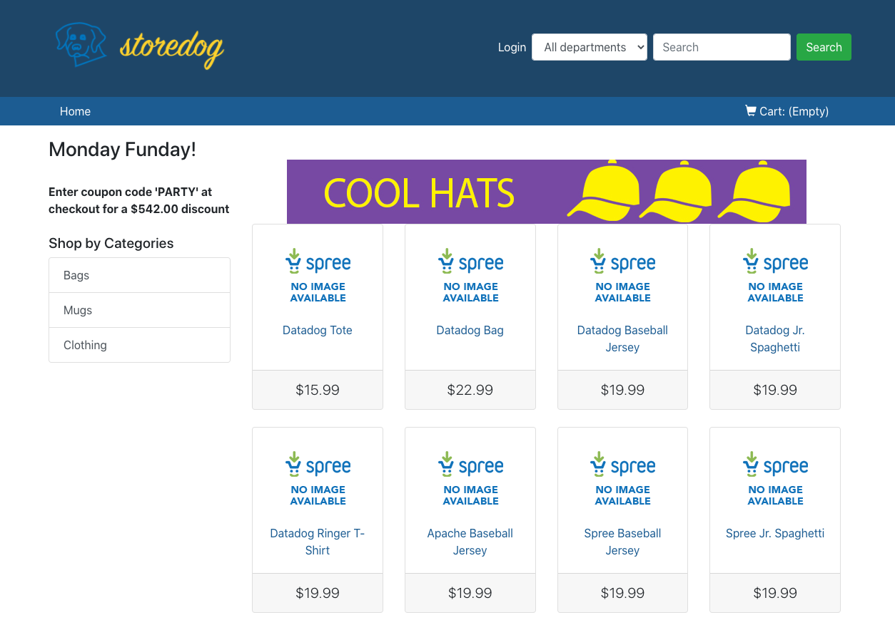
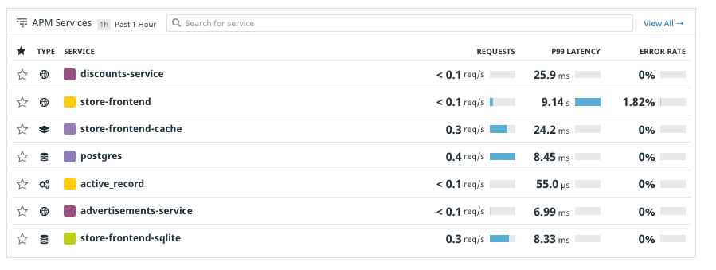
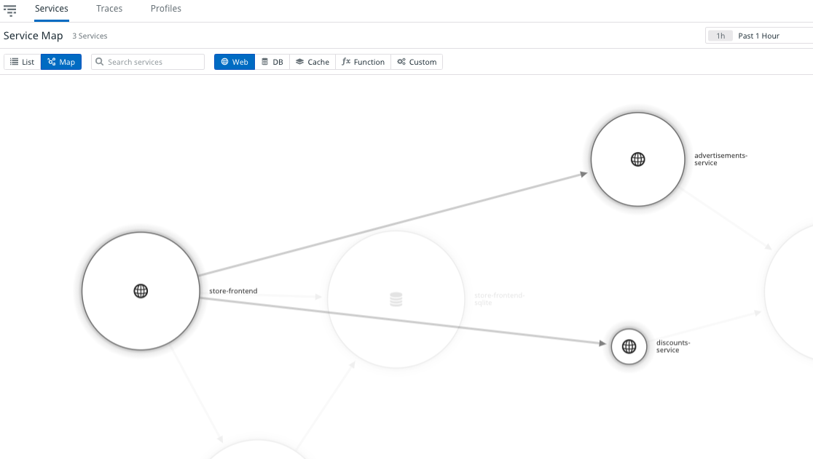
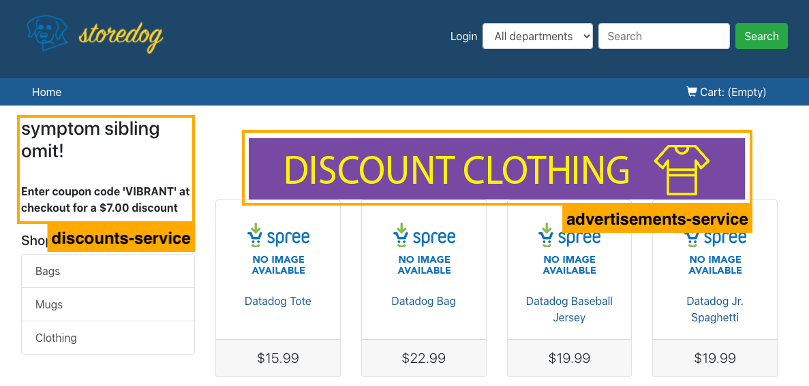

# The Storedog Application
The lab is automatically provisioning the Storedog application, and you'll know that it's ready when you see "Provisioning Complete" in the terminal. You should also see the trial Datadog credentials the lab created for you in the terminal. Copy the username and password somewhere handy because' you'll need them shortly. You can display these credentials any time by entering the command `creds`{{execute}} in the terminal.

When provisioning is complete, you can click on the **Storedog** tab above the terminal to interact with the application. 

Click around Storedog as you would with a real e-commerce site. You can even add items to your shopping cart and check out, but Storedog won't actually ship you anything or charge your credit card. While you're getting familiar with the application the Datadog Agent container is sending metrics to Datadog.

## Datadog Metrics

Log in to [Datadog](https://app.datadoghq.com) using the trial credentials the lab created for you. You will see the Application Performance Monitoring (APM) Services page listing all of the services the Datadog Agent is reporting from the lab. If you don't see any services, change the **env:** dropdown to `synthetics-intro`. This is the environment for all of the services in this course. (Note that you will only see the environment selection dropdown if your trial account has metrics from multiple environments, i.e. other Learning Center course labs.)

To see how these services interact with each other, navigate to APM > Service Map. By filtering **Web** services, you can see that store-frontend communicates with advertisements-service and discounts-service. If you don't see connections between these services yet, give it a minute or two for Datadog to catch up.

Storedog's frontend-service runs the web application. It makes requests to discounts-service to display promotional coupon codes to shoppers. It also uses this service to validate coupon codes that shoppers use during checkout, and apply the correct discount to the order. frontend-service makes requests to advertisements-service to display product banner ads on the home page and on product pages. You can see a coupon code and an advertisement outlined in this screenshot:

In this lab, we're going to use Datadog synthetic tests to ensure that discounts-service functions correctly after deployments, and that store-frontend displays the discounts coupons correctly on the homepage.

Click the **Continue** button below to create an API test.