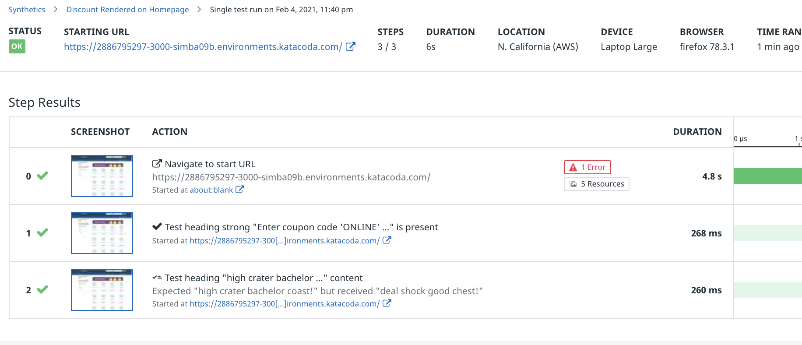

Business requirement #2 is "the coupon code block displays a heading." This is similar to the the first requirement. In the browser test, this step will make assertions about an element's content, rather than about its existence on the page:

1. On the Discount Rendered on Homepage test page, click the **gear icon** in the upper-right corner and select **Edit recording**.
1. Under **Add New**, click **Assertion**
1. Click **Test an element's content**, and then click on the heading of the coupon code block.
    
1. The default assertion is too specific. This heading contains the discount name, which is unique to each discount. Because discounts are chosen randomly for the coupon block, these words will be different for each request. You could match the content against a regular expression, but for now just ensure that the heading is not empty. For **Value**, Select **should not be empty**:
    
1. Click **Apply**, and then **Save & Quit**
1. Click **Run Test Now**, then scroll down to **Test Results** and click the **Refresh** button.
1. Click on one of the new results to see the details of the test. You should see that Step 2 passed. 

    

    There are a couple of interesting details to note in these test results. As expected in Step 2, the assertion expected different text than it received. That's OK, because you set the condition to simply "not empty."

    The other interesting detail is in Step 1. The assertion is is that "test heading strong 'Enter coupon code..." is present. Yet the coupon code in the screenshot for this step is different than expected. Again, because the condition is simply "is present," this is good enough. Datadog is smart enough to know that this is the same element, even if the content is different.

### Validate the Coupon Code
Business requirement #3 is that "the coupon block contains a valid coupon code." You *could* use a regular expression to ensure that a sequence of upper-case letters is found in the coupon block content element. This would add some assurance that something that *looks like* a coupon code is displayed. But how can you confirm that it's valid?

Browser tests offer some advanced functionality, including variable extraction from step results and making additional HTTP requests within steps. By combining these functions, you can extract the coupon code in one step, and then query the discounts service directly in another. You can then determine if the coupon code exists in the discounts service response.

1. On the Discount Rendered on Homepage test page, click the **gear icon** in the upper-right corner and select **Edit recording**.
1. Under **Add New**, click on the **Variables** button.
1. In the **Create variable from** select menu, choose **JavaScript**.
1. For **Variable Name**, enter `DISCOUNT_CODE`.
    
1. Click **Add Variable**. This will display an **Extract from JavaScript** step configuration form.
1. Click the **Select** button and select the coupon code content block, as you did in Step 1.
1. You can now write a JavaScript function to extract the discount code from the element. The function will receive two arguments: all global and local variables as `vars`, and a reference to the selected DOM element as `element`. Paste the following into The **function (vars, element) {}** text area.
    ```JavaScript
    // regex capturing the discount code
    const regex = /^Enter coupon code '([A-Z]{3,8})' at checkout/
    const [full, code] = element.innerText.match(regex)
    return code
    ```

    Your step configuration should look like this: 
1. Click the **Apply** button, and then **Save & Quit**
1. To test the new step, run the test manually using the **Run Test Now** button.
1. In the test results you should see that a discount code was successfully extracted from the coupon block:
    

Now that you are able to extract the discount code from the coupon block element on the Storedog homepage, you can create an HTTP request step to validate it.

Remember when you made a Global Variable for your lab's discount service URL? It will continue to pay dividends of convenience because you're about to use again. However, Global Variables are not *truly* global in the context of HTTP Requests; you must import it first:

1. On the Discount Rendered on Homepage test page, click the **gear icon** in the upper-right corner and select **Edit recording**.
1. Under **Add New**, click **Variables**.
1. For **Create variable from** select **Global Variable**.
1. You will see the two Global Variables you have created. Click the **plus icon** to the right of `DISCOUNT_URL` to import it into the recording context. The **plus icon** will change to **Variable exists**: 
1. Click the **Ok** button.
1. Expand the **2 variables available** section to confirm that `DISCOUNT_URL` is now available, along with the `DISCOUNT_CODE` you extracted in Step 3: 

Now that you can access the `DISCOUNT_URL` global variable, create a new HTTP Request to validate the `DISCOUNT_CODE`: 
<ul style="max-width: 75vw;  margin: auto;">
<li>On the Discount Rendered on Homepage test page, click the **gear icon** in the upper-right corner and select **Edit recording**.
<li>Under **Add New**, click on the **HTTP Request** button.
<li>For **URL**, enter `{{ DISCOUNT_URL }}`. 
<li>If you click the **Test URL** button, you will see a warning that only some variables may be used in "fast tests." You can ignore this warning.
<li>Click the **+ New Assertion** button.
<li>For **assertion type**, select **body**.
<li>For value, enter the variable you extracted from the previous step, `{{ DISCOUNT_CODE }}`
<li>The HTTP step configuration should look like this: 
<li>Click the **Apply** button, and then **Save & Quit**
<li>To test the new step, run the test manually using the **Run Test Now** button.
<li>In the test result details, you should see that Step 4 passed. Click on the result, and you will see the specific assertion made for this test under **Assertions**: 
</ul>

You now have a solid browser test to ensure that the coupon block appears correctly on the home page, and that it displays a valid discount code and value. Click **Continue** below to review what you've learned so far.