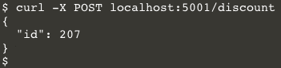
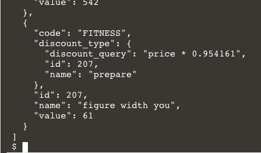
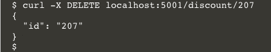
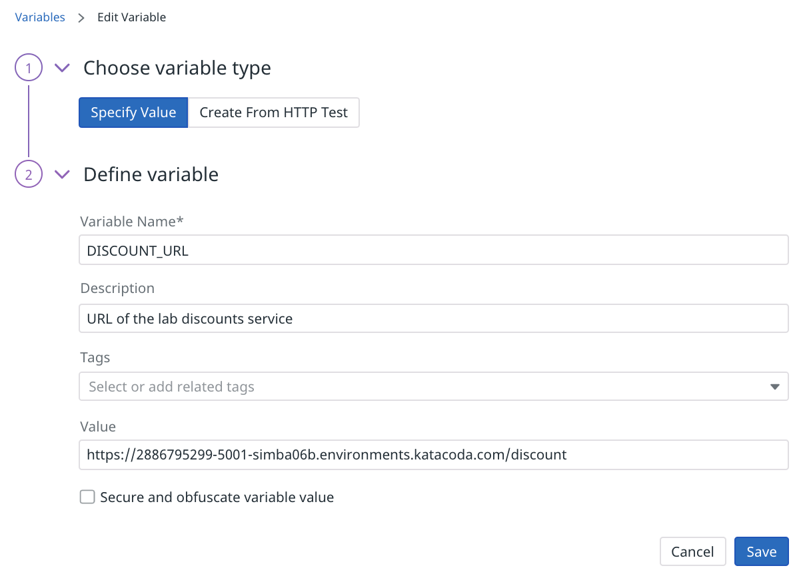

You're confident that the API test you created will alert you when the discounts service is down, slow to respond, or returning something other than well-formed JSON objects from the GET /discounts endpoint. But there's also a POST /discounts endpoint for creating new discounts. And a DELETE /discounts endpoint, too! You should make sure that these functions will be monitored for deployment regressions, too. Fortunately, a synthetic multistep API test can cover both of them.

Before you dive in to creating the multistep API test, get a sense of how these endpoints work by calling them manually.

## About the POST and DELETE Endpoints
When a discounts service receives a POST request, it automatically creates a random discount and adds it to the database. The response will be a JSON document containing the id of the newly created discount. You can try this out in the lab terminal with the command `curl -X POST localhost:5001/discount`{{execute}}. You should see something like the following screenshot:

The discounts service claims that it created a new discount. Did it? You can make a GET request to confirm that the last discount is the one you just created: `curl localhost:5001/discount`{{execute}}

The DELETE endpoint takes the id of the discount you would like to delete. If the deletion is successful, it will return a JSON document containing the id of the deleted discount. Assuming that the id of the newly created discount is `207`, the `curl` command to delete it would be `curl -X DELETE localhost:5001/discount/207`{{execute}}. You should see something like this:

Again, the discounts service *claims* that it deleted the discount. You can make another GET request to the endpoint to confirm that the record you deleted is absent from the results.

You have just manually tested the discounts service's POST and DELETE endpoints. You should do this after every deployment to make sure they work correctly. But don't do it manually! Create a multistep API test to automatically do this for you.

## Automate the Tests
The four manual tests you just executed can be ported to a multistep API test. It will take a bit of work to configure them, but Datadog will happily run them for you thereafter.

### Global Variables
You're about to create four requests and each will require a URL. This value is a good candidate to store in a global variable to use anywhere in your synthetics tests. This saves typing and also reduces the number of places to update the value if the URL changes. To create a global variable for the discounts service URL:

1. In the Datadog App, navigate to **UX Monitoring > Settings** and click on the **Global Variables** tab.
1. Click **+ New Global Variable** in the upper-right corner of the page.
1. For **Variable Name**, enter "DISCOUNT_URL".
1. Optionally give the variable a description, such as "URL of the lab discounts service."
1. For **value**, enter the URL to your lab's discount service, which is `https://[[HOST_SUBDOMAIN]]-5001-[[KATACODA_HOST]].environments.katacoda.com/discount`{{copy}}
 
1. Click **Save**

You can now refer to this variable anywhere in this test as `{{ DISCOUNT_URL }}`.

**Note**: *If your lab session expires or if you restart it, the URL to your discount service will change. Remember to update this variable if that happens.*

Now that you know what the multistep API test needs to do, click **Continue** to create it.

