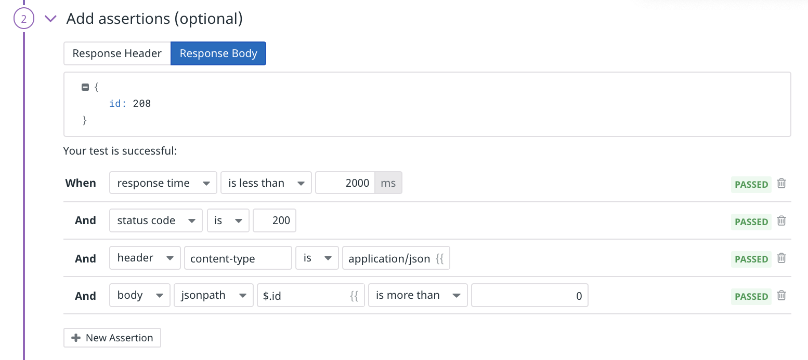
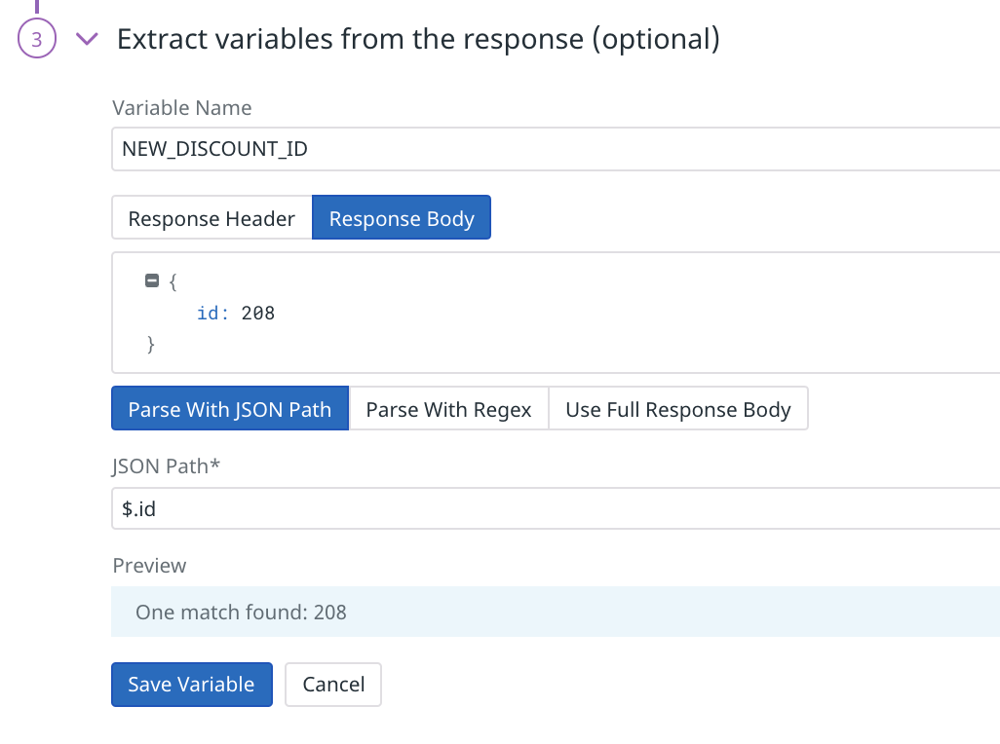
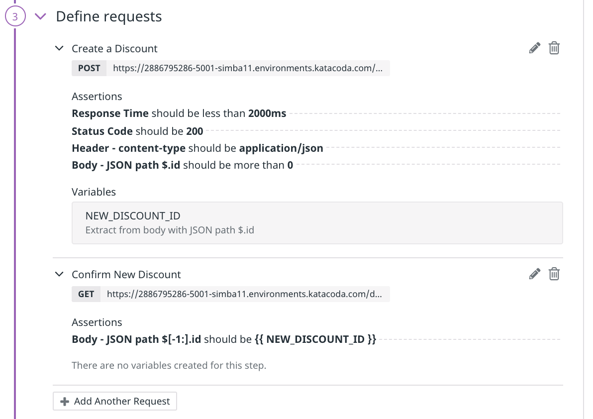
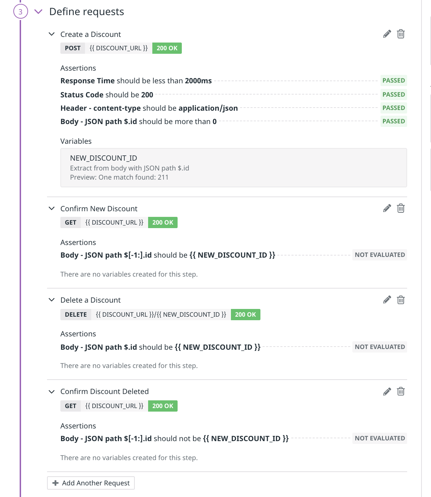
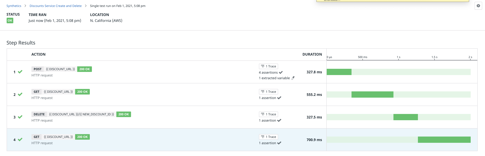
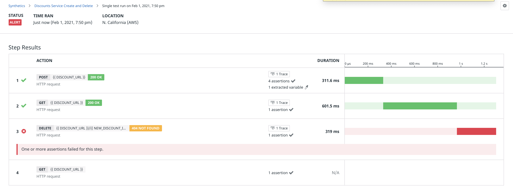
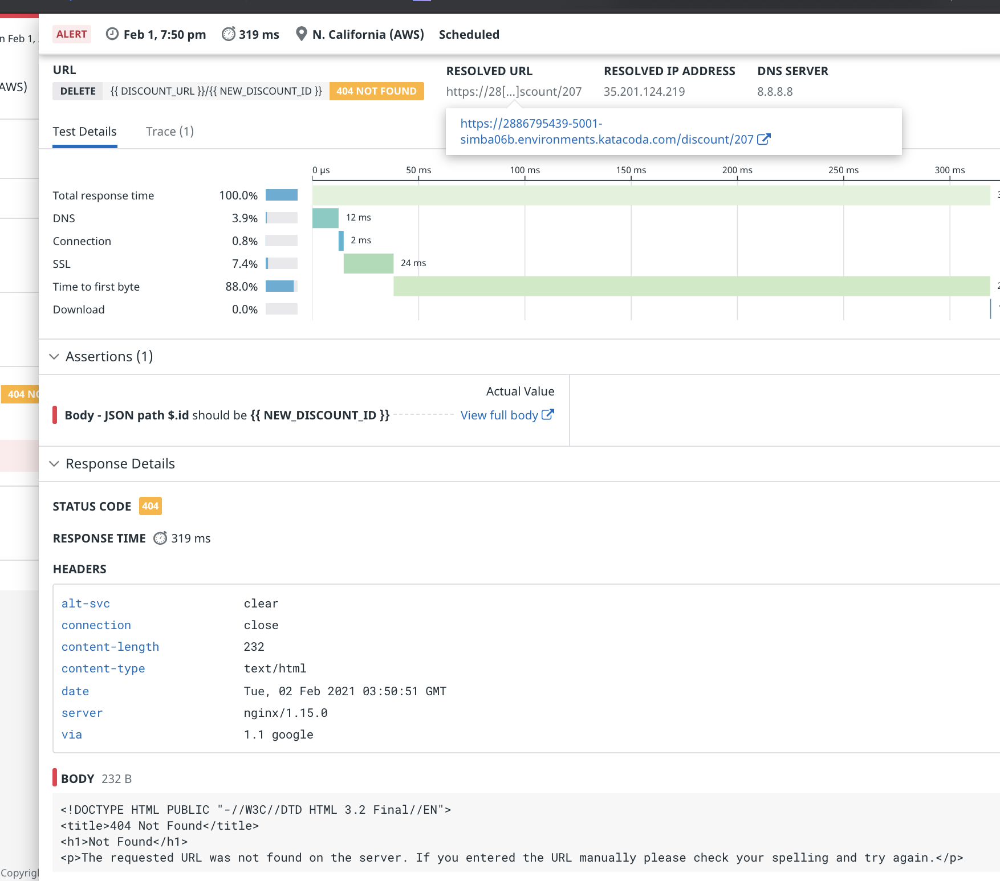

### Configure the new multistep API test
1. Open the Synthetics Tests page and click the **+New Test** button in the upper-right corner. Click **New Multistep API Test**.
1. Under **Name and tag your test**, enter a **Name**, such as "Discounts Service Create and Delete."
1. Under **Select locations**, select *a single location*. This test will only work well if it tests discounts that it creates itself. It will likely fail if it runs from multiple locations simultaneously. This is not a good test to run in production if it won't have exclusive POST and DELETE access to the discount service.

### Define Steps
For the first step, you will test that a new discount can be created at the POST /discount endpoint, as you did manually by hand.

1. Under **Define step**, click the **Create Your First Step** button.
1. Enter a **Step Name** such as "Create a Discount".
1. For **URL**, select **POST** and enter `{{ DISCOUNT_URL }}`.
1. Click the **Test URL** button. This will execute the POST request and display the results of the test and suggest assertions. 
1. Under **Add assertions (optional)**, click on the **Response Body** tab. Click the `id` key. This will add a JSONPath assertion to the suggested assertions.
1. Edit the new JSONPath assertion to change **is** to **is more than**. Enter 0 in the last field. Your assertions should look like this screenshot:
    
1. Under **Extract variables from the response (optional)**, in the **Variable Name** field, enter "NEW_DISCOUNT_ID".
1. Select the **Response Body** tab and click the `id` key. This will automatically parse the id value using JSONPath. You will see the parsed numeric value in the **Preview** field, as in this screenshot:
    
1. Click the **Save Variable** button.
1. Note that `NEW_DISCOUNT_ID` is listed under **Variables extracted in this step**. will be extracted from this step. You will use this variable in subsequent steps.
1. Click the **Save Step** button.

You can see that there is now a **Create a Discount** entry under **Define steps**. Expand it to see the assertions you created and the variable that will be extracted from that step.

Next, you will create a step to confirm that the new discount is returned from the  GET /discount endpoint.

1. Click the **Add Another Step** button.
1. Enter a **Step Name**, such as "Confirm New Discount"
1. For **URL**, keep the default **GET** method and enter `{{ DISCOUNT_URL }}`
1. For **Steps to Run**, keep the default **This step**, and click **Test URL**.
1. Under **Add assertions**, click the **Response Body** tab and scroll to the bottom of the collapsed JSON object list. Expand the last object, and click on the `id` key. This will automatically create a new JSONPath assertion. However, it's too specific. There's no way to know how many discounts will be in the response the next time this test runs, or what the `id` of the last one will be. This is where JSONPath syntax and test variables come into play.
1. Change the JSONPath selector to `$[-1:].id`. This will select the last object in the JSON array, no matter how many there are. The test evaluation should remain **PASSED**.
1. Change the literal id value to `{{ NEW_DISCOUNT_ID }}`, the variable extracted from the previous step. The test evaluation will change to **NOT EVALUATED** because extracted variables are not evaluated until runtime.
1. Click the **Save Step** button.

You didn't need to add more assertions about the response time or response code of the GET request because the single API test you created earlier already handles those. 

Under **Define requests**, expand the two requests you have created so far. They should look like this:

Next, you'll create a step that will test deleting the discount created in the first step. The DELETE /discount endpoint takes a discount id as a parameter in teh URL. Similar to the POST /discount endpoint, the response will be a JSON document containing the id of the deleted discount.

1. Click the **Add Another Step** button.
1. Enter a **Step Name** such as "Delete a Discount" .
1. For **URL**, select **DELETE**. This endpoint takes a discount id as a parameter, so enter `{{ DISCOUNT_URL }}/{{ NEW_DISCOUNT_ID }}`.
1. In the **Steps to Run** field, select **This step and previous steps**. This will run the previous two steps to populate `NEW_DISCOUNT_ID`.
1. Click the **Test URL** button. 
1. Under **Add assertions (optional)**, click on the **Response Body** tab. Click the `id` key. This will add a JSONPath assertion to the suggested assertions.
1. Edit the new JSONPath assertion to change **contains** to **is**. Enter {{ NEW_DISCOUNT_ID }} in the last field. Your assertions should look like this screenshot:
    
1. As in the first step, Datadog suggested some reasonable assertions about the response time, status code, and header of the test response. You can keep these if you like, or delete them. Comprehensive tests are more brittle than simple tests. In real life, you might prefer a separate, single API test to test the DELETE endpoint's performance. 

Finally, you should test that the deleted discount is indeed absent from those returned by GET /discount. Create this step on your own, based on the Confirm New Discount step. Name it "Confirm Discount Deleted." It should assert that the last discount in the results has an id that *is not* the id of the newly created discount.

Your four step should look like the following screenshot. It's OK if you kept some of the suggested assertions about response time, status code, and content type:

Set **Specify test frequency** to **1h** and optionally add an email address to the notification body as you did earlier in the API test.

Click **Save Test**. On hte test summary page, click the **Run Test Now** button in the upper-right corner of the page. Then scroll down to Test Results and click the **Refresh** button. You should see a new result at the top of the list. Click on the result to see the details, which should look like this:

If any part of your test fails, take a close look at the results to determine whether the discounts service is actually failing, or if your tests are misconfigured. If you suspect the latter, review the steps above.

## Introduce a Regression
After all of this set-up, you probably want to see the multi-step test catch a regression!

An opinionated engineer on the Discounts team insists that a good API should take parameters from a step's query string, rather than from its path. Toward this end, the engineer altered the DELETE /discount endpoint code to do exactly that. They merged this "fix" into the production branch and intended to send a memo to stakeholders after lunch. Ironically, the engineer didn't read the memo about today's lunchtime deployment...

You can simulate this scenario back at the lab. In the terminal:
1. `cd /root/lab/discounts-service-fixed`{{execute}}
2. `patch discounts.py regression.patch`{{execute}}.
3. (optional) If you would like to see what changed, you can open `/root/lab/discounts-service-fixed/regression.patch`{{open}} in the IDE.
4. In the terminal, restart the discounts service. It will automatically load the file you patched: `cd /root/lab && docker-compose restart discounts`{{execute}}

When the service has started, return to the [Synthetic Tests page](https://app.datadoghq.com/synthetics/list) in Datadog and click on the Discounts Service Create and Delete multistep test. Then click **Run Test Now** in the upper-right corner.

Scroll down to the **Test Results** section and click the **Refresh** button. You should see that the test failed with **ALERT** status. Click on that result to take a close look:

You can see that third step failed, as expected. At this level you can see that the status code is **404 NOT FOUND**. Click on that step to see the details:

Here you can see that `{{ NEW_DISCOUNT_ID }}` was not found in the response body, which makes sense if the endpoint returned a 404 Not Found error. Expanding the **Response Details** section confirms that the response is a `text/html` page with boilerplate 404 HTML content. 

Mouse over **RESOLVED URL** at the top of the screen. You will see that the path portion of the URL is something like `/discount/207` (yours might be a different id). The you applied alters the DELETE endpoint to expect `/discount?id=207`. This is why the URL for this step failed.

In the real world, you would probably rollback the latest deployment and update all of the application code that calls the DELETE endpoint. This will likely entail a discussion with your team, and some period of time during which users experience a broken discounts service. In the second part of this course, you'll learn how to catch regressions like this before they are even deployed to production. 

See if you can update the DELETE request of the multistep test to reflect the change to the discounts service. 

When you're ready, click the **CONTINUE** button below to test Storedog's frontend functionality with a synthetic Browser Test.

